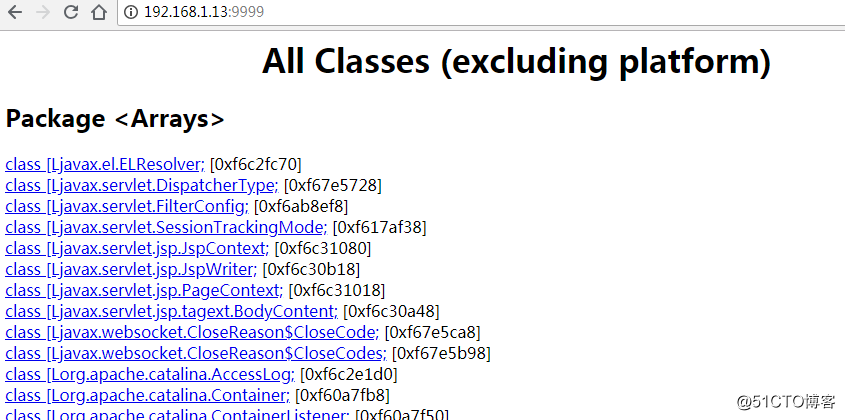

JDK本身提供了很丰富的性能监控工具，除了集成式的visualVM和jConsole外，还有jstat,jstack,jps,jmap,jhat小工具，这些都是性能调优的常用工具


我们在Java的开发中，常常会遇到下面这些问题：

1内存不足，2内存泄漏，3锁争用，4线程锁死，5java进程消耗CPU过高等

这些问题出现的时候 大家常常通过重启服务器或者调大内存来临时解决


# jps命令

jps主要用来输出JVM中运行的进程状态信息

命令行参数选项：

-q 不输出类名、Jar名和传入main方法的参数

-m 输出传入main方法的参数

-l 输出main类或Jar的全限名

-v 输出传入JVM的参数


最常用的是 jps -l

```bash
[root@zabbix-agent bin]# jps -l
1217 sun.tools.jps.Jps
1094 org.apache.catalina.startup.Bootstrap

也可以通过 ps -ef|grep java  查看所有Java应用进程
```


# jstat命令

jstat 它可以显示出虚拟机进程中的类装载、内存、垃圾收集、JIT编译等运行数据

## 1. 类加载统计

```bash
[root@zabbix-agent bin]# jstat -class 1094
Loaded  Bytes  Unloaded  Bytes     Time   
  3133  6273.2        0     0.0       1.91
  
======================
Loaded:加载class的数量
Bytes：所占用空间大小
Unloaded：未加载数量
Bytes:未加载占用空间
Time：时间
======================
```


## 2. 编译统计

```bash
[root@zabbix-agent bin]# jstat -compiler 1094
Compiled Failed Invalid   Time   FailedType FailedMethod
    1994      1       0     5.23          1 org/apache/tomcat/util/IntrospectionUtils setProperty
    
===================
Compiled：编译数量。
Failed：失败数量
Invalid：不可用数量
Time：时间
FailedType：失败类型
FailedMethod：失败的方法
===================
```


## 3. 垃圾回收统计

```bash
[root@zabbix-agent bin]# jstat -gc 1094
 S0C    S1C    S0U    S1U      EC       EU        OC         OU       MC     MU    CCSC   CCSU   YGC     YGCT    FGC    FGCT     GCT   
832.0  832.0   96.4   0.0    7040.0   6278.2   17372.0    16028.9   20224.0 19493.8 2304.0 2056.7     18    0.141   1      0.030    0.171

====================
S0C : survivor0区的总容量
S1C : survivor1区的总容量
S0U : survivor0区已使用的容量
S1C : survivor1区已使用的容量
EC : Eden区的总容量
EU : Eden区已使用的容量
OC : Old区的总容量
OU : Old区已使用的容量
PC 当前perm的容量 (KB)
PU perm的使用 (KB)
YGC : 新生代垃圾回收次数
YGCT : 新生代垃圾回收时间
FGC : 老年代垃圾回收次数
FGCT : 老年代垃圾回收时间
GCT : 垃圾回收总消耗时间
====================
jstat -gc 1094 3000 10

这个命令意思就是每隔3000ms输出1094的gc情况，一共输出10次

[root@zabbix-agent bin]# jstat -gcutil 1094    已使用空间占总空间的百分比
  S0     S1     E      O      M     CCS    YGC     YGCT    FGC    FGCT     GCT   
  0.00  12.48   6.74  92.27  96.39  89.27     19    0.158     1    0.030    0.187
  
[root@zabbix-agent bin]# jstat -gccapacity 1094    同-gc，不过还会输出Java堆各区域使用到的最大、最小空间 （堆内存统计）
 NGCMN    NGCMX     NGC     S0C   S1C       EC      OGCMN      OGCMX       OGC         OC       MCMN     MCMX      MC     CCSMN    CCSMX     CCSC    YGC    FGC 
  5440.0  83264.0   8704.0  832.0  832.0   7040.0    10944.0   166592.0    17372.0    17372.0      0.0 1067008.0  20224.0      0.0 1048576.0   2304.0     19     1
```

更多jstat命令参数 可参看https://www.cnblogs.com/lizhonghua34/p/7307139.html


# jstack命令

jstack主要用来查看某个Java进程内的线程堆栈信息，jstack可以定位到线程堆栈，根据堆栈信息我们可以定位到具体代码，所以它在JVM性能调优中使用得非常多。

命令行参数选项

-l long listings，会打印出额外的锁信息，在发生死锁时可以用jstack -l pid来观察锁持有情况

-m mixed mode，不仅会输出Java堆栈信息，还会输出C/C++堆栈信息（比如Native方法）

**常用命令 jstack PID （切换到对应用户下）**

下面通过一个示例说明；

**实例找出某个Java进程中最耗费CPU的Java线程并定位堆栈信息**，用到的命令有ps、top、printf、jstack、grep。

首先找出应用进程的PID

```bash
ps -ef|grep java

[root@zabbix-agent bin]# jps -l
1217 sun.tools.jps.Jps
1094 org.apache.catalina.startup.Bootstrap

[root@zabbix-agent bin]# ps -ef|grep java
root       1094      1  0 18:35 pts/0    00:00:17 /usr/lib/jvm/java-1.8.0-openjdk-1.8.0.161-0.b14.el7_4.x86_64/bin/java -Djava.util.logging.config.file=/home/apache-tomcat-8.5.31/conf/logging.properties -Djava.util.logging.manager=org.apache.juli.ClassLoaderLogManager -Djdk.tls.ephemeralDHKeySize=2048 -Djava.protocol.handler.pkgs=org.apache.catalina.webresources -Dorg.apache.catalina.security.SecurityListener.UMASK=0027 -Dignore.endorsed.dirs= -classpath /home/apache-tomcat-8.5.31/bin/bootstrap.jar:/home/apache-tomcat-8.5.31/bin/tomcat-juli.jar -Dcatalina.base=/home/apache-tomcat-8.5.31 -Dcatalina.home=/home/apache-tomcat-8.5.31 -Djava.io.tmpdir=/home/apache-tomcat-8.5.31/temp org.apache.catalina.startup.Bootstrap start
```

找到应用进程的PID为1094，接着找出该进程最消耗CPU的线程，可以使用ps -Lfp 1094 或者top -Hp 1094来查看该进程中线程的cpu消耗情况

```bash
[root@zabbix-agent bin]# top -Hp 1094
top - 19:40:51 up  1:52,  1 user,  load average: 0.00, 0.01, 0.05
Threads:  44 total,   0 running,  44 sleeping,   0 stopped,   0 zombie
%Cpu(s):  0.0 us,  0.3 sy,  0.0 ni, 99.7 id,  0.0 wa,  0.0 hi,  0.0 si,  0.0 st
KiB Mem :   998628 total,    84224 free,   690548 used,   223856 buff/cache
KiB Swap:  2097148 total,  2068536 free,    28612 used.   146256 avail Mem 

   PID USER      PR  NI    VIRT    RES    SHR S %CPU %MEM     TIME+ COMMAND                                         
  1094 root      20   0 2778656  84996   5324 S  0.0  8.5   0:00.00 java                                            
  1095 root      20   0 2778656  84996   5324 S  0.0  8.5   0:01.01 java                                            
  1096 root      20   0 2778656  84996   5324 S  0.0  8.5   0:00.54 java                                            
  1097 root      20   0 2778656  84996   5324 S  0.0  8.5   0:00.00 java                                            
  1098 root      20   0 2778656  84996   5324 S  0.0  8.5   0:00.00 java                                            
  1099 root      20   0 2778656  84996   5324 S  0.0  8.5   0:00.00 java                                            
  1100 root      20   0 2778656  84996   5324 S  0.0  8.5   0:03.06 java                                            
  1101 root      20   0 2778656  84996   5324 S  0.0  8.5   0:01.46 java                                            
  1102 root      20   0 2778656  84996   5324 S  0.0  8.5   0:00.00 java                                            
  1103 root      20   0 2778656  84996   5324 S  0.0  8.5   0:06.76 java                                            
  1104 root      20   0 2778656  84996   5324 S  0.0  8.5   0:00.59 java
```

查看到线程1103的消耗CPU时间是最大的，用命令查看线程的十六进制值

```bash
[root@zabbix-agent bin]# printf "%x\n" 1103
44f

查询到的值44f 用于下面jstack 定位信息

[root@zabbix-agent bin]# jstack 1094|grep 44f
"VM Periodic Task Thread" os_prio=0 tid=0x00007f602c01bc80 nid=0x44f waiting on condition
```

这样就可以看到VM Periodic Task Thread 是最耗时的类，然后就可以去代码审查代码了。


# jmap

jmap命令参数

```bash
dump : 生成堆转储快照
finalizerinfo : 显示在F-Queue队列等待Finalizer线程执行finalizer方法的对象
heap : 显示Java堆详细信息
histo : 显示堆中对象的统计信息
permstat : to print permanent generation statistics
F : 当-dump没有响应时，强制生成dump快照
```

常用情况，用jmap把进程内存使用情况dump到文件中，再用jhat分析查看

```bash
jmap -dump:format=b,file=/tmp/dump.dat 1094
生成dump.dat文件
```

dump出来的文件可以用MAT、VisualVM等工具查看，这里用jhat查看

```bash
[root@zabbix-agent /]# jmap -dump:format=b,file=/tmp/dump.dat 1094
Dumping heap to /tmp/dump.dat ...
Heap dump file created
[root@zabbix-agent /]# jhat -port 9999 /tmp/dump.dat 
Reading from /tmp/dump.dat...
Dump file created Sat Jun 23 20:34:39 CST 2018
Snapshot read, resolving...
Resolving 274150 objects...
Chasing references, expect 54 dots......................................................
Eliminating duplicate references......................................................
Snapshot resolved.
Started HTTP server on port 9999
Server is ready.
```

下面就可以浏览器界面查看了




来源：https://blog.51cto.com/superleedo/2132016