# Java篇之JavaSE
## 面向对象编程

### 类的成员之一：属性

1. 局部变量和成员变量的区别：

    1. 声明的位置
        1. 局部变量：方法体{}中，形参，代码块{}中
        2. 成员变量：类中方法外
            1. 类变量（静态类变量，static class variable）：有static修饰
            2. 实例变量（非静态实例变量，non-static instance variable）：没有static修饰
    2. 修饰符
        1. 局部变量：final
        2. 成员变量：public protected private final static volatile transient
    3. 值存储的位置
        1. 局部变量：栈
        2. 实例变量：堆
        3. 类变量：方法区
    4. 作用域：
        1. 局部变量：从声明处开始，到所属的`}`结束
        2. 实例变量：在当前类中`this.`（有时`this.`可以缺省），在其他类中`对象名.`访问。
        3. 类变量：在当前类中`类名.`（有时`类名.`可以省略），在其他类中`类名.`或`对象名.`访问。
    5. 生命周期
        1. 局部变量：每一个线程，每一次调用执行都是新的生命周期。
        2. 实例变量：随着对象的创建而初始化，随着对象的被回收而消亡，每一个对象的实例变量是独立的。
        3. 类变量：随着类的初始化而初始化，随着类的卸载而消亡，该类的所有对象的类变量是共享的。

2. 当局部变量与成员变量重名时，如何区分：

    1. 局部变量与实例变量重名：
        1. 在实例变量前面加`this.`
    2. 局部变量与类变量重名：
        1. 在类变量前面加`类名.`

3. 对象属性的默认初始化赋值

    1. 当一个对象被创建时，会对其中各种类型的成员变量自动进行初始化赋值。除了基本数据类型之外的变量类型都是引用类型。

        | 成员变量类型 | 初始值   |
        | ------------ | -------- |
        | byte         | 0        |
        | short        | 0        |
        | int          | 0        |
        | long         | 0L       |
        | float        | 0.0F     |
        | double       | 0.0D     |
        | char         | '\u0000' |
        | boolean      | false    |
        | 引用类型     | null     |

### 类的成员之二：方法

1. 方法参数的值传递机制
    1. Java里方法的参数传递方式只有一种：值传递（Value Pass）。即将实际参数值的副本（复制品）传入方法内，而参数本身不受影响。
        1. 形参是基本数据类型：将实参基本数据类型变量的`值拷贝（value copy）`传递给形参。
        2. 形参是引用数据类型：将实参引用数据类型变量的`引用拷贝（reference copy）`传递给形参。

### 类的成员之三：构造器

1. 根据参数不同，构造器可以分为如下两类：
    1. 隐式无参构造器（系统默认提供）
    2. 显式定义一个或多个构造器（无参、有参）
2. 注意：
    1. Java语言中，每个类都至少有一个构造器
    2. 默认构造器的修饰符与所属类的修饰符一致
    3. 一旦显式定义了构造器，则系统不再提供默认构造器
    4. 一个类可以创建多个重载的构造器
    5. 父类的构造器不可被子类继承

### 总结：属性赋值过程

1. 赋值的位置：
    1. 默认初始化
    2. 显示初始化
    3. 构造器中初始化
    4. 通过 `对象.属性` 或 `对象.方法` 的方式赋值
2. 赋值的先后顺序：1 - 2 - 3 - 4 

### 关键字 - this

1. 在Java中，this关键字比较难理解，他的作用和其词义很接近。
    1. 它在方法内部使用，即这个方法所属对象的引用；
    2. 它在构造器内部使用，表示该构造器正在初始化的对象。
2. this可以调用类的属性、方法和构造器
3. 使用this，调用属性、方法
    1. 在任意地方或构造器内，如果使用当前类的成员变量或成员方法可以在其前面添加this，增强程序的阅读性。不过，通常我们都习惯省略this。
    2. 当形参与成员变量同名时，如果在方法内或构造器内需要使用成员变量，必须添加this来表明该变量时类的成员变量。
    3. 使用this访问属性和方法时，如果在本类中未找到，会从父类中查找
4. 使用this调用本类的构造器
    1. this可以作为一个类型构造器相互调用的特殊格式。
5. 注意：
    1. 可以在类的构造器中使用`this(形参列表)`的方式，调用本类中重载的其他的构造器
    2. 明确：构造器中不能通过`this(形参列表)`的方式调用自身构造器
    3. 如果一个类中声明了n个构造器，则最多有n-1个构造器中使用了`this(形参列表)`
    4. `this(形参列表)`必须声明在类的构造器的首行
    5. 在类的一个构造器中，最多只能声明一个`this(形参列表)`

### 方法的重写（@Override）

1. 定义：
    1. 在子类中可以根据需要对从父类中继承来的方法进行改造，也称为方法的重置、覆盖。在程序执行时，子类的方法将覆盖父类的方法。
2. 要求：
    1. 子类重写的方法必须和父类被重写的方法具有相同的方法名称、参数列表
    2. 子类重写的方法的返回值类型不能大于父类被重写的方法的返回值类型
    3. 子类重写的方法使用的访问权限不能小于父类被重写的方法的访问权限
        1. 子类不能重写父类中声明为private权限的方法
    4. 子类方法抛出的异常不能大于父类被重写方法的异常
3. 注意
    1. 子类与父类中同名同参数的方法必须同时声明为非static的（即为重写），或者同时声明为static（不是重写）。因为static方法是属于类的，子类无法覆盖父类的方法。

### 关键字 - super

1. 在Java类中使用super来调用父类中的指定操作：

    1. super可用于访问父类中定义的属性
    2. super可用于访问父类中定义的成员方法
    3. super可用于在子类构造器中调用父类的构造器

2. 注意：

    1. 尤其当子父类出现同名成员时，可以用super表明调用的是父类中的成员
    2. super的追溯不仅限于直接父类
    3. super和this的用法相像，this代表本类对象的引用，super代表父类的内存空间的标识。

3. 调用父类的构造器

    1. 子类中所有的构造器默认都会访问父类中空参数的构造器 `super()`
    2. 当父类中没有空参数的构造器时，子类的构造器必须通过 `this(参数列表)` 或者 `super(参数列表)` 语句指定调用本类或者父类中相应的构造器。同时，只能二选一，且必须放在构造器的首行
    3. 如果子类构造器中既未显式调用父类或本类的构造器，且父类中又没有无参的构造器，则编译出错

4. this和super的区别

    | No.  | 区别点     | this                                                   | super                                    |
    | ---- | ---------- | ------------------------------------------------------ | ---------------------------------------- |
    | 1    | 访问属性   | 访问本类中的属性，如果本类没有此属性则从父类中继续查找 | 直接访问父类中的属性                     |
    | 2    | 调用方法   | 访问本类中的方法，如果本类没有此方法则从父类中继续查找 | 直接访问父类中的方法                     |
    | 3    | 调用构造器 | 调用本类构造器，必须放在构造器的首行                   | 调用父类构造器，必须放在子类构造器的首行 |

### 小结：方法的重载与重写

1. 从编译和运行的角度看：
    1. 重载，是指允许存在多个同名方法，而这些方法的参数不同。编译器根据方法不同的参数表，对同名方法的名称做修饰。对于编译器而言，这些同名方法就成了不同的方法。它们的调用地址在编译器就绑定了。Java的重载是可以包括父类和子类的，即子类可以重载父类的同名不同参数的方法。
    2. 所以，对于重载而言，在方法调用之前，编译器就已经确定了所要调用的方法，这成为`早绑定`或`静态绑定`
    3. 而对于多态，只有等到方法调用的那一刻，解释运行器才会确定所要调用的具体方法，这称为`晚绑定`或`动态绑定`。

### Object类

1. ==操作符与equals方法：
    1. ==
        1. 基本类型比较值：只要两个变量的值相等，即为true。
        2. 引用类型比较引用（是否指向同一个对象）：只有指向同一个对象时，==才返回true
    2. equals()：
        1. 所有类都继承了Object，也就获得了equals()方法。还可以重写。
            2. 只能比较引用类型，其作用与`==`相同,比较是否指向同一个对象。
            2. 格式:obj1.equals(obj2)
        4. 特例：当用equals()方法进行比较时，对类File、String、Date及包装类（Wrapper Class）来说，是比较类型及内容而不考虑引用的是否是同一个对象；
            1. 原因：在这些类中重写了Object类的equals()方法
        3. 当自定义使用equals()时，可以重写。用于比较两个对象的`内容`是否都相等
    3. 重写equals()方法的原则
        1. 对称性：如果x.equals(y)返回是 true，那么y.equals(x) 也应该返回是 true。
        2. 自反性：x.equals(x) 必须返回是 true。
        3. 传递性：如果 x.equals(y)返回是 true，而且 y.equals(z) 返回是 true，那么 z.equals(x) 也应该返回是 true。
        4. 一致性：如果 x.equals(y) 返回是 true，只要 x 和 y内容一直不变，不管你重复 x.equals(y) 多少次，返回都是 true。
        5. 任何情况下，x.equals(null)，永远返回是 false；x.equals(和x不同类型的对象)永远返回是 false。
    4. == 和 equals 的 区别
        1. ==既可以比较基本类型也可以比较引用类型。对于基本类型就是比较值，对于引用类型就是比较内存地址。
        2. equals的话，它是属于java.lang.Object类里面的方法，如果该方法没有被重写过默认也是==；我们可以看到String等类的equals方法是被重写过的，而且String类在日常开发中用的比较多，久而久之，形成了equals是比较值的错误观点。
        3. 具体要看自定义类里有没有重写Object的equals方法来判断。
        4. 通常情况下，重写equals方法，会比较类中的相应属性是否都相等。
2. toString() 方法
    1. toString() 方法在Object类中定义，其返回值是String类型，返回类名和它的引用地址。
    2. 在进行String与其他类型数据的连接操作时，自动调用toString()方法
    3. 可以根据需要在用户自定义类型中重写toString()方法。
    4. 基本类型数据转换为String类型时，调用了对应包装类的toString()方法

### 包装类

1. 针对八种基本数据类型定义相应的引用类型——包装类（封装类）

    | 基本数据类型 | 包装类              |
    | ------------ | ------------------- |
    | byte         | Byte，父类Number    |
    | short        | Short，父类Number   |
    | int          | Integer，父类Number |
    | long         | Long，父类Number    |
    | float        | Float，父类Number   |
    | double       | Double，父类Number  |
    | boolean      | Boolean             |
    | char         | Character           |

2. 装箱：基本数据类型包装成包装类的实例

    ```
    // int -> Integer
    // 1. new Integer(int);
    Integer i1 = new Integer(996);
    
    // 2. Integer.valueOf(int);
    Integer i2 = Integer.valueOf(996);
    ```

3. 拆箱：获得包装类对象中包装的基本类型变量

    ```
    // Integer -> int
    // 1. Integer.intValue();
    // 2. Xxx.xxxValue();
    int i3 = i1.intValue();
    ```

4. JDK1.5之后，支持自动装箱，自动拆箱。但类型必须匹配。

5. 字符串转换成基本数据类型：

    ```
    // String -> int
    // 1. new Integer(String);
    int i1 = new Integer("996").intValue();
    
    // 2. Integer.parseInt();
    // 3. Xxx.parseXxx();
    int i2 = Integer.parseInt("996");
    ```

6. 基本数据类型转换成字符串

    ```
    // int -> String
    // 1. String.valueOf(int);
    String s1 = String.valueOf(996);
    
    // 2. Integer.toString();
    String s2 = Integer.toString(996);
    ```
7. java.lang.Class.isPrimitive(): 判断是否是基本数据类型。`int.class.isPrimitive();`

### 关键字 - static

1. 类属性、类方法的设计思想
    1. 类属性作为该类各个对象之间共享的变量。在设计类时，分析哪些属性不因对象的不同而改变，将这些属性设置为类属性。相应的方法设置为类方法。
    2. 如果方法与调用者无关，则这样的方法通常被声明为类方法，由于不需要创建对象就可以调用类方法，从而简化了方法的调用。
2. 使用范围：
    1. 在Java类中，可用static修饰属性、方法、代码块、内部类
3. 被修饰后的成员具备以下特点：
    1. 随着类的加载而加载
    2. 优先于对象存在
    3. 修饰的成员，被所有对象所共享
    4. 访问权限允许时，可不创建对象，直接被类调用
4. 类变量（static class variable）
    1. 类变量（类属性）由该类的所有实例共享
5. 类方法（static class method）
    1. 没有对象的实例时，可以用`类名.方法名()`的形式访问由static修饰的类方法。
    2. 在static方法内部只能访问类的static修饰的属性或方法，不能访问类的非static的结构。
    3. 因为不需要实例就可以访问static方法，因此static方法内部不能有this。
    4. static修饰的方法不能被重写。

### 类的成员之四：代码块

1. 代码块（或初始化块）的作用：
    1. 对Java类或对象进行初始化
2. 代码块（或初始化块）的分类：
    1. 一个类中代码块若有修饰符，则只能被static修饰，称为静态初始化块（static initializer），没有使用static修饰的，为实例初始化块（instance initializer）。
3. static代码块通常用于初始化static的属性
4. 静态代码块（static initializer）：用static修饰的代码块
    1. 可以有输出语句。
    2. 可以对类的属性、类的声明进行初始化操作。
    3. 不可以对非静态的属性初始化。即：不可以调用非静态的属性和方法。
    4. 若有多个静态的代码块，那么按照从上到下的顺序依次执行。
    5. 静态代码块的执行要先于非静态代码块。
    6. 静态代码块随着类的加载而加载，且只执行一次。
5. 非静态代码块：没有static修饰的代码块
    1. 可以有输出语句。
    2. 可以对类的属性、类的声明进行初始化操作。
    3. 除了调用非静态的结构外，还可以调用静态的变量或方法。
    4. 若有多个非静态的代码块，那么按照从上到下的顺序依次执行。
    5. 每次创建对象的时候，都会执行一次。且先于构造器执行。

### 总结：程序中成员变量赋值的执行顺序

1. 声明成员变量的默认初始化
2. 显示初始化、多个初始化块依次被执行（同级别下按先后顺序执行）
3. 构造器再对成员进行初始化操作
4. 通过 `对象.属性` 或 `对象.方法` 的方式，可多次给属性赋值

### 关键字 - final

1. 在Java中声明类、变量和方法时，可使用关键字final来修饰，表示“最终的”。

    1. final标记的类不能被继承。提高安全性，提高程序的可读性。

        1. String类、System类、StringBuffer类

    2. final标记的方法不能被子类重写。

        1. Object类中的getClass()。

    3. final标记的变量（成员变量或局部变量）即称为常量。名称大写，且只能被赋值一次。

        1. final标记的成员变量必须在声明的同时或在每个构造方法中或代码块中显式赋值，然后才能使用。

         ```
         // 1. 声明并赋值
         final double PI = 3.14;
         
         // 2. 初始化块中赋值
         final double PI2;
         {
         	PI2 = 3.14;
         }
         
         // 3. 构造器中赋值
         final double PI3;
         public MyPI() {
         	PI3 = 3.14;
         }
         ```

### Java8中关于接口的改进

1. Java8中，你可以为接口添加静态方法和默认方法。从技术角度来说，这是完全合法的，只是它看起来违反了接口作为一个抽象定义的理念。
2. 静态方法：使用static关键字修饰。可以通过接口直接调用静态方法，并执行器方法体。我们经常在相互一起使用的类中使用静态方法。你可以在标准库中找到像Collection/Collections或者Path/Paths这样成对的接口和类。
3. 默认方法：默认方法使用default关键字修饰。可以通过实现类对象来调用。我们在已有的接口中提供新方法的同时，还保持了与旧版本代码的兼容性。比如：java8 API中对Collection、List、Comparator等接口提供了丰富的默认方法。
4. 接口中的默认方法
    1. 若一个接口中定义了一个默认方法，而另外一个接口中也定义了一个同名同参数的方法（不管此方法是否是默认方法），在实现类同时实现了这两个接口时，会出现：接口冲突。
      1. 解决方法：实现类必须覆盖接口中同名同参数的方法，来解决冲突。
    2. 若一个接口中定义了一个默认方法，而父类中也定义了一个同名同参数的非抽象方法，则不会出现冲突问题。因为此时遵守：类优先原则。接口中具有相同名称和参数的默认方法会被忽略。

### 类的内部成员之五 - 内部类

1. 当一个事物的内部，还有一个部分需要一个完整的结构进行描述，而这个内部的完成的结构又只为外部事务提供服务，那么整个内部的完整结构最好使用内部类。
2. 在Java中，允许一个类的定义位于另一个类的内部，前者称为内部类，后者称为外部类。
3. Inner class一般用在定义它的类或语句块之内，在外部引用它时必须给出完成的名称。
    1. Inner class的名字不能与包含它的外部类类名相同。
4. 分类
    1. 成员内部类（static成员内部类和非static成员内部类）
    2. 局部内部类（不谈修饰符）、匿名内部类
5. 成员内部类
    1. 成员内部类作为类的成员的角色：
        1. 和外部类不同，Inner class还可以声明为private或protected；
        2. 可以调用外部类的结构；
        3. Inner class可以声明为static的，但此时就不能再使用外层类的非static的成员变量；
    2. 成员内部类作为类的角色：
        1. 可以在内部定义属性、方法、构造器等结构
        2. 可以声明为abstract类，因此可以被其他的内部类继承
        3. 可以声明为final的
        4. 编译以后生成OuterClass$InnerClass.class字节码文件（也适用于局部内部类）
    3. 注意
        1. 非static的成员内部类中的成员不能声明为static的，只有在外部类或static的成员内部类中才可声明static成员。
        2. 外部类访问成员内部类的成员，需要`内部类.成员` 或 `内部类对象.成员` 的方式
        3. 成员内部类可以直接使用外部类的所有成员，包括私有的数据
        4. 当想要在外部类的静态成员部分使用内部类时，可以考虑内部类声明为静态的
6. 局部内部类
7. 匿名内部类

### 类初始化过程

1. 一个类要创建实例需要先加载并初始化该类。
    1. main() 方法所在的类需要先加载和初始化。
2. 一个子类要初始化需要先初始化父类。
3. 一个类初始化就是执行 `<clinit>()` 方法
    1. `<clinit>()` 方法由静态类变量显示赋值代码和静态代码块组成。
    2. 静态类变量显示赋值代码和静态代码块代码从上到下顺序执行。
    3. `<clinit>()` 方法只执行一次。

### 实例初始化过程

1. 实例初始化就是执行`<init>()`方法
    1. `<init>()` 方法可以重载有多个，有几个构造器就有几个 `<init>()` 方法。
    2. `<init>() `方法由非静态实例变量显示赋值代码和非静态代码块、对应构造代码组成。
    3. 非静态实例变量显示赋值代码和非静态代码块代码从上到下顺序执行，而对应构造器的代码最后执行。
    4. 每次创建实例对象，调用对应构造器，执行的就是对应的 `<init>()` 方法。
    5. `<init>()` 方法的首行是 super() 或 super(实参列表)，即对应父类的 `<init>()` 方法。

## Java集合框架

### Java集合可分为Collection和Map两种体系

1. Collection接口：单列数据，定义了存取一组对象的方法和集合
    1. List：元素有序、可重复的集合
    2. Set：元素无序、不可重复的集合
2. Map接口：双列数据，保存具有映射关系“key-value对”的集合

### Collection接口

1. Collection接口是List、Set和Queue接口的父接口，该接口里定义的方法既可用于操作Set集合，也可用于操作List和Queue集合。
2. JDK不提供此接口的任何直接实现，而是提供更具体的子接口（如：Set和List）实现。
3. 在Java5之前，Java集合会丢失容器中所有对象的数据类型，把所有对象都当成Object类型处理；从JDK5.0增加了泛型以后，Java集合可以记住容器中对象的数据类型。

### Iterator迭代器接口

1. 使用 Iterator 接口遍历集合元素
    1. Iterator对象称为迭代器(设计模式的一种)，主要用于遍历 Collection 集合中的元素。
    2. GOF给迭代器模式的定义为：提供一种方法访问一个容器（container）对象中各个元素，而又不需要暴露该对象的内部细节。迭代器模式，就是为容器而生。
    3. Collection接口继承了java.lang.Iterable接口，该接口有一个iterator()方法，那么所有实现了Collection接口的集合类都有一个iterator()方法，用以返回一个实现了Iterator接口的对象。
    4. Iterator仅用于遍历集合，Iterator本身并不提供承装对象的能力。如果需要创建Iterator对象，则必须有一个被迭代的集合。
    5. 集合对象每次调用iterator()方法都得到一个全新的迭代器对象，默认游标都在集合的第一个元素之前。
2. 使用 foreach 循环遍历集合元素
    1. Java 5 提供了 foreach 循环迭代访问 Collection和数组。
    2. 遍历操作不需获取Collection或数组的长度，无需使用索引访问元素。
    3. 遍历集合的底层调用Iterator完成操作。
    4. foreach还可以用来遍历数组。

### Collection子接口之一：List接口

1. 鉴于Java中数组用来存储数据的局限性，我们通常使用List替代数组。
2. List集合类中元素有序、且可重复，集合中的每个元素都有其对应的顺序索引。
3. List容器中的元素都对应一个整数型的序号记载其在容器中的位置，可以根据序号存取容器中的元素。
4. JDK API中List接口的实现类常用的有：ArrayList、LinkedList和Vector。
5. List实现类之一：ArrayList
    1. ArrayList 是 List 接口的典型实现类、主要实现类
    2. 本质上，ArrayList是对象引用的一个“变长”数组
    3. ArrayList的JDK1.8之前与之后的实现区别？
        1. JDK1.7：ArrayList像饿汉式，直接创建一个初始容量为10的数组。
        2. JDK1.8：ArrayList像懒汉式，一开始创建一个长度为0的数组，当添加第一个元素时在创建一个初始容量为10的数组。
    4. Arrays.asList(...) 方法返回的List集合，既不是ArrayList实例，也不是Vector实例。Arrays.asList(...) 返回值时一个固定长度的List集合。
    5. ArrayList 是线程不安全的，而 Vector 是线程安全的，即使为保证 List 集合线程安全，也不推荐使用Vector
    6. Arrays.asList(...) 方法返回的 List 集合既不是 ArrayList 实例，也不是 Vector 实例。 Arrays.asList(...) 返回值是一个固定长度的 List 集合
6. List实现类之二：LinkedList
    1. 对于频繁的插入或删除元素的操作，建议使用LinkedList类，效率较高
    2. LinkedList：双向链表，内部没有声明数组，而是定义了Node类型的first和last，用于记录首末元素。同时，定义内部类Node，作为LinkedList中保存数据的基本结构。Node除了保存数据，还定义了两个变量：
        1. prev变量记录前一个元素的位置
        2. next变量记录下一个元素的位置
7. List 实现类之三：Vector
    1. Vector 是一个古老的集合，JDK1.0就有了。大多数操作与ArrayList相同，区别之处在于Vector是线程安全的。
    2. 在各种list中，最好把ArrayList作为缺省选择。当插入、删除频繁时，使用LinkedList；Vector总是比ArrayList慢，所以尽量避免使用。
8. ArrayList/LinkedList/Vector的异同？
    1. ArrayList和LinkedList的异同
        1. 二者都线程不安全，相对线程安全的Vector，执行效率高。
        2. 此外，ArrayList是实现了基于动态数组的数据结构，LinkedList基于链表的数据结构。对于随机访问get和set，ArrayList觉得优于LinkedList，因为LinkedList要移动指针。对于新增和删除操作add（特指插入）和remove，LinkedList比较占优势，因为ArrayList要移动数据。
    2. ArrayList和Vector的区别
        1. Vector和ArrayList几乎是完全相同的，唯一的区别在于Vector是同步类（synchronized），属于强同步类。因此开销就比ArrayList要大，访问要慢。正常情况下，大多数的Java程序员使用ArrayList而不是Vector，因为同步完全可以由程序员自己来控制。Vector每次扩容请求其大小的2倍空间，而ArrayList是1.5倍。Vector还有一个子类Stack。

### Collection子接口之二：Set接口

1. Set接口是Collection的子接口，set接口没有提供额外的方法

2. Set 集合不允许包含相同的元素，如果试把两个相同的元素加入同一个 Set 集合中，则添加操作失败。

3. Set 判断两个对象是否相同不是使用 == 运算符，而是根据 equals() 方法

4. Set实现类之一：HashSet
    1. HashSet 是 Set 接口的典型实现，大多数时候使用 Set 集合时都使用这个实现类。
    
    2. HashSet 按 Hash 算法来存储集合中的元素，因此具有很好的存取、查找、删除性能。
    
    3. HashSet 具有以下特点：
        1. 不能保证元素的排列顺序
        2. HashSet 不是线程安全的
        3. 集合元素可以是 null
        
    4. HashSet 集合判断两个元素相等的标准：两个对象通过 hashCode() 方法比较相等，并且两个对象的 equals() 方法返回值也相等。
    
    5. 对于存放在Set容器中的对象，对应的类一定要重写equals()和hashCode(Object obj)方法，已实现对象相等规则。即：相等的对象必须具有相等的散列码。
    
    6. 向HashSet中添加元素的过程：
    
        1. 当向HashSet集合中存放一个元素时，HashSet会调用该对象的hashCode()方法来得到该对象的hashCode值，然后根据hashCode值，通过某种散列函数决定该对象在HashSet底层数组中的存储位置。（这个散列函数会与底层数组的长度相计算得到在数组中的下标，并且这种散列函数计算还尽可能保证能均匀存储元素，越是散列分布，该散列函数设计的越好）
    
        2. 如果两个元素的hashCode()值相等，会在继续调用equals方法，如果equals方法结果为true，添加失败；如果为false，那么会保存该元素，但是该数组的位置已经有元素了，那么会通过链表的方式继续链接。
    
        3. 如果两个元素的equlas()方法返回true，但它们的hashCode()返回值不相等，hashSet将会把他们存储在不同的位置，但依然可以添加成功。
    
            
    
    7. 重写hashCode()方法的基本原则
    
        1. 在程序运行时，同一个对象多次调用hashCode()方法应该返回相同的值。
        2. 当两个对象的equals()方法比较返回true时，这两个对象的hashCode()方法的返回值也应相等。
        3. 对象中用作equals()方法比较的Field，都应该用来计算hashCode值。
    
    8. 重写equals()方法的基本原则
    
        1. 复写equals方法的时候一般都需要同时复写hashCode方法。通常参与计算hashCode的对象的属性也应该参与到equals()中进行计算。
    
    9. Eclipse/IDEA工具里hashCode()的重写
    
        1. 以Eclipse/IDEA为例，在自定义类中可以调用工具自动重写equals和hashCode
        2. 为什么用Eclipse/IDEA复写hashCode方法，有31这个数字？
            1. 选择系数的时候要选择尽量大的系数。因为如果计算出来的hash地址越大，所谓的“冲突”就越少，查找起来效率也会提高。（减少冲突）
            2. 并且31只占用5bits，相乘造成数据溢出的概率较小。
            3. 31可以由i*31 == (i << 5)-1来表示，现在很多虚拟机里面都有做相关优化。（提高算法效率）
            4. 31是一个素数，素数作用就是如果我用一个数字来乘以这个素数，那么最终出来的结果只能被素数本身和被乘数还有1来整除！（减少冲突）
    
5. Set实现类之二：LinkedHashSet
    1. LinkedHashSet 是 HashSet 的子类
    2. LinkedHashSet 根据元素的 hashCode 值来决定元素的存储位置，但它同时使用双向链表维护元素的次序，这使得元素看起来是以插入顺序保存的。
    3. LinkedHashSet插入性能略低于 HashSet，但在迭代访问 Set 里的全部元素时有很好的性能。
    4. LinkedHashSet 不允许集合元素重复。
    
6. Set实现类之三：TreeSet
    1. TreeSet 是 SortedSet 接口的实现类，TreeSet 可以确保集合元素处于排序状态。
    2. TreeSet底层使用红黑树结构存储数据
    3. TreeSet 两种排序方法：自然排序和定制排序。默认情况下，TreeSet 采用自然排序。
    
7. 排序 —— 自然排序

    1. 自然排序：TreeSet会调用集合元素的compareTo(Object obj)方法来比较元素之间的大小关系，然后将集合元素按升序（默认情况）排序。
    2. 如果试图把一个对象添加TreeSet时，则该对象的类必须实现Comparable接口。
        1. 实现Comparable的类必须实现compareTo(Object obj)方法，两个对象即通过compareTo(Object obj)方法的返回值来比较大小。
    3. Comparable的典型实现：
        1. BigDecimal、BigInteger以及所有的数值型对应的包装类：按他们对应的数值大小进行比较
        2. Character：按字符的unicode值来进行比较
        3. Boolean：true对应的包装类实例大于false对应的包装类实例
        4. String：按字符串中字符的unicode值进行比较
        5. Date、Time：后边的时间、日期比前面的时间、日期大

8. 排序 —— 自然排序：

    1. 向TreeSet中添加元素时，只有第一个元素无需比较compareTo()方法，后面添加的所有元素都会调用compareTo()方法进行比较。
    2. 因为只有相同类的两个实例才会比较大小，所以向TreeSet中添加的应该是同一个类的对象。
    3. 对于TreeSet集合而言，它判断两个对象是否相等的唯一标准时：两个对象通过compareTo(Object obj)方法比较返回值。
    4. 当需要把一个对象放入TreeSet中，重写该对象对应的equals()方法时，应保证该方法与compareTo(Object obj)方法有一致的结果：如果两个对象通过equals()方法比较返回true，则通过compareTo(Object obj)方法比较应返回0。否则，让人难以理解。

9. 排序 —— 定制排序

    1. TreeSet的自然排序要求元素所属的类实现Comparable接口，如果元素所属的类没有实现Comparable接口，或不希望按照升序（默认情况）的方式排序元素或希望按照其他属性大小进行排序，则考虑使用定制排序。定制排序，通过Comparator接口来实现。需要重写compare(T o1, T o2)方法。
    2. 利用int compare(T o1, T o2)方法，比较o1和o2的大小：如果方法返回正整数，则表示o1大于o2；如果返回0，表示相等；返回负整数，表示o1小于o2。
    3. 要实现定制排序，需要将实现Comparator接口的实例作为形参传递给TreeSet的构造器。
    4. 此时，仍然只能向TreeSet中添加类型相同的对象。否则发生ClassCastException异常。
    5. 使用定制排序判断两个元素相等的标准是：通过Comparator比较两个元素返回了0。

### Map接口

1. Map与Collection并列存在。用于保存具有映射关系的数据：Key-Value

2. Map 中的 key 和 value 都可以是任何引用类型的数据

3. Map 中的 key 用Set来存放，不允许重复，即同一个 Map 对象所对应的类，须重写hashCode()和equals()方法。

4. 常用String类作为Map的“键”。

5. key 和 value 之间存在单向一对一关系，即通过指定的 key 总能找到唯一的、确定的 value。

6. Map接口的常用实现类：HashMap、TreeMap、LinkedHashMap和Properties。其中，HashMap是Map接口使用频率最高的实现类。

7. Map实现类之一：HashMap

    1. HashMap是 Map 接口使用频率最高的实现类。

    2. 允许使用null键和null值，与HashSet一样，不保证映射的顺序。

    3. 所有的key构成的集合是Set：无序的、不可重复的。所以，key所在的类要重写：equals()和hashCode()

    4. 所有的value构成的集合是Collection：无序的，可以重复的。所以，value所在的类要重写：equals()

    5. 一个key-value构成一个entry

    6. 所有的entry构成的集合是Set：无序的、不可重复的

    7. HashMap 判断两个 key 相等的标准是：两个 key 通过 equals() 方法返回 true，hashCode 值也相等。

    8. HashMap 判断两个 value相等的标准是：两个 value 通过 equals() 方法返回 true。

    9. HashMap的存储结构

        1. JDK7及以前版本：HashMap是数组+链表结构（即为链地址法）

            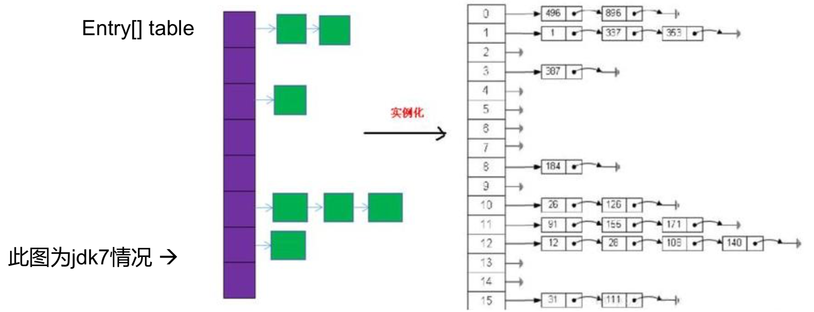

        2. JDK8版本发布以后：HashMap是数组+链表+红黑树实现。

            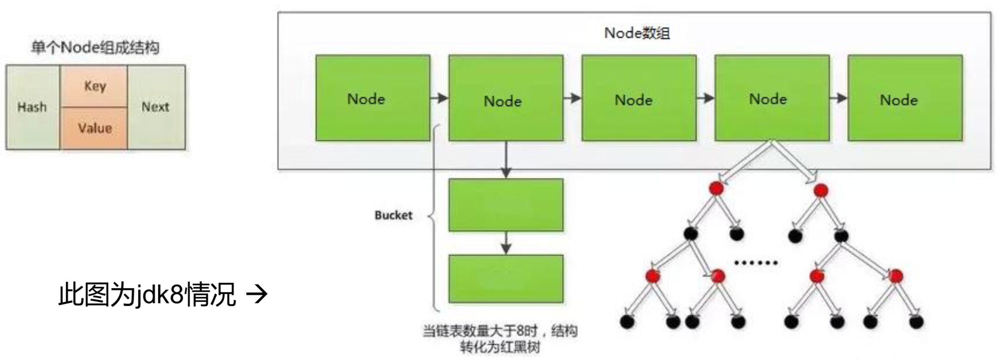

        3. HashMap源码中的重要常量：

            1. DEFAULT_INITIAL_CAPACITY：HashMap的默认容量，16
            2. MAXIMUM_CAPACITY：HashMap的最大支持容量，$2^{30}$
            3. DEFAULT_LOAD_FACTOR：HashMap的默认加载因子
            4. TREEIFY_THRESHOLD：Bucket中链表长度大于该默认值，转换为红黑树
            5. UNTREEIFY_THRESHOLD：Bucket中红黑树存储的Node小于该默认值，转化为链表。
            6. MIN_TREEIFY_CAPACITY：桶中的Node被树化时最小的hash表容量。（当桶中Node的数量大到需要变红黑树时，若hash表容量小于MIN_TREEIFY_CAPACITY时，此时应执行resize扩容操作这个MIN_TREEIFY_CAPACITY的值至少时TREEIFY_THRESHOLD的4倍。）
            7. table：存储元素的数组，总是2的n次幂。
            8. entrySet：存储具体元素的集
            9. size：HashMap中存储的键值对的数量
            10. modCount：HashMap扩容和结构改变的次数。
            11. threshold：扩容的临界值，=容量*填充因子
            12. loadFactor：填充因子

        4. HashMap的存储结构：JDK1.8之前

            1. HashMap的内部存储结构其实是数组和链表的结合。当实例化一个HashMap时，系统会创建一个长度为Capacity的Entry数组，这个长度在哈希表中被称为容量（Capacity），在这个数组中可以存放元素的位置我们称之为“桶”（bucket），每个bucket都有自己的索引，系统可以根据索引快速的查找bucket中的元素。
            2. 每个bucket中存储一个元素，即一个Entry对象，但每一个Entry对象可以带一个引用变量，用于指向下一个元素，因此，在一个桶中，就有可能生成一个Entry链。而且新添加的元素作为链表的head。
            3. 添加元素的过程：
                1. 向HashMap中添加entry1(key, value)，需要首先计算entry1中key的哈希值（根据key所在类的hashCode()计算得到），此哈希值经过处理以后，得到在底层Entry[]数组中要存储的位置i。如果位置i上没有元素，则entry1直接添加成功。如果位置i上已经存在entry2（或还有链表存在的entry3，entry4），则需要通过循环的方法，一次比较entry1中key和其他的entry。如果彼此hash值不同，则直接添加成功。如果hash值相同，继续比较二者是否equals。如果返回值为true，则使用entry1的value去替换equals为true的entry的value。如果遍历一遍以后，发现所有的equals返回都为false，则entry1仍可添加成功。entry1指向原有的entry元素。
            4. HashMap的扩容
                1. 当HashMap中的元素越来越多的时候，hash冲突的几率也就越来越高，因为数组的长度是固定的。所以为了提高查询的效率，就要对HashMap的数组进行扩容，而在HashMap数组扩容之后，最消耗性能的点就出现了：原数组中的数组必须重新计算其在新数组中的位置，并放进去，这就是resize。
            5. 那么HashMap什么时候进行扩容呢？
                1. 当HashMap中的元素个数超过数组大小（数组总大小length，不是数组中个数size） * loadFactor时，就会进行数组扩容，loadFactory的默认值（DEFAULT_LOAD_FACTOR）为0.75，这是一个折中的取值。也就是说，默认情况下，数组大小（DEFAULT_INITIAL_CAPACITY）为16，那么当HashMap中元素个数超过16 * 0.75=12（这个值就是代码中的thresold值，也叫做临界值）的时候，就把数组的大小扩展为 2 * 16 = 32，即扩大一倍，然后重新计算每个元素在数组中的位置，而这是一个非常消耗性能的操作，所以如果我们已经预知HashMap中元素的个数，那么预设元素的个数能够有效的提高HashMap的性能。

        5. HashMap的存储结构：JDK1.8

            1. HashMap的内部存储结构其实是数组+链表+树的结合。当实例化一个HashMap时，会初始化initialCapacity和loadFactory，在put第一对映射关系时，系统会创建一个长度为initialCapacity的Node数组，这个长度在哈希表中被称为容量（Capacity），在这个数组中可以存放元素的位置我们称之为“桶”（bucket），每个bucket都有自己的索引，系统可以根据索引快速的查找bucket中的元素。
            2. 每个bucket中存储一个元素，即一个Node对象，但每一个Node对象可以带一个引用变量next，用于指向下一个元素，因此，在一个桶中，就有可能生成一个Node链。也可能是一个一个TreeNode对象，每一个TreeNode对象可以有两个叶子结点left和right，因此，在一个桶中，就有可能生成一个TreeNode树。而新添加的元素作为链表的last，或树的叶子结点。
            3. 那么HashMap什么时候进行扩容和树形化呢？
                1. 当HashMap中的元素个数超过数组大小（数组总大小length，不是数组中个数size） * loadFactor 时，就会进行数组扩容，loadFactor的默认值（DEFAULT_LOAD_FACTOR）为0.75，这是一个折中的取值。也就是说，默认情况下，数组大小（DEFAULT_INITIAL_CAPACITY）为16，那么当HashMap中元素个数超过 16 * 0.75 = 12（这个值就是代码中的thresold值，也叫做临界值）的时候，就把数组的大小扩展为 2 * 16 = 32，即扩大一倍，然后重新计算每个元素在数组中的位置，而这是一个非常消耗性能的操作，所以如果我们已经预知HashMap中元素的个数，那么预设元素的个数能够有效的提高HashMap的性能。
                2. 当HashMap中的其中一个链的对象个数如果达到了8个，此时如果capacity没有达到64，那么HashMap会先扩容解决，如果已经达到了64，那么这个链会变成树，结点类型有Node变成TreeNode类型。当前，如果当映射关系被移除后，下次resize方法时判断树的结点个数低于6个，也会把树在转为链表。
            4. 关于映射关系的key是否可以修改？answer：不要修改
                1. 映射关系存储到HashMap中会存储key的hash值，这样就不用在每次查找时重新计算每一个Entry或Node（TreeNode）的hash值了，因此如果已经put到Map中的映射关系，在修改key的属性，而这个属性有参与了hashCode值的计算，那么会导致匹配不上。
            5. 总结：JDK1.8相较于之前的变化：
                1. HashMap map = new HashMap(); // 默认情况下，先不创建长度为16的数组
                2. 当每次调用map.put()时，在创建长度为16的数组
                3. 数组为Node类型，在JDK7中称为Entry类型
                4. 形成链表结构时，新添加的key-value对在链表的尾部（七上八下）
                5. 当数组指定索引位置的链表长度 > 8时，且map中的数组的长度 > 64 时，此索引位置上的所有key-value对使用红黑树进行存储。

        6. 负载因子值的大小，对HashMap有什么影响

            1. 负载因子的大小决定了HashMap的数据密度
            2. 负载因子越大密度越大，发生碰撞的几率越高，数组中的链表越容易长，造成查询或插入时的比较次数增多，性能会下降。
            3. 负载因子越小，就越容易触发扩容，数据密度也越小，意味着发生碰撞的几率越小，数组中的链表也就越短，查询和插入时比较的次数也越小，性能会更高。但是会浪费一定的内容空间。而且经常扩容也会影响性能，建议初始化预设大一点的空间。
            4. 按照其他语言的参考及研究经验，会考虑将负载因子设置为0.7-0.75，此时平均检索长度接近于常数。

8. Map实现类之二：LinkedHashMap
    1. LinkedHashMap 是 HashMap 的子类
    2. 在HashMap存储结构的基础上，使用了一对双向链表来记录添加元素的顺序
    3. 与LinkedHashSet类似，LinkedHashMap 可以维护 Map 的迭代顺序：迭代顺序与 Key-Value 对的插入顺序一致

9. Map实现类之三：TreeMap
    1. TreeMap存储 Key-Value 对时，需要根据 key-value 对进行排序。TreeMap 可以保证所有的 Key-Value 对处于有序状态。
    2. TreeSet底层使用红黑树结构存储数据
    3. TreeMap 的 Key 的排序：
        1. 自然排序：TreeMap 的所有的 Key 必须实现 Comparable 接口，而且所有的 Key 应该是同一个类的对象，否则将会抛出 ClassCastException
        2. 定制排序：创建 TreeMap 时，传入一个 Comparator 对象，该对象负责对 TreeMap 中的所有 key 进行排序。此时不需要 Map 的 Key 实现 Comparable 接口
    4. TreeMap判断两个key相等的标准：两个key通过compareTo()方法或者compare()方法返回0。

10. Map实现类之四：Hashtable
    1. Hashtable是个古老的 Map 实现类，JDK1.0就提供了。不同于HashMap，Hashtable是线程安全的。
    2. Hashtable实现原理和HashMap相同，功能相同。底层都适用哈希表结构，查询速度快，很多情况下可以互用。
    3. 与HashMap不同，Hashtable 不允许使用 null 作为 key 和 value
    4. 与HashMap一样，Hashtable 也不能保证其中 Key-Value 对的顺序
    5. Hashtable判断两个key相等、两个value相等的标准，与hashMap一致。

11. Map实现类之五：Properties
    1. Properties 类是 Hashtable 的子类，该对象用于处理属性文件
    2. 由于属性文件里的 key、value 都是字符串类型，所以 Properties 里的 key 和 value 都是字符串类型
    3. 存取数据时，建议使用setProperty(String key,String value)方法和getProperty(String key)方法

### Collections工具类

### Enumeration

1. Enumeration 接口是 Iterator 迭代器的 “古老版本”

## 泛型Generic

### 在集合中使用泛型

### 自定义泛型结构

1. 泛型类、泛型接口
    1. 泛型类可能有多个参数，此时应将多个参数一起放在尖括号内。比如：`<E1,E2,E3>`
    2. 泛型类的构造器如下：public GenericClass() {}。
    3. 实例化后，操作原来泛型位置的结构必须与指定的泛型类型一致。
    4. 泛型不同的引用不能相互赋值。
        1. 尽管在编译时`ArrayList<String>`和`ArrayList<Integer>`是两种类型，但是，在运行时只有一个ArrayList被加载到JVM中。
    5. 泛型如果不指定，将被擦除，泛型对应的类型均按照Object处理，但不等价于Object。经验：泛型要使用就一路都用。要不用，一路都不要用。
    6. 如果泛型结构是一个接口或抽象类，则不可创建泛型类的对象。
    7. jdk1.7，泛型的简化操作：`ArrayList<Fruit> list = new ArrayList<>();`
    8. 泛型的指定中不能使用基本数据类型，可以使用包装类替换。
    9. 在类/接口上声明的泛型，在本类或本接口中即代表某种类型，可以作为非静态属性的类型、非静态方法的参数类型、非静态方法的返回值类型。但在静态方法中不能使用类的泛型。
    10. 异常类不能时泛型的。
    11. 不能使用new E[]。但是可以 E[] elements = (E[])new Object[capacity];
         1. 参考：ArrayList源码中声明：Object[] elementData，而非泛型参数类型数组。
    12. 父类有泛型，子类可以选择保留泛型也可以选择指定泛型类型：
         1. 子类不保留父类的泛型：按需实现
             1. 没有类型 擦除
             2. 具体类型
         2. 子类保留父类的泛型：泛型子类
             1. 全部保留
             2. 部分保留
         3. 结论：子类必须时“富二代”，子类除了执行或保留父类的泛型，还可以增加自己的泛型
2. 泛型方法：

### 泛型在继承上的体现

1. 如果B是A的一个子类型（子类或者子接口），而G是具有泛型声明的类或接口，`G<B>` 并不是 `G<A>` 的子类型！
2. 比如：String是Object的子类，但是 `List<String>` 并不是 `List<Object>` 的子类。

### 通配符

1. 使用类型通配符：? 
    1. 比如：`List<?> Map<?,?>`
    2. `List<?>` 是 `List<String>`、`List<Object>` 等各种泛型List的父类。
2. 读取 `List<?>` 的对象list中的元素时，永远是安全的，因为不管list的真实类型是什么，它包含的都是Object。
3. 写入list中的元素时，不行。因为我们不知道c的元素类型，我们不能向其中添加对象。
    1. 唯一的例外是null，它是所有类型的成员。
4. 有限制的通配符：
    1. `<?>`: 允许所有的泛型的引用调用
    2. 通配符指定上限：
        1. 上限extends：使用时指定的类型必须是继承某个类，或者实现某个接口，即<=
    3. 通配符指定下限：
        1. 下限super：使用时指定的类型不能小于操作的类，即>=
    4. 举例：
        1. `<? extends Number>` (无穷小, Number]：
            1. 只允许泛型为Number及Number子类的引用调用
        2. `<? super Number>` [Number, 无穷大)：
            1. 只允许泛型为Number及Number父类的引用调用
        3. `<? extends Comparable>`：
            1. 只允许泛型为实现Comparable接口的实现类的引用调用

## 枚举类Enum

### 枚举类的使用

1. 枚举类的实现
    1. JDK1.5之前需要自定义枚举类
    2. JDK1.5新增的enum关键字用于定义枚举类
2. 若枚举类只有一个对象，则可以作为一种单例模式的实现方式。
3. 枚举类的属性
    1. 枚举类对象的属性不应允许被改动, 所以应该使用 private final 修饰
    2. 枚举类的使用 private final 修饰的属性应该在构造器中为其赋值
    3. 若枚举类显式的定义了带参数的构造器, 则在列出枚举值时也必须对应的传入参数

### 自定义枚举类

1. 私有化类的构造器，保证不能在类的外部创建其对象
2. 在类的内部创建枚举类的实例。声明为：public static final
3. 对象如果有实例变量，应该声明为 private final，并在构造器中初始化

### 使用enum定义枚举类

1. 使用说明
    1. 使用enum定义的枚举类默认继承了java.lang.Enum类，因此不能在继承其他类
    2. 枚举类的构造器只能使用 private 访问控制符
    3. 枚举类的所有实例必须在枚举类中显式列出(`,` 分隔 `;` 结尾)。列出的实例系统会自动添加 public static final 修饰
    4. 必须在枚举类的第一行声明枚举类对象
2. JDK 1.5 中可以在 switch 表达式中使用Enum定义的枚举类的对象作为表达式，case 子句可以直接使用枚举值的名字，无需添加枚举类作为限定。

### 实现接口的枚举类

1. 和普通 Java 类一样，枚举类可以实现一个或多个接口
2. 若每个枚举值在调用实现的接口方法呈现相同的行为方式，则只要统一实现该方法即可。
3. 若需要每个枚举值在调用实现的接口方法呈现出不同的行为方式，则可以让每个枚举值分别来实现该方法。

## 注解Annotation

### 在编译时进行格式检查（JDK内置的三个基本注解）

1. @Override：限定重写父类方法，该注释只能用于方法
2. @Deprecated：用于表示某个程序元素（类，方法等）已过时。通常是因为锁修饰的结构危险或存在更好的选择
3. @SuppressWarnings：抑制编译器警告

### 自定义Annotation：

1. 定义新的 Annotation 类型使用 @interface 关键字
2. 自定义注解自动继承了java.lang.annotation.Annotation接口
3. Annotation 的成员变量在 Annotation 定义中以无参数方法的形式来声明。其方法名和返回值定义了该成员的名字和类型。我们称为配置参数。类型只能是八种基本数据类型、String类型、Class类型、enum类型、Annotation类型、以上所有类型的数组。
4. 可以在定义 Annotation 的成员变量时为其指定初始值，指定成员变量的初始值可使用 default 关键字
5. 如果只有一个参数成员，建议使用参数名为value
6. 如果定义的注解包含配置参数，那么使用时必须指定参数值，除非它有默认值。格式为“参数名 = 参数值”，如果只有一个参数成员，且名称为value，可以省略“value=”
7. 没有成员定义的 Annotation 称为标记；包含成员变量的 Annotation 称为元数据 Annotation
8. 注意：
    1. 自定义注解必须配上注解的信息处理流程才有意义。

### JDK 的元注解

1. JDK 的元 Annotation 用于修饰其他 Annotation 定义
2. JDK5.0提供了4个标准的meta-annotation类型，分别是：
    1. @Retention：
      
        1. 只能用于修饰一个 Annotation 定义，用于指定该 Annotation 的生命周期，@Retention 包含一个 RetentionPolicy 类型的成员变量，使用 @Retention 时必须为该 value 成员变量指定值
            1. RetentionPolicy.SOURCE：在源文件中有效（即源文件保留），编译器直接丢弃这种策略的注释
            2. RetentionPolicy.CLASS：在class文件中有效（即class保留），当运行 Java 程序时，JVM 不会保留注解。这是默认值
            3. RetentionPolicy.RUNTIME：在运行时有效（即运行时保留），当运行 Java 程序时，JVM 会保留注释。程序可以通过反射获取该注释
        
    2. @Target：
    
        1. 用于修饰 Annotation 定义，用于指定被修饰的 Annotation 能用于修饰哪些程序元素。@Target 也包含一个名为 value 的成员变量。
    
            | 取值（ElementType） |                                            |
            | ------------------- | ------------------------------------------ |
            | CONSTRUCTOR         | 用于描述构造器                             |
            | PACKAGE             | 用于描述包                                 |
            | FIELD               | 用于描述域                                 |
            | PARAMETER           | 用于描述参数                               |
            | LOCAL_VARIABLE      | 用于描述局部变量                           |
            | TYPE                | 用于描述类、接口（包括注解类型）或enum声明 |
            | METHOD              | 用于描述方法                               |
    
    3. @Documented：
    
        1. 用于指定被该元 Annotation 修饰的 Annotation 类将被 javadoc 工具提取成文档。默认情况下，javadoc是不包括注解的。
            1. 定义为Documented的注解必须设置Retention值为RUNTIME。
    
    4. @Inherited：
    
        1. 被它修饰的 Annotation 将具有继承性。如果某个类使用了被 @Inherited 修饰的 Annotation，则其子类将自动具有该注解。
            1. 比如：如果把标有@Inherited注解的自定义的注解标注在类级别上，子类则可以继承父类类级别的注解
            2. 实际应用中，使用较少

### 利用反射获取注解信息

1. JDK 5.0 在 java.lang.reflect 包下新增了 AnnotatedElement 接口，该接口代表程序中可以接受注解的程序元素
2. 当一个 Annotation 类型被定义为运行时 Annotation 后，该注释才是运行时可见，当 class 文件被载入时保存在 class 文件中的 Annotation 才会被虚拟机读取
3. 程序可以调用 AnnotationElement 对象的如下方法来访问 Annotation 信息

### JDK8中注解的新特性

1. Java8对注解处理提供了两点改进：可重复的注解及可用于类型的注解。此外，反射也得到了加强，在Java8中能够得到方法参数的名称。这会简化标注在方法参数上的注解。
2. 类型注解：
    1. JDK1.8之后，关于元注解@Target的参数类型ElementType枚举值多了两个：TYPE_PARAMETER、TYPE_USE。
    2. 在Java8之前，注解只能是在声明的地方所使用，Java8开始，注解可以应用在任何地方。
        1. ElementType.TYPE_PARAMETER 表示该注解能写在类型变量的声明语句中（如：泛型声明）。
        2. ElementType.TYPE_USE 表示该注解能写在使用类型的任何语句中。

## IO流

### File类的使用

1. java.io.File类：文件和文件目录路径的抽象表示形式，与平台无关
2. File能新建、删除、重命名文件和目录，但File不能访问文件内容本身。如果需要访问文件内容本身，则需要使用输入/输出流。
3. 想要在Java程序中表示一个真实存在的文件或目录，那么必须有一个File对象，但是Java程序中的一个File对象，可能没有一个真实存在的文件或目录。
4. File对象可以作为参数传递给流的构造器。

### IO流原理及流的分类

1. Java IO原理
2. 流的分类

    1. 按操作数据单位不同分类：字节流（8bit），字符流（16bit）

    2. 按数据流的流向不同分为：输入流，输出流

    3. 按流的角色的不同分为：节点流，处理流

        | 抽象基类 | 字节流       | 字符流 |
        | -------- | ------------ | ------ |
        | 输入流   | InputStream  | Reader |
        | 输出流   | OutputStream | Writer |

        1. Java的IO流共涉及40多个类，实际上非常规则，都是从以上4个抽象基类派生的。
        2. 由这四个类派生出来的子类名称都是以其父类名作为子类名后缀。

3. IO流体系：

    | 分类       | 字节输入流           | 字节输出流            | 字符输入流        | 字符输出流          |
    | ---------- | -------------------- | --------------------- | ----------------- | ------------------- |
    | 抽象基类   | InputStream          | OutputStream          | Reader            | Writer              |
    | 访问文件   | FileInputStream      | FileOutputStream      | FileReader        | FileWriter          |
    | 访问数组   | ByteArrayInputStream | ByteArrayOutputStream | CharArrayReader   | CharArrayWriter     |
    | 访问管道   | PipedInputStream     | PipedOutputStream     | PipedReader       | PipedWriter         |
    | 访问字符串 |                      |                       | StringReader      | StringWriter        |
    | 缓冲流     | BufferedInputStream  | BufferedOutputStream  | BufferedReader    | BufferedWriter      |
    | 转换流     |                      |                       | InputStreamReader | OutputStreamWriter |
    | 对象流     | ObjectInputStream    | ObjectOutputStream    |                   |                     |
    |            | FilterInputStream    | FilterOutputStream    | FilterReader      | FilterWriter        |
    | 打印流     |                      | PrintStream           |                   | PrintWriter         |
    | 推回输入流 | PushbackInputStream  |                       | PushbackReader    |                     |
    | 特殊流     | DataInputStream      | DataOutputStream      |                   |                     |

4. 节点流：文件流

    1. 注意点
        1. 定义文件路径时，注意：可以用`/`或者`\\`。
        2. 在写入一个文件时，如果使用构造器FileOutputStream(file)，则目录下有同名文件将被覆盖。
        3. 如果使用构造器FileOutputStream(file, true)，则目录下的同名文件不会被覆盖，在文件内容末尾追加内容。
        4. 在读取文件时，必须保证该文件已存在，否则报异常。
        5. 字节流操作字节，比如：.mp3等
        6. 字符流操作字符，只能操作普通文本文件。最常见的文本文件：.txt等语言的源代码。尤其注意.doc这些不是文本文件。

5. 处理流之一：缓冲流

    1. 当读取数据时，数据按块读取缓冲区，其后的读操作则直接访问缓冲区。
    2. 当使用BufferedInputStream读取字节文件时，BufferedInputStream会一次性从文件读取8192个（8KB），存在缓冲区中，知道缓冲区装满了，才重新从文件中读取下一个8192个字节数组。
    3. 向流中写入字节时，不会直接写到文件，先写到缓冲区中知道缓冲区写满，BufferedOutputStream才会把缓冲区中的数据一次性写到文件里。使用flush()可以强制将缓冲区的内容全部写入输出流。
    4. 关闭流的顺序和打开流的顺序相反。只要关闭最外层流即可，关闭最外层流也会相应关闭内层节点流。
    5. flush()方法的使用：手动将buffer中内容写入文件
    6. 如果是带缓冲区的流对象的close()方法，不但会关闭流，还会在关闭流之前刷新缓冲区，关闭后不能在写出。

6. 处理流之二：转换流

    1. 转换流提供了在字节流和字符流之间的转换。
    2. 字节流中的数据都是字符时，转成字符流操作更高效。
    3. 很多时候我们使用转换流来处理文件乱码问题。实现编码和解码的功能。

7. 处理流之三：标准输入、输出流

    1. System.in 和 System.out 分别代表了系统标准的输入和输出设备。
    2. 默认输入设备是：键盘，输出设备是：显示器
    3. System.in的类型是InputStream
    4. System.out的类型是PrintStream，其是OutputStream的子类FilterOutputStream的子类。
    5. 重定向：通过System类的setIn，setOut方法对默认设备进行改变。
        1. public static void setIn(InputStream in)
        2. public static void setOut(PrintStream out)

8. 处理流之四：打印流

    1. 实现将基本数据类型的数据格式转化为字符串输出
    2. 打印流：PrintStream和PrintWriter
        1. 提供了一系列重载的print()和println()方法，用于多种数据类型的输出
        2. PrintStream和PrintWriter的输出不会抛出IOException异常
        3. PrintStream和PrintWriter有自动flush功能
        4. PrintStream打印的所有字符都适用平台的默认字符编码转换为字节。在需要写入字符而不是写入字节的情况下，应该使用PrintWriter类。
        5. System.out返回的是PrintStream的实例。

9. 处理流之五：数据流

    1. 为了方便地操作Java语言的基本数据类型和String的数据，可以使用数据流。

10. 处理流之六：对象流

    1. ObjectInputStream和ObjectOutputStream
        1. 用于存储和读取基本数据类型数据或对象的处理流。他的强大之处就是可以把Java中的对象写入到数据源中，也能把对象从数据源中还原回来。
    2. 序列化：用ObjectOutputStream类保存基本数据类型或对象的机制。
    3. 反序列化：用ObjectInputStream类读取基本类型数据或对象的机制
    4. ObjectOutputStream和ObjectInputStream不能序列化static和transient修饰的成员变量。

11. 对象的序列化

    1. 对象序列化机制允许把内存中的Java对象转换成平台无关的二进制流，从而允许把这种二进制流持久地保存在磁盘上，或通过网络将这种二进制流传输到另一个网络节点。当其它程序获取了这种二进制流，就可以恢复成原来的Java对象
    2. 序列化的好处在于可将任何实现了Serializable接口的对象转化为字节数据，使其在保存和传输时可被还原
    3. 序列化是 RMI（Remote Method Invoke – 远程方法调用）过程的参数和返回值都必须实现的机制，而 RMI 是 JavaEE 的基础。因此序列化机制是 JavaEE 平台的基础
    4. 如果需要让某个对象支持序列化机制，则必须让对象所属的类及其属性是可序列化的，为了让某个类是可序列化的，该类必须实现如下两个接口之一。否则，会抛出NotSerializableException异常
        1. Serializable
        2. Externalizable
    5. 凡是实现Serializable接口的类都有一个表示序列化版本标识符的静态变量：
        1. private static final long serialVersionUID;
        2. serialVersionUID用来表明类的不同版本间的兼容性。简言之，其目的是以序列化对象进行版本控制，有关各版本反序列化时是否兼容。
        3. 如果类没有显示定义这个静态变量，它的值是Java运行时环境根据类的内部细节自动生成的。若类的实例变量作了修改，serialVersionUID 可能发生变化。故建议，显式声明
    6. 简单来说，Java的序列化机制是通过在运行时判断类的serialVersionUID来验证版本一致性的。在进行反序列化时，JVM会把传来的字节流中的serialVersionUID与本地相应实体类的serialVersionUID进行比较，如果相同就认为是一致的，可以进行反序列化，否则就会出现序列化版本不一致的异常。（InvalidCastExcption）
    7. java.io.Serializable接口的理解：
        1. 实现了Serializable接口的对象，可将他们转换成一系列字节，并可在以后完全恢复回原来的样子。这一过程亦可通过网络进行。这意味着序列化机制能自动补擦操作系统间的差异。换句话说，可以先在Windows机器上创建一个对象，对其序列化，然后通过网络发给一台Unix机器，然后在那里准确无误地重新“装配”。不必关心数据在不同机器上如何表示，也不必关系字节的顺序或者其他任何细节。
        2. 由于大部分作为参数的类如String、Integer等实现了java.io.Serializable的接口，也可以利用多态的性质，作为参数使接口更灵活。

12. 随机存取文件流：RandomAccessFile类

    1. RandomAccessFile声明在java.io包下，但直接继承于java.lang.Object类。并且他实现了DataInput、DataOutput这两个接口，也就意味着这个类既可以读也可以写。
    2. RandomAccessFile类支持“随机访问”方式，程序可以直接跳到文件的仁义地方来读、写文件
        1. 支持只访问文件的部分内容
        2. 可以向已存在的文件后面追加内容
    3. RandomAccessFile对象包含一个记录指针，用以标示当前读写处的位置。RandomAccessFile类对象可以自由移动记录指针：
        1. long getFilePointer(): 获取文件记录指针的当前位置。
        2. void seek(long pos): 将文件记录指针定位到pos位置


### 流的基本应用小节

1. 流是用来处理数据的。
2. 处理数据时，一定要先明确数据源，与数据目的地
    1. 数据源可以是文件，可以是键盘
    2. 数据目的地可以时文件、显示器或者其他设备。
3. 而流只是在帮助数据进行传输，并对传输的数据进行处理，比如过滤处理、转换处理等。

### NIO.2中Path、Paths、Files类的使用

1. Java NIO概述
    1. Java NIO（New IO，Non-Blocking IO）是从Java1.4版本开始引入的一套新的IO API，可以替代标准的Java IO API。NIO与原来的IO有同样的作用和目的，但是使用的方式完全不同，NIO支持面向缓冲区的（IO时面向流的）、基于通道的IO操作。NIO将以更加高效的方式进行文件的读写操作。
    2. Java API中提供了两套NIO，一套是针对标准输入输出NIO，另一套就是网络编程NIO。
2. NIO.2
3. Path、Paths和Files核心API


## 多线程：

### API中创建线程的两种方式

1. JDK1.5之前创建新执行线程有两种方法：
    1. 继承Thread类的方式
    2. 实现Runnable接口的方式
2. 方式一：继承Thread类
    1. 定义子类继承Thread类。
    2. 子类中重写Thread类中的run方法。
    3. 创建Thread子类对象，即创建了线程对象。
    4. 调用线程对象start方法：启动线程，调用run方法。
3. 方式二：实现Runnable接口
    1. 定义子类，实现Runnable接口。
    2. 子类中重写Runnable接口中的run方法。
    3. 通过Thread类含参构造器创建线程对象。
    4. 将Runnable接口的子类对象作为实际参数传递给Thread类的构造方法中。
    5. 调用Thread类的start方法：开启线程，调用Runnable子类接口的run方法。
4. 继承方式和实现方式的联系与区别
    1. 区别：
        1. 继承Thread：    线程代码存放Thread子类run方法中。
        2. 实现Runnable：  线程代码存在接口的子类的run方法。
    2. 实现方法的好处
        1. 避免了单继承的局限性
        2. 多个线程可以共享同一个接口实现类的对象，非常适合多个相同线程来处理同一份资源。

### 线程的调度

1. 调度策略
    1. 时间片
    2. 抢占式：高优先级的线程抢占CPU
2. Java的调度方法
    1. 同优先级线程组成先进先出队列（先到先服务），使用时间片策略
    2. 对高优先级，使用优先调度的抢占式策略

### 线程的分类

1. Java中的线程分为两类：一种是守护线程，一种是用户线程。
    1. 它们在几乎每个方面都是相同的，唯一的区别是判断JVM何时离开。
    2. 守护线程是用来服务用户线程的，通过在start()方法前调用thread.setDaemon(true)可以把一个用户线程变成一个守护线程。
    3. Java垃圾回收就是一个典型的守护线程。
    4. 若JVM中都是守护线程，当前JVM将退出。

### 线程的生命周期

1. JDK中用Thread.State类定义了线程的几种状态
    1. 要想实现多线程，必须在主线程中创建新的线程对象。Java语言使用Thread类及其子类的对象来表示线程，在它的一个完整的生命周期中通常要经历如下的五种状态：
        1. 新建：当一个Thread类或其子类的对象被声明并创建时，新生的线程对象处于新建状态
        2. 就绪：处于新建状态的线程被start()后，将进入线程队列等待CPU时间片，此时它已具备了运行的条件，只是没分配到CPU资源
        3. 运行：当就绪的线程被调度并获得CPU资源时，便进入运行状态，run()方法定义了线程的操作和功能
        4. 阻塞：在某种特殊情况下，被认为挂起或执行输入输出操作时，让出CPU并临时终止自己的执行，进入阻塞状态
        5. 线程完成了它的全部工作或线程被提前强制性地终止或出现异常导致结束

### 线程的同步

1. synchronized的使用方法

    1. Java对于多线程的安全问题提供了专业的解决方式：同步机制

        1. 同步代码块：

            ```
            synchronized(对象) {
            	// 需要被同步的代码;
            }
            ```

        2. synchronized还可以放在方法声明中，表示整个方法为同步方法。

            ```
            public synchronized void show() {...}
            ```

    2. 同步机制中的锁：

        1. 同步锁机制
        2. synchronized的锁是什么
            1. 任意对象都可以作为同步锁。所有对象都自动含有单一的锁（监视器）。
            2. 同步方法的锁：静态方法（类名.class）、非静态方法（this）
            3. 同步代码块：自己指定，很多时候也是指定为this或类名.class
        3. 注意：
            1. 必须确保使用同一个资源的多个线程共用一把锁，这个非常重要，否则就无法保证共享资源的安全。
            2. 一个线程类中的所有静态方法共用同一把锁（类名.class），所有非静态方法共用同一把锁（this），同步代码块（指定需谨慎）
        4. 释放锁的操作：
            1. 当前线程的同步方法、同步代码块执行结束
            2. 当前线程在同步代码块、同步方法中遇到break、return终止了该代码块、该方法的继续执行。
            3. 当前线程在同步代码块、同步方法中出现了未处理的Error或Exception，导致异常结束
            4. 当前线程在同步代码块、同步方法中执行了线程对象的wait()方法，当前线程暂停，并释放锁。
        5. 不会释放锁的操作：
            1. 线程执行同步代码块或同步方法时，程序调用Thread.sleep()、Thread.yield()方法暂停当前线程的执行
            2. 线程执行同步代码块时，其他线程调用了该线程的suspend()方法将该线程挂起，该线程不会释放锁（同步监视器）。
                1. 应尽量避免使用suspend()和resume()来控制线程

2. Lock（锁）

    1. 从JDK5.0开始，Java提供了更强大的线程同步机制——通过显示定义同步锁对象来实现同步。同步锁使用Lock对象充当。

    2. java.util.concurrent.locks.Lock接口时控制多个线程对共享资源进行访问的工具。锁提供了对共享资源的独占访问，每次只能有一个线程对Lock对象加锁，线程开始访问共享资源之前应当先获得Lock对象。

    3. ReentrantLock类实现了Lock，他拥有与synchronized相同的并发性和内存语义，在实现线程安全的控制中，比较常用的是ReentrantLock，可以显示加锁、释放锁。

        ```
        lock.lock();
        try {
        	// 保证线程安全的代码;
        } finally {
        	lock.unlock(); // 注意！
        }
        ```

3. synchronized与Lock的对比

    1. Lock是显示锁（手动开启和关闭锁，别忘记关闭锁），synchronized是隐式锁，出了作用域自动释放。
    2. Lock只有代码块锁，synchronzied有代码块锁和方法锁
    3. 使用Lock锁，JVM将花费较少的时间来调度线程，性能更好。并且具有更好的扩展性（提供更多的子类）

4. 优先使用顺序：

    1. Lock -> 同步代码块（已经进入了方法体，分配了相应资源） -> 同步方法（在方法体之外）

### 线程通信

1. wait() 与 notify() 和 notifyAll()
    1. wait()：令当前线程挂起并放弃CPU、同步资源并等待，使别的线程可访问并修改共享资源，而当前线程排队等候其他线程调用notify()或notifyAll()方法唤醒，唤醒后等待重新获得对监视器的所有权才能继续执行。
    2. notify()：唤醒正在排队等待同步资源的线程中优先级最高者结束等待。
    3. notifyAll()：唤醒正在排队等待资源的所有线程结束等待。
2. 这三个方法只有在synchronized方法或synchronized代码块中才能使用，否则会报java.lang.IllegalMonitorStateException异常。
3. 因为这三个方法必须有锁对象调用，而任意对象都可以作为synchronized的同步锁，因此这三个方法只能在Object类中声明。
4. wait() 方法:
    1. 在当前线程中调用方法：  对象名.wait()
    2. 使当前线程进入等待（某对象）状态 ，直到另一线程对该对象发出 notify (或notifyAll) 为止。
    3. 调用方法的必要条件：当前线程必须具有对该对象的监控权（加锁）
    4. 调用此方法后，当前线程将释放对象监控权，然后进入等待
    5. 在当前线程被notify后，要重新获得监控权，然后从断点处继续代码的执行。
5. notify()/notifyAll()
    1. 在当前线程中调用方法：  对象名.notify()
    2. 功能：唤醒等待该对象监控权的一个/所有线程。
    3. 调用方法的必要条件：当前线程必须具有对该对象的监控权（加锁）

### JDK5.0新增线程创建方式

1. 新增方式一：实现Callable接口
    1. 与使用Runnable相比，Callable功能更强大些
        1. 相比run()方法，可以有返回值
        2. 方法可以抛出异常
        3. 支持泛型的返回值
        4. 需要借助FutureTask类，比如获取返回结果
    2. Future接口
        1. 可以对具体Runnable、Callable任务的执行结果进行取消、查询是否完成、获取结果等
        2. FutureTask是Future接口的唯一的实现类
        3. FutureTask同时实现了Runnable，Future接口。它既可以作为Runnable被线程执行，又可以作为Future得到Callable的返回值
2. 新增方式二：使用线程池
    1. JDK5.0起提供了线程池相关API：ExecutorService和Executors
    2. ExecutorService：真正的线程池接口。常见子类ThreadPoolExecutor
        1. void execute(Runnable command)：执行任务/命令，没有返回值，一般用来执行Runnable
        2. `<T> Future<T> sumbit(Callable<T> task)`：执行任务，有返回值，一般用来执行Callable
        3. void shutdown()：关闭线程池
    3. Executors：工具类、线程池的工厂类，用于创建并返回不同类型的线程池
        1. Executors.newCachedThreadPool()：创建一个可根据需要创建新线程的线程池。
        2. Executors.newFixedThreadPool(n)：创建一个可重用固定线程数的线程池。
        3. Executors.newSingleThreadExecutor()：创建一个只有一个线程的线程池。
        4. Executors.newScheduledThreadPool(n)：创建一个线程池，它可安排在给定延迟后运行命令或者定期地执行。

## Java常用类：

### 字符串相关的类

1. 字符串相关的类：String
    1. String类：代表字符串。Java程序中的所有字符串字面值（如"abc"）都作为此类的实例实现。
    2. String是一个final类，代表不可变的字符序列
    3. 字符串是常量，用双引号引起来表示。它们的值在创建之后不能更改。
    4. String对象的字符内容是存储在一个字符数组value[]中的。
    5. 注意：
        1. 字符串常量存储在字符串常量池（String pool），目的是共享
        2. 常量与常量的拼接结果在字符串常量池（String pool）。且字符串常量池中不会存在相同内容的常量。
        3. 只要其中有一个是变量，结果就在堆中。
        4. 如果拼接的结果调用intern()方法，返回值就在字符串常量池中。
2. 字符串相关的类：StringBuffer
    1. java.lang.StringBuffer代表可变的字符序列，JDK1.0中声明，可以对字符串内容进行增删，此时不会产生新的对象。
    2. 很多方法与String相同。
    3. 作为参数传递时，方法内部可以改变值。
3. 字符串相关的类：StringBuilder
    1. StringBuilder 和 StringBuffer 非常类似，均代表可变的字符序列，而且提供相关功能的方法也一样
    2. 对比String、StringBuffer、StringBuilder
        1. String（JDK1.0）：不可变字符序列
        2. StringBuffer（JDK1.0）：可变字符序列、效率低、线程安全
        3. StringBuilder（JDK1.5）：可变字符序列、效率高、线程不安全
        4. 作为参数传递的话，方法内部String不会改变其值，StringBuffer和StringBuilder会改变其值。

### JDK8之前日期时间API

1. java.lang.System：

    1. System类提供的public static long currentTimeMills()用来返回当前时间与1970年1月1日0时0分0秒之间以毫秒为单位的时间差。
        1. 此方法适于计算时间差。
    2. 计算世界时间的主要标准有：
        1. UTC（Coordinated Universal Time）
        2. GMT（Greenwich Mean Time）
        3. CST（China Standard Time）

2. java.util.Date类

    1. 表示特定的瞬间，精确到毫秒
    2. 构造器：
        1. Date()：使用无参构造器创建的对象可以获取本地当前时间。
        2. Date(long date)
    3. 常用方法
        1. getTime()：返回自1970年1月1日 00:00:00 GMT以来此Date对象表示的毫秒数。
        2. toString()：把此Date对象转换为以下形式的String：dow mon dd h:mm:ss zzz yyyy 其中：dow是一周中的某一天（Sun，Mon，Tue，Web，Thu，Fri，Sat），zzz是时间标准。
        3. 其它很多方法都过时了。

3. java.text.SimpleDateFormat类

    1. Date类的API不易于国际化，大部分被废弃了，java.text.SimpleDateFormat类是一个不与语言环境有关的方式来格式化和解析日期的具体类。

    2. 它允许进行格式化：日期 -> 文本、解析：文本 -> 日期

    3. 格式化：

        1. SimpleDateFormat()：默认的模式和语言环境创建对象
        2. public SimpleDateFormat(String pattern)：该构造方法可以用参数pattern指定的格式创建一个对象，该对象调用
            1. public string fromat(Date date)：方法格式话时间对象date

    4. 解析：

        1. public Date parse(String source)：从给定字符串的开始解析文本，以生成一个日期。

           | 字母 | 日期或时间元素          | 表示              | 示例                                  |
           | ---- | ----------------------- | ----------------- | ------------------------------------- |
           | G    | Era标志符               | Text              | AD                                    |
           | y    | 年                      | Year              | 1996；96                              |
           | M    | 年中的月份              | Month             | July；Jul；07                         |
           | w    | 年中的周数              | Number            | 27                                    |
           | W    | 月份中的周数            | Number            | 2                                     |
           | D    | 年中的天数              | Number            | 189                                   |
           | d    | 月份中的天数            | Number            | 10                                    |
           | F    | 月份中的星期            | Number            | 2                                     |
           | E    | 星期中的天数            | Text              | Tuesday；Tue                          |
           | a    | AM/PM标记               | Text              | PM                                    |
           | H    | 一天中的小时数（0-23）  | Number            | 0                                     |
           | k    | 一天中的小时数（1-24）  | Number            | 24                                    |
           | K    | AM/PM中的小时数（0-11） | Number            | 0                                     |
           | h    | AM/PM中的小时数（1-12） | Number            | 12                                    |
           | m    | 小时中的分钟数          | Number            | 30                                    |
           | s    | 分钟中的秒数            | Number            | 55                                    |
           | S    | 毫秒数                  | Number            | 978                                   |
           | z    | 时区                    | General time zone | Pacific Standard Time；PST；GMT-08:00 |
           | Z    | 时区                    | RFC822 time zone  | -800                                  |

4. java.util.Calendar（日历）类：

    1. Calendar是一个抽象基类，主用用于完成日期字段之间相互操作的功能。
    2. 获取Calendar实例的方法
        1. 使用Calendar.getInstance()方法
        2. 调用它的子类GregorianCalendar的构造器。
    3. 一个Calendar的实例是系统时间的抽象表示，通过get(int field)方法来取得想要的时间信息。比如YEAR、MONTH、DAY_OF_WEEK、HOUR_OF_DAY、MINUTE、SECOND
    4. 注意：
       1. 获取月份时：一月是0，二月是1，以此类推，12月是11
       2. 获取星期是：周日是1，周一是2，以此类推，周六是7

### JDK8中新日期时间API

1. LocalDate、LocalTime、LocalDateTime

    1. LocalDate、LocalTime、LocalDateTime类是其中较重要的几个类，它们的实例是不可变的对象，分别表示使用ISO-8601日历系统的日期、时间和日期和时间。它们提供了简单的本地日期或时间，并不包含当前的时间信息，也不包含与失去相关的信息。

        1. LocalDate代表IOS格式（yyyy-MM-dd）的日期，可以储存生日、纪念日等日期。

        2. LocalTime表示一个时间，而不是日期。

        3. LocalDateTime是用来表示日期和时间的，这是一个最常用的类之一。

           | 方法                                                         | 描述                                                         |
           | ------------------------------------------------------------ | ------------------------------------------------------------ |
           | now()<br />* now(ZondId zone)                                | 静态方法，根据当前时间创建对象/指定时区的对象                |
           | of()                                                         | 静态方法，根据指定日期/时间创建对象                          |
           | getDayOfMonth()<br />getDayOfYear()                          | 获得月份天数（1-31）<br />获得年份天数（1-366）              |
           | getDayOfWeek()                                               | 获得星期几（返回一个DayOfWeek枚举值）                        |
           | getMonth()                                                   | 获得月份，返回一个Month枚举值                                |
           | getMonthValue()<br />getYear()                               | 获得月份（1-12）<br />获得年份                               |
           | getHour()<br />getMinute()<br />getSecond()                  | 获得当前对象对应的小时、分钟、秒                             |
           | withDayOfMonth()<br />withDayOfYear()<br />withMonth()<br />withYear() | 将月份天数、年份天数、月份、年份修改为指定的值并返回新的对象 |
           | plusDays()<br />plusWeeks()<br />plusMonths()<br />plusYears()<br />plusHours() | 向当前对象添加几天、几周、几个月、几年、几小时               |
           | minusMonths()<br />minusWeeks()<br />minusDays()<br />minusYears()<br />minusHours() | 从当前对象减去几月、几周、几天、几年、几小时                 |

2. 瞬时：Instant

    1. Instant：时间线上的一个瞬时点。这可能被用来记录应用程序中的事件时间戳。

    2. 在处理时间和日期的时候，我们通常会想到年，月，日，时，分，秒。然而，这只是时间的一个模型，是面向人类的。第二种通常模型是面向机器的，或者说是连续的。在此模型中，时间线中的一个点表示为一个很大的数，这有利于计算机处理。在UNIX中，这个数从1970年开始，以秒为的单位；同样的，在Java中，也是从1970年开始，但以毫秒为单位。

    3. java.time包通过值类型Instant提供机器视图，不提供处理人类意义上的时间单位。Instant表示时间线上的一点，而不需要任何上下文信息，例如，时区。概念上讲，他只是简单的表示自1970年1月1日0时0分0秒（UTC）开始的秒数。因为java.time包是基于纳秒计算的，所以Instant的精度可以达到纳秒级。

      | 方法                          | 描述                                                         |
      | ----------------------------- | ------------------------------------------------------------ |
      | now()                         | 静态方法，返回默认UTC时区的Instant类的对象                   |
      | ofEpochMilli(long epochMilli) | 静态方法，返回在1970-01-01 00:00:00基础上加上特定毫秒数之后的Instant类的对象 |
      | atOffset(ZoneOffset offset)   | 结合即时的偏移来创建一个 OffsetDateTime                      |
      | toEpochMilli()                | 返回1970-01-01 00:00:00到当前时间的毫秒数，即为时间戳        |

3. 格式化与解析日期或时间

    1. java.time.format.DateTimeFormatter类：该类提供了三种格式化方法：

        1. 预定义的标准格式。如：ISO_LOCAL_DATE_TIME，IOS_LOCAL_DATE，ISO_LOCAL_TIME

    2. 本地化相关的格式。如：ofLocalizedDateTime(FormatStyle.LONG)

    3. 自定义的格式。如：ofPattern("yyyy-MM-dd HH:mm:ss")

      | 方法                       | 描述                                                |
      | -------------------------- | --------------------------------------------------- |
      | ofPattern(String pattern)  | 静态方法，返回一个执行字符串格式的DateTimeFormatter |
      | format(TemporalAccessor t) | 格式化一个日期、时间，返回字符串                    |
      | parse(CharSequence text)   | 将指定格式的字符串列解析为一个日期、时间            |

4. 其他API

    1. ZoneId：该类中包含了所有的时区信息，一个时区的ID，如Europr/Paris。
    2. ZonedDateTime：一个在ISO-8601日历系统时区的日期时间，如2007-12-03T10:15:30+01:00 Europe/Paris。
        1. 其中每个时区都对应着ID，地区ID都为`{区域}/{城市}`的格式，例如：Asia/Shanghai等。
    3. Clock：使用时区提供对当前即时、日期和时间的访问的时钟。
    4. 持续时间：Duration，用于计算两个“时间”间隔
    5. 日期间隔：Period，用于计算两个“日期”间隔
    6. TemporalAdjuster：时间校正器。有时我们可能需要获取例如：将日期调整到“下一个工作日”等操作。
    7. TemporalAdjusters：该类通过静态方法（firstDayOfXXX() / lastDayOfXxx() / nextXxx() ）提供了大量的常用TemporalAdjuster的实现。

5. 与传统日期处理的转换

   | 类                                                           | To遗留类                              | From遗留类                  |
   | ------------------------------------------------------------ | ------------------------------------- | --------------------------- |
   | java.time.Instant<br />java.util.Date                        | Date.from(instant)                    | date.toInstant()            |
   | java.time.Instant<br />java.sql.Timestamp                    | Timestamp.from(instant)               | timestamp.toInstant         |
   | java.time.ZonedDateTime<br />java.util.GregorianCalendar     | GregorianCalendar.from(zonedDateTime) | cal.toZonedDateTime()       |
   | java.time.LocalDate<br />java.sql.Time                       | Date.valueOf(localDate)               | date.toLocalDate()          |
   | java.time.LocalTime<br />java.sql.Time                       | Date.valueOf(localDate)               | date.toLocalTime()          |
   | java.time.LocalDateTime<br />java.sql.Timestamp              | Timestamp.valueOf(localDateTime)      | timestamp.toLocalDateTime() |
   | java.time.ZoneId<br />java.util.TimeZone                     | Timezone.getTimeZond(id)              | timeZone.toZoneId()         |
   | java.time.format.DateTimeFormatter<br />java.text.DateFormat | formatter.toFormat()                  | 无                          |

### Java比较器

1. 自然排序：java.lang.Comparable
    1. Comparable接口强行对实现它的每个类的对象进行整体排序。这种排序被称为类的自然排序。
    2. 实现Comparable的类必须实现 compareTo(Object obj)方法，两个对象即通过compareTo(Object obj)方法的返回值来比较大小。如果当前对象this大于形参对象obj，则返回正整数，如果当前对象this小于形参对象obj，则返回负整数，如果当前对象this等于形参对象obj，则返回零。
    3. 实现Comparable接口的对象列表（和数组）可以通过Collections.sort或Arrays.sort进行自动排序。实现此接口的对象可以用作有序映射中的键或有序集合中的元素，无需指定比较器。
    4. 对于类C的每一个e1和e2来说，当前仅当e1.compareTo(e2) == 0 与 e1.equals(e2) 具有相同boolean值时，类C的自然排序才叫做与equals一致。建议（虽然不是必须的）最好使自然排序与equals一致。
    5. Comparable的典型实现：（默认都是从小到大排列的）
        1. String：按照字符串中字符的unicode值进行比较。
        2. Character：按照字符的Unicode值来进行比较。
        3. 数据类型对应的包装类以及BigInteger，BigDecimal：按照他们对应的数值大小进行比较。
        4. Boolean：true对应的包装类实例大于false对应的包装类实例。
        5. Date、Time等：后面的日期时间比前面的日期时间大。
2. 定制排序：java.util.Comparator
    1. 当元素的类型没有实现java.lang.Comparable接口而又不方便修改代码，或者实现了java.lang.Comparable接口的排序规则不适合当前的操作，那么可以考虑使用Comparator的对象来排序，强行对多个对象进行整体排序的比较。
    2. 重写compare(Object o1, Object o2)方法，比较o1和o2的大小：如果方法返回正整数，则表示o1大于o2；如果返回0，表示相等；返回负整数，表示o1小于o2。
    3. 可以将Comparator传递给sort方法（如Collections.sort 或 Arrays.sort），从而允许在排序顺序上实现精确控制。
    4. 还可以使用Comparator来控制某些数据结构（如有序set或有序映射）的顺序，或者为那些没有自然顺序的对象collection提供排序。

### java.lang.System类

1. System类代表系统，系统级的很多属性和控制方法都放置在该类的内部。给类位于java.lang包。

2. 由于该类的构造器是private的，所以无法创建该类的对象，也就是无法实例化该类。其内部的成员变量和成员方法都是static的，所以也可以很方便的进行调用。

3. 成员变量

    1. System类内部包含in、out和err三个成员变量，分别代表标准输入流（终端输入），标准输出流（终端输出）和标准错误输出流（终端输出）。

4. 成员方法：

    1. native long currentTimeMillis():

        1. 该方法的作用是返回当前的计算机时间，时间的表达格式为当前计算机时间和GMT时间（格林威治时间）1970年1月1日0时0分0秒所差的毫秒数。

        2. void exit(int status):

            1. 该方法的作用是退出程序。其中status的值为0代表正常退出，非0代表异常退出。使用该方法可以在图形界面编程中实现程序的退出功能等。

        3. void gc():

            1. 该方法的作用时请求系统进行垃圾回收。至于系统是否立刻回收，则取决于系统中垃圾回收算法的实现以及系统执行时的情况。

        4. String getProperty(String key):

            1. 该方法的作用时获得系统中属性名为key的属性对应的值。系统中常见的属性名以及属性的作用如下表所示：

               | 属性名       | 属性说明           |
               | ------------ | ------------------ |
               | java.version | java运行时环境版本 |
               | java.home    | java安装目录       |
               | os.name      | 操作系统的名称     |
               | os.version   | 操作系统的版本     |
               | user.name    | 用户的账户名称     |
               | user.home    | 用户的主目录       |
               | user.dir     | 用户的当前工作目录 |

### java.lang.Math

1. java.lang.Math提供了一系列静态方法用于科学计算；其方法的参数和返回值类型一般为double型。

### java.math.BigInteger

1. Integer类作为int的包装类，能存储的最大整型值为$2^{31}-1$，Long类也是有限的，最大为$2^{63}-1$。如果要表示再大的整数，不管是基本数据类型还是它们的包装类都无能为力，更不用说进行运算了。
2. java.math包的BigInteger可以表示不可变的任意精度的整数。BigInteger提供所有Java的基本整数操作符的对应物，并提供java.lang.Math的所有相关方法。另外，BigInteger还可以提供以下运算：模运算、GCD运算、质数测试、素数生成、位操作以及一些其他操作。
3. 构造器
    1. BigInteger(String val)：根据字符串构建BigInteger对象

### java.math.BigDecimal

1. 一般的Float类和Double类可以用来做科学计算或工程计算，但在商业计算中，要求数字精度比较高，故用到java.math.BigDecimal类。
2. BigDecimal类支持不可变的、任意精度的有符号十进制定点数。
3. 构造器
    1. public BigDecimal(double val)
    2. public BigDecimal(String val)

## Java反射机制：

### Class类

1. 在Object类中定义了以下的方法，此方法将被所有子类继承：
    1. public final Class getClass()
    2. 以上的方法返回值的类型是一个Class类，此类是Java反射的源头，实际上所谓反射从程序的运行结果来看也很好理解，即：可以通过对象反射求出类的名称。
2. 对象照镜子后可以得到的信息：某个类的属性、方法和构造器、某个类到底实现了哪些接口。对于每个类而言，JRE 都为其保留一个不变的 Class 类型的对象。一个 Class 对象包含了特定某个结构（class/interface/enum/annotation/primitive type/void/[]）的有关信息。
    1. Class本身也是一个类
    2. Class 对象只能由系统建立对象
    3. 一个类在 JVM 中只会有一个Class实例 
    4. 一个Class对象对应的是一个加载到JVM中的一个.class文件
    5. 每个类的实例都会记得自己是由哪个 Class 实例所生成
    6. 通过Class可以完整地得到一个类中的完整结构 
    7. Class类是Reflection的根源，针对任何你想动态加载、运行的类，唯有先获得相应的Class对象。
3. Class类的常用方法
4. 实例化Class类的实例（四种方法）
    1. 前提：若已知具体的类，通过类的class属性获取，该方法最为安全可靠，程序性能最高
        1. Class clazz = String.class;
    2. 前提：已知某个类的实例，调用该实例的getClass()方法获取Class对象
        1. Class clazz = "Hello, world!".getClass();
    3. 前提：已知一个类的全类名，且该类在类路径下，可通过Class类的静态方法forName()获取，可能抛出ClassNotFoundException
        1. Class clazz = Class.forName("java.lang.String");
    4. 通过类的加载器：
        1. ClassLoader cl = this.getClass().getClassLoader(); Class clazz4 = cl.loadClass("类的全类名");

### 类的加载过程

1. 加载：将class文件字节码内容加载到内存中，并将这些静态数据转换成方法区的运行时数据结构，然后生成一个代表这个类的java.lang.Class对象，作为方法区中类数据的访问入口（即引用地址）。所有需要访问和使用类数据只能通过这个Class对象。这个加载的过程需要类加载器参与。
2. 链接：将Java类的二进制代码合并到JVM的运行状态之中的过程。 
    1. 验证：确保加载的类信息符合JVM规范，例如:以cafe开头，没有安全方面的问题
    2. 准备：正式为类变量（static）分配内存并设置类变量默认初始值的阶段，这些内存都将在方法区中进行分配。
    3. 解析：虚拟机常量池内的符号引用（常量名）替换为直接引用（地址）的过程。
3. 初始化：
    1. 执行类构造器`<clinit>()`方法的过程。类构造器`<clinit>()`方法是由编译期自动收集类中所有类变量的赋值动作和静态代码块中的语句合并产生的。（类构造器是构造类信息的，不是构造该类对象的构造器）。
    2. 当初始化一个类的时候，如果发现其父类还没有进行初始化，则需要先触发其父类的初始化。
    3. 虚拟机会保证一个类的`<clinit>()`方法在多线程环境中被正确加锁和同步。

### 什么时候会发生类初始化？

1. 类的主动引用（一定会发生类的初始化）
    1. 当虚拟机启动，先初始化main方法所在的类
    2. new一个类的对象
    3. 调用类的静态成员（除了final变量）和静态方法
    4. 使用java.lang.reflect包的方法对类进行反射调用
    5. 当初始化一个类，如果其父类没有被初始化，则先会初始化它的父类
2. 类的被动引用（不会发生类的初始化）
    1. 当访问一个静态域时，只有真正声明这个域的类才会被初始化
        1. 当通过子类引用父类的静态变量，不会导致子类初始化
    2. 通过数组定义类引用，不会触发此类的初始化
    3. 引用常量不会触发此类的初始化（常量在链接阶段就存入调用类的常量池中了）

### ClassLoader

1. 引导类加载器(Bootstrap ClassLoader)：用C++编写的，是JVM自带的类加载器，负责Java平台核心库，用来加载核心类库。该加载器无法直接获取
2. 扩展类加载器(Extension ClassLoader)：负责jre/lib/ext目录下的jar包或 -Djava.ext.dirs 指定目录下的jar包装入工作库 
3. 系统类加载器(System ClassLoader)：负责java –classpath 或 -Djava.class.path所指的目录下的类与jar包装入工作 ，是最常用的加载器

### 创建运行时类的对象

### 获取运行时类的完整结构

1. 通过反射获取运行时类的完整结构：Field、Method、Constructor、Superclass、Interface、Annotation
    1. 实现的全部接口
        1. `public Class<?>[] getInterfaces()` 确定此对象所表示的类或接口实现的接口。
    2. 所继承的父类
        1. `public Class<? Super T> getSuperclass()` 返回表示此 Class 所表示的实体（类、接口、基本类型）的父类的 Class。
    3. 全部的构造器
        1. `public Constructor<T>[] getConstructors()` 返回此 Class 对象所表示的类的所有public构造方法。
        2. `public Constructor<T>[] getDeclaredConstructors()` 返回此 Class 对象表示的类声明的所有构造方法。
        3. Constructor类中：
            1. 取得修饰符: public int getModifiers();
            2. 取得方法名称: public String getName();
            3. 取得参数的类型：`public Class<?>[] getParameterTypes();`
        4. 全部的方法
            1. public Method[] getDeclaredMethods() 返回此Class对象所表示的类或接口的全部方法
            2. public Method[] getMethods()  返回此Class对象所表示的类或接口的public的方法
            3. Method类中：
                1. `public Class<?> getReturnType()`取得全部的返回值
                2. `public Class<?>[] getParameterTypes()`取得全部的参数
                3. public int getModifiers()取得修饰符
                4. `public Class<?>[] getExceptionTypes()`取得异常信息
        5. 全部的Field
            1. public Field[] getFields() 返回此Class对象所表示的类或接口的public的Field。
            2. public Field[] getDeclaredFields() 返回此Class对象所表示的类或接口的全部Field。
            3. Field方法中：
                1. public int getModifiers()  以整数形式返回此Field的修饰符
                2. `public Class<?> getType()`  得到Field的属性类型
                3. public String getName()  返回Field的名称。
        6. Annotation相关
            1. `get Annotation(Class<T> annotationClass)`
            2. getDeclaredAnnotations() 
        7. 泛型相关
            1. 获取父类泛型类型：Type getGenericSuperclass()
            2. 泛型类型：ParameterizedType
            3. 获取实际的泛型类型参数数组：getActualTypeArguments()
        8. 类所在的包
            1. Package getPackage() 

### 调用运行时类的指定结构

1. 调用指定方法
    1. 通过Class类的getMethod(String name,Class... parameterTypes)方法取得一个Method对象，并设置此方法操作时所需要的参数类型。
    2. 之后使用Object invoke(Object obj, Object[] args)进行调用，并向方法中传递要设置的obj对象的参数信息。
        1. Object 对应原方法的返回值，若原方法无返回值，此时返回null
        2. 若原方法若为静态方法，此时形参Object obj可为null
        3. 若原方法形参列表为空，则Object[] args为null
        4. 若原方法声明为private,则需要在调用此invoke()方法前，显式调用方法对象的setAccessible(true)方法，将可访问private的方法。
2. 调用指定属性
    1. 在反射机制中，可以直接通过Field类操作类中的属性，通过Field类提供的set()和get()方法就可以完成设置和取得属性内容的操作。
        1. public Field getField(String name) 返回此Class对象表示的类或接口的指定的public的Field。
        2. public Field getDeclaredField(String name)返回此Class对象表示的类或接口的指定的Field。
    2. 在Field中：
        1. public Object get(Object obj) 取得指定对象obj上此Field的属性内容
        2. public void set(Object obj,Object value) 设置指定对象obj上此Field的属性内容
3. 关于setAccessible方法的使用
    1. Method和Field、Constructor对象都有setAccessible()方法。
    2. setAccessible启动和禁用访问安全检查的开关。
    3. 参数值为true则表示反射的对象在使用时应该取消Java语言访问检查。
        1. 提高反射的效率。如果代码中必须用反射，而该句代码需要频繁的被调用，那么请设置为true。
        2. 使用原本无法访问的私有成员也可以访问
    4. 参数值为false则指示反射的对象应该实施Java语言访问检查。

### 反射的应用：动态代理

1. Proxy：专门完成代理的操作类，是所有动态代理类的父类。通过此类为一个或多个接口动态地生成实现类。
2. 提供用于创建动态代理类和动态代理对象的静态方法
    1. `static Class<?> getProxyClass(ClassLoader loader, Class<?>... interfaces)`: 创建一个动态代理类所对应的Class对象
    2. `static Object newProxyInstance(ClassLoader loader, Class<?>[] interfaces, InvocationHandler h)`: 直接创建一个动态代理对象
3. 动态代理步骤：
    1. 创建一个实现接口InvocationHandler的类，它必须实现invoke方法，以完成代理的具体操作。
    2. 创建被代理的类以及接口
    3. 通过Proxy的静态方法`newProxyInstance(ClassLoader loader, Class[] interfaces, InvocationHandler h)` 创建一个Subject接口代理
    4. 通过Subject代理调用RealSubject实现类的方法
4. 动态代理与AOP：
    1. 使用Proxy生成一个动态代理时，往往并不会凭空产生一个动态代理，这样没有太大的意义。通常都是为指定的目标对象生成动态代理
    2. 这种动态代理在AOP中被称为AOP代理，AOP代理可代替目标对象，AOP代理包含了目标对象的全部方法。但AOP代理中的方法与目标对象的方法存在差异：AOP代理里的方法可以在执行目标方法之前、之后插入一些通用处理

## 网络编程

### 网络通信要素概述

1. 网络通信协议

    | OSI参考模型                    | TCP/IP参考模型  | TCP/IP参考模型各层对应协议 |
    | ------------------------------ | --------------- | -------------------------- |
    | 应用层<br />表示层<br />会话层 | 应用层          | HTTP、FTP、Telnet、DNS...  |
    | 传输层                         | 传输层          | TCP、UDP...                |
    | 网络层                         | 网络层          | IP、ICMP、ARP...           |
    | 数据链路层<br />物理层         | 物理+数据链路层 | Link                       |

### 通信要素1：IP和端口号

1. IP地址：InetAddress
    1. 唯一的标识Internet上的计算机（通信实体）
2. 端口号标识正在计算机上运行的进程（程序）
3. 端口号与IP地址的组合得出一个网络套接字：Socket

### 通信要素2：网络协议

1. TCP/IP协议簇

    1. 传输层协议中有两个非常重要的协议：
        1. 传输控制协议TCP（Transmission Control Protocol）
        2. 用户数据报协议UDP（User Datagram Protocol）
    2. TCP/IP以其两个主要协议：传输控制协议（TCP）和网络互联协议（IP）而得名，实际上是一组协议，包括多个具有不同功能且互为关联的协议。
    3. IP（Internet Protocol）协议是网络层的主要协议，支持网间互联的数据通信。
    4. TCP/IP协议模型从更实用的角度出发，形成了高效的四层体系结构，即物理链路层、IP层、传输层和应用层。

2. TCP 和 UDP

    1. [TCP协议](https://hit-alibaba.github.io/interview/basic/network/TCP.html)

        1. 使用TCP协议前，须先建立TCP连接，形成传输数据通道

        2. 传输前，采用“三次握手”方式，点对点通信，是可靠的

           

        3. TCP协议进行通信的两个应用进程：客户端、服务端

        4. 在连接中可进行大数据量的传输

        5. 传输完毕，需释放已建立的连接，效率低

           

    2. UDP协议：
        1. 将数据、源、目的封装成数据包，不需要建立连接
        2. 每个数据报的大小限制在64K内
        3. 发送不管对方是否准备好，接收方收到也不确认，故是不可靠的
        4. 可以广播发送
        5. 发送数据结束时无需释放资源，开销小，速度快

3. Socket
    1. 利用套接字(Socket)开发网络应用程序早已被广泛的采用，以至于成为事实上的标准。
    2. 网络上具有唯一标识的IP地址和端口号组合在一起才能构成唯一能识别的标识符套接字。
    3. 通信的两端都要有Socket，是两台机器间通信的端点。
    4. 网络通信其实就是Socket间的通信。
    5. Socket允许程序把网络连接当成一个流，数据在两个Socket间通过IO传输。
    6. 一般主动发起通信的应用程序属客户端，等待通信请求的为服务端
    7. Socket分类：
       1. 流套接字（stream socket）：使用TCP提供可依赖的字节流服务
       2. 数据报套接字（datagram socker）：使用UDP提供“尽力而为”的数据报服务

### TCP网络编程

1. 基于Socket的TCP编程

    1. Java语言的基于套接字编程分为服务端编程和客户端编程，其通信模型如图所示：

        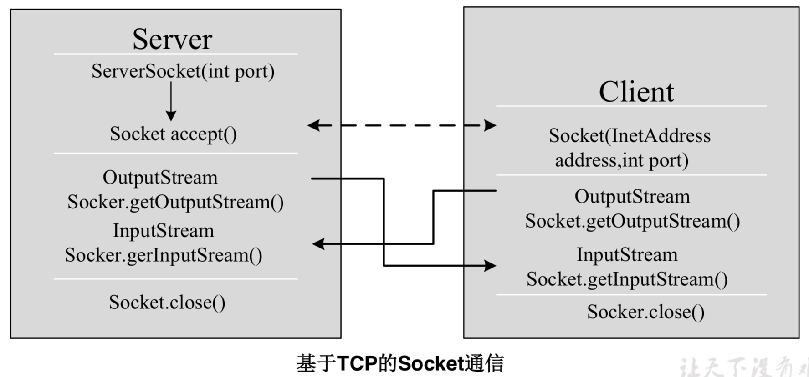

    2. 客户端Socket的工作过程包含以下四个基本的步骤：

        1. 创建 Socket：根据指定服务端的 IP 地址或端口号构造 Socket 类对象。若服务器端响应，则建立客户端到服务器的通信线路。若连接失败，会出现异常。
        2. 打开连接到 Socket 的输入/出流： 使用 getInputStream()方法获得输入流，使用 getOutputStream()方法获得输出流，进行数据传输
        3. 按照一定的协议对 Socket  进行读/写操作：通过输入流读取服务器放入线路的信息（但不能读取自己放入线路的信息），通过输出流将信息写入线程。
        4. 关闭 Socket：断开客户端到服务器的连接，释放线路

    3. 服务器程序的工作过程包含以下四个基本的步骤：

        1. 调用 ServerSocket(int port) ：创建一个服务器端套接字，并绑定到指定端口上。用于监听客户端的请求。
        2. 调用 accept()：监听连接请求，如果客户端请求连接，则接受连接，返回通信套接字对象。
        3. 调用 该Socket类对象的 getOutputStream() 和 getInputStream ()：获取输出流和输入流，开始网络数据的发送和接收。
        4. 关闭ServerSocket和Socket对象：客户端访问结束，关闭通信套接字。

### UDP网络编程

1. UDP网络通信
    1. 类 DatagramSocket 和 DatagramPacket 实现了基于 UDP 协议网络程序。
    2. UDP数据报通过数据报套接字 DatagramSocket 发送和接收，系统不保证UDP数据报一定能够安全送到目的地，也不能确定什么时候可以抵达。
    3. DatagramPacket 对象封装了UDP数据报，在数据报中包含了发送端的IP地址和端口号以及接收端的IP地址和端口号。
    4. UDP协议中每个数据报都给出了完整的地址信息，因此无须建立发送方和接收方的连接。
    5. 流程：
        1. DatagramSocket 与 DatagramPacket：
        2. 建立发送端，接收端
        3. 建立数据包
        4. 调用Socket的发送、接收方法
        5. 关闭Socket
    6. 发送端与接收端是两个独立的运行程序

### URL网络编程

1. URL类
2. 针对HTTP协议的URLConnection类
    1. URL的方法openStream()：能从网络上读取数据
    2. 若希望输出数据，例如向服务器端的CGI（公共网关接口-Common Gateway Interface-的简称，是用户浏览器和服务器端的应用程序进行连接的接口）程序发送一些数据，则必须先与URL建立连接，然后才能对其进行读写，此时需要使用URLConnection。
    3. URLConnection：表示到URL所引用的远程对象的连接。当与一个URL建立连接时，首先要在一个URL对象上通过方法openConnection()生成对应的URLConnection对象。如果连接过程失败，将产生IOException。
3. URI、URL和URN的区别

### 小结

1. 位于网络中的计算机具有唯一的IP地址，这样不同的主机可以互相区分。
2. 客户端-服务器是一种最常见的网络应用程序模型。服务器是一个为其客户端提供某种特定 服务的硬件或软件。客户机是一个用户应用程序，用于访问某台服务器提供的服务。端口号 是对一个服务的访问场所，它用于区分同一物理计算机上的多个服务。套接字用于连接客户 端和服务器，客户端和服务器之间的每个通信会话使用一个不同的套接字。TCP协议用于实 现面向连接的会话。
3. Java 中有关网络方面的功能都定义在 java.net 程序包中。Java 用 InetAddress 对象表示 IP 地址，该对象里有两个字段:主机名(String) 和 IP 地址(int)。
4. 类 Socket 和 ServerSocket 实现了基于TCP协议的客户端-服务器程序。Socket是客户端 和服务器之间的一个连接，连接创建的细节被隐藏了。这个连接提供了一个安全的数据传输 通道，这是因为 TCP 协议可以解决数据在传送过程中的丢失、损坏、重复、乱序以及网络 拥挤等问题，它保证数据可靠的传送。
5. 类 URL 和 URLConnection 提供了最高级网络应用。URL 的网络资源的位置来同一表示 Internet 上各种网络资源。通过URL对象可以创建当前应用程序和 URL 表示的网络资源之 间的连接，这样当前程序就可以读取网络资源数据，或者把自己的数据传送到网络上去。

## JUC多线程及并发包

### 关键字 - volatile

1. volatile是Java虚拟机提供的轻量级的同步机制

    1. 保证可见性

    2. 不保证原子性

    3. 禁止指令重排

2. [Java并发编程：volatile关键字解析](https://www.cnblogs.com/dolphin0520/p/3920373.html)

3. JMM

    1. JMM（Java内存模型）本身是一种抽象的概念并不真实存在，它描述的是一组规则或规范，通过这组规范定义了程序中各个变量（包括实例字段，静态字段和构成数组对象的元素）的访问方式。

    2. JMM三大特性：

        1. 可见性
        2. 原子性
        3. 有序性

    3. JMM关于同步的规定：

        1. 线程解锁前，必须把共享变量的值刷新回主内存
        2. 线程加锁前，必须读取主内存的最新值到自己的工作内存
        3. 加锁解锁是同一把锁

    4. 由于JVM运行程序的实体是线程，而每个线程创建时JVM都会为其创建一个工作内存（有些地方称为栈空间），工作内存是每个线程的私有数据区域，而Java内存模型中规定所有的变量都存储在主内存，主内存是共享内存区域，所有的线程都可以访问，但线程对变量的操作（读取赋值等）必须在工作内存中进行，首先要将变量从主内存拷贝到自己的工作内存空间，然后对变量进行操作，操作完成后在将变量写回主内存，不能直接操作主内存中的变量，各个线程的工作内存中存储着主内存中的变量副本拷贝，因此不同的线程间无法访问对方的工作内存，线程间的通信（传值）必须通过主内存来完成，其简要访问过程如下图：

      

    5. JMM提供的解决方案

        1. 原子性问题，除了JVM自身提供的对基本数据类型读写操作的原子性外，对于方法级别或者代码块级别的原子性操作，可以使用synchronized关键字或者重入锁(ReentrantLock)保证程序执行的原子性。
        2. 而工作内存与主内存同步延迟现象导致的可见性问题，可以使用synchronized关键字或者volatile关键字解决。它们都可以使一个线程修改后的变量立即对其他线程可见。
        3. 对于指令重排导致的可见性问题和有序性问题，则可以利用volatile关键字解决。volatile的另一个作用就是禁止重排序优化。
        4. 除了靠sychronized和volatile关键字之外，JMM内部还定义一套happens-before（先行发生）原则来保证多线程环境下两个操作间的原子性、可见性以及有序性。

### CAS（Compare And Swap）

1. 比较并交换
2. 底层原理：
    1. AtomicInteger.getAndIncrement();
    2. Unsafe
        1. 是CAS的核心类，由于Java无法直接访问底层系统，需要通过本地（native）方法来访问，Unsafe相当于一个后门，基于该类可以直接操作特定内存的数据。Unsafe类存在于sun.misc包中，其内部方法操作可以像C的指针一样直接操作系统内存，因此Java中CAS操作的执行依赖于Unsafe类的方法。
            1. 注意Unsafe类中的所有方法都是native修饰的，也就是说Unsafe类中的方法都直接调用操作系统底层资源执行相应任务。
        2. 变量valueOffset，表示该变量值在内存中的偏移地址，因为Unsafe就是根据内存偏移地址获取数据的。
        3. 变量value用volatile修饰，保证了多线程之间的内存可见性。
    3. CAS是什么
        1. CAS的全称为Compare-And-Swap，它是一条CPU并发原语。
            1. 它的功能是判断内存某个位置的值是否为预期值，如果是则更新为新的值，这个过程是原子的。
            2. CAS并发原语体现在Java语言中就是sun.misc.Unsafe类中的各个方法。调用Unsafe类中的CAS方法，JVM会帮我们实现CAS汇编指令。这是一种完全依赖于硬件的功能，通过它实现了原子操作。再次强调，由于CAS是一种系统原语，原语属于操作系统用语范畴，是由若干条指令组成，用于完成某个功能的一个过程，并且原语的执行必须是连续的，在执行过程中不允许被中断，也就是说CAS是一条CPU的原子指令，不会造成所谓的数据不一致问题。
        2. Unsafe.getAndAddInt
        3. 底层汇编
        4. 简单版小总结
            1. CAS（CompareAndSwap）
                1. 比较当前工作内存中的值和主内存中的值，如果相同则执行规定操作，否则继续比较直到主内存和工作内存中的值一致为止。
            2. CAS应用
                1. CAS有3个操作数，内存值V，旧的预期值A，要修改的更新值B。
                2. 当且仅当预期值A与内存值V相同时，将内存值V修改为B，否则什么都不做。
3. CAS的缺点：
    1. 循环时间长开销很大。
    2. 只能保证一个共享变量的原子操作。
    3. 引出来ABA问题

### ABA问题

1. ABA问题的产生
    1. CAS会导致“ABA问题”。
    2. CAS算法实现一个重要前提需要取出内存中某时刻的数据并在当下时刻比较并替换，那么在这个时间差内会导致数据的变化。
    3. 比如说一个线程one从内存位置V中取出A，这时候另一个线程two也从内存中取出A，并且线程two进行了一些操作将值变成了B，然后线程two又将V位置的数据变为A，这时候线程one进行CAS操作发现内存中仍然是A，然后线程one操作成功。
    4. 尽管线程one的CAS操作成功，但是不代表这个过程就是没有问题的。
2. 原子引用（AtomicReference）
3. 时间戳原子引用（AtomicStampedReference）

### ArrayList是线程不安全的

1. 解决方案一：（读写同步）
    1. Collections.synchronizedList(new ArrayList<>());
    2. Collections.synchronizedSet(new HashSet<>());
    3. Collections.synchronizedMap(new HashMap<>());
2. 解决方案二：（读写分离）
    1. new CopyOnWriteArrayList<>();
    2. new CopyOnWriteArraySet<>();
    3. new ConcurrentHashMap<>();

### 公平锁/非公平锁/可重入锁/递归锁/自旋锁

1. 公平和非公平锁
    1. 是什么
        1. 公平锁：是指多个线程按照申请锁的顺序来获取锁，类似排队打饭，先来后到。
        2. 非公平锁：是指多个线程获取锁的顺序并不是按照申请锁的顺序，有可能后申请的线程比先申请的线程优先获取到锁。在高并发的情况下，有可能会造成优先级反转或者饥饿现象。
    2. 两者区别
        1. 公平锁/非公平锁
            1. 并发包中ReentrantLock的创建可以执行构造函数的boolean类型来得到公平锁和非公平锁，默认是非公平锁。
        2. 关于两者区别：
            1. 公平锁：Threads acquire a fair lock in the order in which they requested it
            2. 公平锁，就是很公平，在并发环境中，每个线程在获取锁时会先查看此锁维护的等待队列，如果为空，或者当前线程是等待队列的第一个，就占有锁，否则就会加入到等待队列中，以后就按照FIFO的规则从队列中取到自己。
            3. 非公平锁：a nonfair lock permits barging: threads requesting a lock can jump ahead of the queue of waiting threads if the lock happens to be available when it is requested.
            4. 非公平锁比较粗鲁，上来就直接尝试占有锁，如果尝试失败，就再采用类似公平锁那种方式。
    3. 题外话
        1. Java ReentrantLock而言，
            1. 通过构造函数指定该锁是否是公平锁，默认是非公平锁，非公平锁的优点在于吞吐量比公平锁大。
        2. 对于 Synchronzied 而言，依然是一种非公平锁。
2. 可重入锁（又名递归锁）
    1. 是什么
        1. 指的是同一个线程外层函数获得锁之后，内层递归函数仍然能获取该锁的代码，在同一个线程在外层方法获取锁的时候，在进入内层方法会自动获取锁。
        2. 也即是说，线程可以进入任何一个它已经拥有的锁同步着的代码块。
    2. ReentrantLock/Synchronzied 就是一个典型的可重入锁
    3. 可重入锁最大的作用是避免死锁
3. 自旋锁（spinlock）
    1. 是指尝试获取锁的线程不会立即阻塞，而是采用循环的方式来尝试获取锁，这样的好处是减少线程上下文切换的消耗，缺点是循环会消耗CPU。
4. 独占锁（写锁）/共享锁（读锁）/互斥锁
    1. 独占锁：指该锁一次只能被一个线程所持有。对ReentrantLock和synchronized而言都是独占锁。
    2. 共享锁：指该锁可被多个线程锁持有。
    3. 对ReentrantReadWriteLock其读锁是共享锁，其写锁是独占锁。
    4. 读锁的共享锁是保证并发读是非常高效的，读写，写读，写写的过程是互斥的。

### CountDownLatch/CyclicBarrier/Semaphore

1. CountDownLatch
    1. 让一些线程阻塞直到另一些线程完成一系列操作后才被唤醒
    2. CountDownLatch主要有两个方法，当一个或多个线程调用await方法时，调用线程会被阻塞。其他线程调用countDown方法会将计数器减1（调用countDown方法的线程不会阻塞），当计数器的值变为零时，因调用await方法被阻塞的线程会被唤醒，继续执行。
2. CyclicBarrier
    1. CyclicBarrier的字面意思是可循环（Cyclic）使用的屏障（Barrier）。它要做的事情是，让一组线程到达一个屏障（也可以叫同步点）时被阻塞，直到最后一个线程到达屏障时，屏障才会开门，所有被屏障拦截的线程才会继续干活，线程进入屏障通过CyclicBarrier的await()方法。
3. Semaphore
    1. 信号量主要用于两个目的，一个是用于多个共享资源的互斥使用，另一个用户并发线程数的控制。

### 阻塞队列

1. 队列+阻塞队列

    1. 阻塞队列，顾名思义，首先它是一个队列，而一个阻塞队列在数据结构中所起的作用大致如下图所示：

      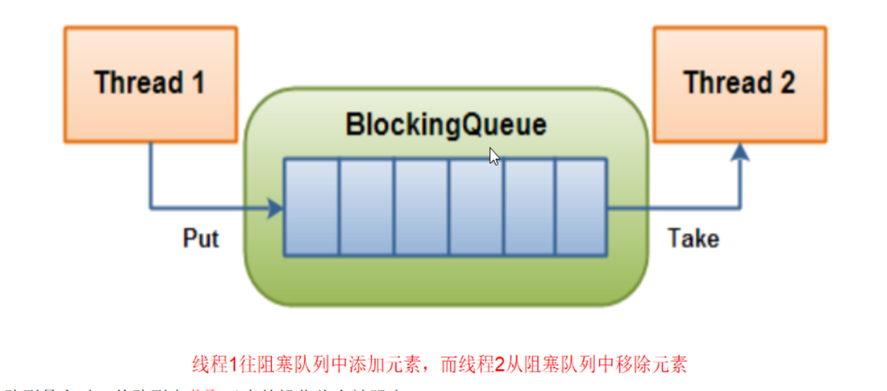

    2. 当阻塞队列是空时，从队列中获取元素的操作将会被阻塞。

    3. 当阻塞队列是满时，往队列里添加元素的操作将会被阻塞。

    4. 试图从空的阻塞队列中获取元素的线程将会被阻塞，直到其他的线程往空的队列插入新的元素。

    5. 同样，试图往已满的阻塞队列中添加新元素的线程同样会被阻塞，直到其他的线程从队列中移除一个或者多个元素或者完全清空队列后使队列重新变得空闲起来并后续新增。

2. 为什么用？有什么好处？

    1. 在多线程领域：所谓阻塞，在某些情况下会挂起线程（即阻塞），一旦条件满足，被挂起的线程又会自动被唤醒。
    2. 为什么需要BlockingQueue
        1. 好处是我们不需要关系什么时候需要阻塞线程，什么时候需要唤醒线程，因为这一切BlockingQueue都给你一手包办了
    3. 在concurrent包发布以前，在多线程环境下，我们每个程序员都必须去自己控制这些细节，尤其还要兼顾效率和线程安全，而这会给我们的程序带来不小的复杂度。

3. BlockingQueue的核心方法

   | 方法类型 | 抛出异常  | 特殊值   | 阻塞   | 超时                 |
   | -------- | --------- | -------- | ------ | -------------------- |
   | 插入     | add(e)    | offer(e) | put(e) | offer(e, time, unit) |
   | 移除     | remove()  | poll()   | take() | poll(time, unit)     |
   | 检查     | element() | peek()   | 不可用 | 不可用               |

   |          |                                                              |
   | -------- | ------------------------------------------------------------ |
   | 抛出异常 | 当阻塞队列满时，再往队列里add插入元素会抛出IllegalStateException: Queue full<br />当阻塞队列空时，再往队列里remove移除元素会抛NoSuchElementException |
   | 特殊值   | 插入方法，成功true失败false<br />移除方法，成功返回出队列的元素，队列里面没有就返回null |
   | 一直阻塞 | 当阻塞队列满时，生产者线程继续往队列里put元素，队列会一直阻塞生产线程直到put数据or响应中断退出。<br />当阻塞队列空时，消费者线程试图从队列里take元素，队列会一直阻塞消费者线程直到队列可用。 |
   | 超时退出 | 当阻塞队列满时，队列会阻塞生产者线程一定时间，超过后限时后生产者线程会退出。 |
   
4. 架构梳理+种类分析

    1. 架构介绍
    2. 种类分析
        1. ArrayBlockingQueue：由数组结构组成的有界阻塞队列。
        2. LinkedBlockingQueue：由链表结构组成的有界（但大小默认值为Integer.MAX_VALUE）阻塞队列
        3. PriorityBlockingQueue：支持优先级排序的无界阻塞队列。
        4. DelayQueue：使用优先级队列实现的延迟无界阻塞队列。
        5. SynchronousQueue：不存储元素的阻塞队列，也即单个元素的队列。
        6. LinkedTransferQueue：由链表结构组成的无界阻塞队列。
        7. LinkedBlockingDeque：由链表结构组成的双向阻塞队列。

5. 用在哪里

    1. 生产者消费者模式
        1. 传统版
        2. 阻塞队列版
    2. 线程池
    3. 消息中间件

### synchronzied和lock有什么区别？用新的lock有什么好处？

1. 原始构成
    1. synchronized是关键字属于JVM层面，
        1. moniterenter（底层是通过monitor对象来完成的，其实wait/notify等方法也依赖于monitor对象只有在同步代码块或方法中才能调wait/notify等方法）
        2. moniterexit
    2. Lock是具体类（java.util.concurrent.locks.Lock）是api层面的锁
2. 使用方法
    1. synchronzied不需要用户去手动释放锁，当synchronzied代码执行完后系统会自动让线程释放对锁的占用。
    2. ReentrantLock则需要用户去手动释放锁，若没有主动释放锁，就有可能导致出现死锁现象。
        1. 需要 lock() 和 unlock() 方法配合 try/finally 语句块来完成。
    3. 等待是否可中断
        1. synchronzied不可中断，除非抛出异常或者正常运行完成。
        2. ReentrantLock可中断，
            1. 设置超时方法 tryLock(long timeout, TimeUnit unit)
            2. lockInterruptibly() 放代码块中，调用 interrupt() 方法可中断。
    4. 加锁是否公平
        1. synchronzied非公平锁
        2. ReentrantLock两者都可以，默认为非公平锁，构造方法可以传入 boolean 值，true为公平锁，false为非公平锁。
    5. 锁绑定多个条件Condition
        1. synchronzied没有
        2. ReentrantLock用来实现分组唤醒需要唤醒的线程们，可以精确唤醒，而不是像synchronzied要么随机唤醒一个线程要么唤醒全部线程。

### 线程池ThreadPoolExecutor

1. 为什么要线程池，优势

    1. 线程池做的工作主要是控制运行的线程的数量，处理过程中将任务放入队列，然后在线程创建后自动启动这些任务，如果线程数量超过了最大数量，超出数量的线程排队等待，等其他线程执行完毕，再从队列中取出任务来执行。
    2. 他的主要特点为：线程复用、控制最大并发数、管理线程。
        1. 降低资源消耗。通过重复利用已创建的线程降低线程创建和销毁造成的消耗。
        2. 提高响应速度。当任务到达时，任务可以不需要等到线程创建就能立即执行。
        3. 提高线程的可管理性。线程是稀缺资源，如果无限制的创建，不仅会消耗系统资源，还会降低系统的稳定性，使用线程池可以进行统一的分配，调优和监控。

2. 线程池如何使用

    1. 架构说明

        1. Java 中的线程池是通过 Executor 框架实现的，该框架中用到了 Executor，Executors，ExecutorService，ThreadPoolExecutor 这几个类。

         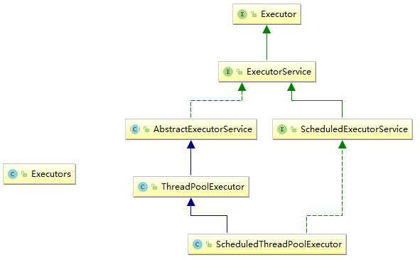

    2. 编码实现

        1. 了解
            1. Executors.newScheduledThreadPool()
            2. Java8新出
                1. Executors.newWorkStealingPool(int)：java8新增，使用目前机器上可用的处理器作为它的并行级别。
        2. 重点
            1. Executors.newFixedThreadPool(int)：执行长期的任务，性能好很多。
            2. Executors.newSingleThreadExecutor()：一个任务一个任务执行的场景
            3. Executors.newCachedThreadPool()：执行很多短期异步的小程序或者负载较轻的服务器

    3. ThreadPoolExecutor

3. 线程池的几个重要参数介绍

    1. corePoolSize：线程池中的常驻核心线程数
        1. 在创建了线程池后，当有请求任务来之后，就会安排池中的线程去执行请求任务，近似理解为今日当值线程
        2. 当线程池中的线程数目达到corePoolSize后，就会把到达的任务放到缓存队列当中
    2. maxinumPoolSize：线程池能够容纳同时执行的最大线程数，此值必须大于等于1
    3. keepAliveTime：多余的空闲线程的存活时间。当前线程池数量超过corePoolSize时，当空闲时间达到keepAliveTime值时，多余空闲线程会被销毁直到只剩下corePoolSize个线程为止。
        1. 默认情况下，只有当线程池中的线程数大于corePoolSize时keepAliveTime才会起作用，直到线程池中的线程数不大于corePoolSize。
    4. unit：keepAliveTime的单位。
    5. workQueue：任务队列，被提交但尚未被执行的任务。
    6. threadFactory：表示生成线程池中工作线程的线程工厂，用于创建线程一般用默认的即可
    7. handler：拒绝策略，表示当队列满了并且工作线程大于等于线程池的最大线程数（maxinumPoolSize）时如何来拒绝请求执行的runnable的策略。

4. 说说线程池的底层工作原理

   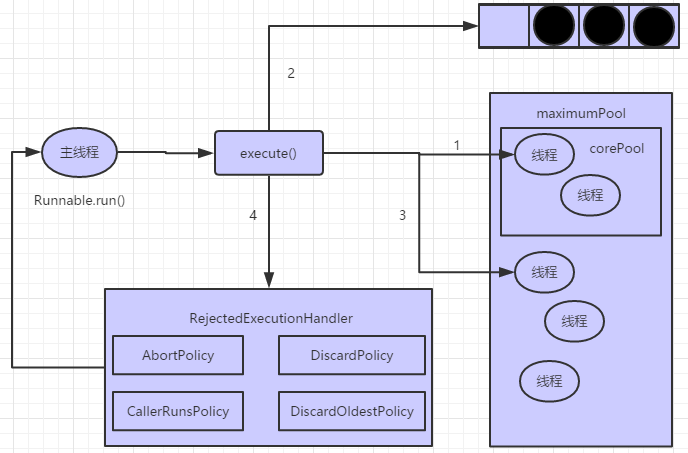

   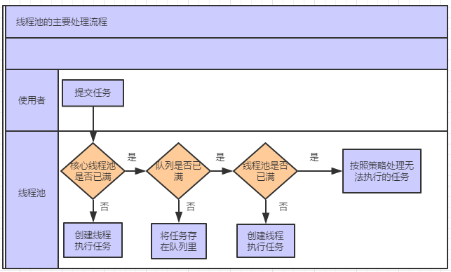

    1. 在创建线程池后，等待提交过来的任务请求。
    2. 当调用execute()方法添加一个请求任务时，线程池会做如下判断：
        1. 如果正在与行的线程数量小于corePoolSize，那么马上创建线程运行这个任务；
        2. 如果正在运行的线程数量大于或等于corePoolSize，那么将这个任务放入队列；
        3. 如果这时候队列满了，且正在运行的线程数量还小于maximumPoolSize，那么还是要创建非核心线程立刻运行这个任务；
        4. 如果队列满了，且正在运行的线程数量大于或等于maximumPoolSize，那么线程池会启动饱和拒绝策略来执行。
    3. 当一个线程完成任务时，它会从队列中取下一个任务来执行。
    4. 当一个线程无事可做超过一定的时间（keepAliveTime）时，线程池会判断：
        1. 如果当前运行的线程数大于corePoolSize，那么这个线程就被停掉。
        2. 所以当线程池的所有任务完成后，它最终会收缩到corePoolSize的大小。

### 线程池参数设置

1. 线程池的拒绝策略
    1. 等待队列也已经排满了，再也塞不下新任务了，同时，线程池中的max线程也达到了，无法继续为新任务服务。这时候我们就需要拒绝策略机制合理的处理这个问题。
    2. JDK内置的拒绝策略
        1. AbortPolicy（默认）：直接抛出RejectedExecutedException异常阻止系统正常运行。
        2. CallerRunsPolicy：“调用者运行”一种调节机制，该策略不会抛弃任务，也不会抛出异常，而是将某些任务回退给调用者，从而降低新任务的流量。
        3. DiscardOldestPolicy：抛弃队列中等待最久的任务，然后把当前任务加入队列中尝试再次提交当前任务。
        4. DiscardPolicy：直接丢弃任务，不予任何处理也不抛出异常。如果允许任务丢失，这是最好的一种方案。
    3. 以上内置拒绝策略均实现了RejectedExecutionHandler接口。
2. 线程池不允许使用 Executors 去创建，而是通过 ThreadPoolExecutor 的方式，这样的处理方式让写的同学更加明确线程池的运行规则，规避资源耗尽的风险。
    1. 说明：Executors 返回的线程池对象的弊端如下： 
        1. FixedThreadPool 和 SingleThreadPool： 允许的请求队列长度为 Integer.MAX_VALUE，可能会堆积大量的请求，从而导致 OOM。 
        2. CachedThreadPool： 允许的创建线程数量为 Integer.MAX_VALUE，可能会创建大量的线程，从而导致 OOM。
3. 合理配置线程池
    1. CPU密集型
        1. CPU密集的意思是该任务需要大量的运算，而没有阻塞，CPU一直全速运行。
        2. CPU密集任务只有在真正的多核CPU上才可能得到加速（通过多线程），而在单核CPU上，无论你开几个模拟的多线程该任务都不可能得到加速，因为CPU总的运算能力就那些。
        3. CPU密集型任务配置尽可能少的线程数量：
            1. 一般公式：CPU核数+1个线程的线程池
    2. IO密集型
        1. 由于IO密集型任务线程并不是一直在执行任务，则应配置尽可能多的线程，如CPU核数*2
        2. IO密集型，即该任务需要大量的IO，即大量的阻塞。在单线程上运行IO密集型的任务会导致浪费大量的CPU运算能力浪费在等待。所以在IO密集型任务重使用多线程可以大大的加速程序运行，即使在单核CPU上，这种加速主要是利用了被浪费掉的阻塞时间。
            1. IO密集型时，大部分线程都阻塞，故需要多配置线程数：
            2. 参考公式：CPU核数/(1-阻塞系数)，阻塞系数在0.8～0.9之间，比如8个CPU：8/(1-0.9)=80个线程。

### 死锁编码及定位分析

1. 是什么？

    1. 死锁是指两个或两个以上的进行在执行过程中，因争夺资源而造成的一种互相等待的现象，若无外力干涉那它们都将无法推进下去，如果系统资源充足，进程的资源请求都能够得到满足，死锁出现的可能性就很低，否则就会因争夺有限的资源而陷入死锁。

      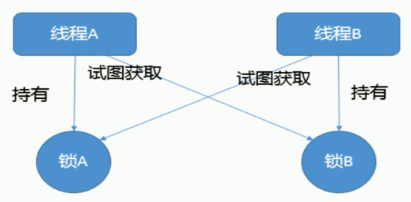

    2. 产生死锁的主要原因

        1. 系统资源不足
        2. 进行运行推进的顺序不合适
        3. 资源分配不当

2. 解决

    1. jps命令定位进程号
    2. jstack找到死锁查看

## JVM+GC解析

### JVM内存结构

1. JVM体系概述

   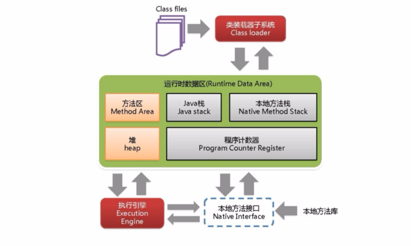

2. Java8以后的JVM

   

### GC的作用域

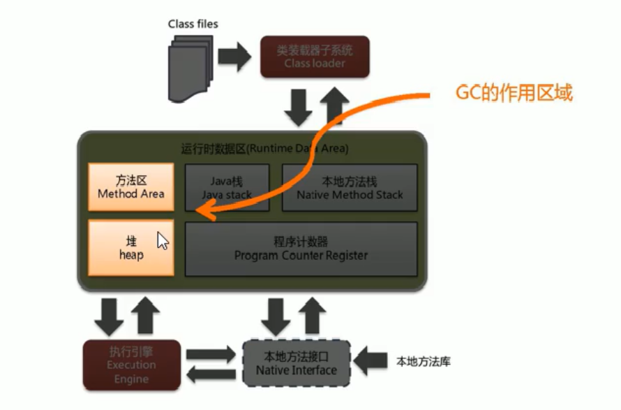

### 常见的垃圾回收方法

1. 引用计数

   

    1. 应用：微软的COM/ActionScript3/Python...
    2. 缺点：
        1. 每次对对象赋值均要维护引用计数器，且计数器本身也有一定的消耗；
        2. 较难处理循环引用
        3. JVM的实现一般不采用这种方式
   
2. 复制算法（Copying）

   

    1. 年轻代中使用的是Minor GC，这种GC算法采用的是复制算法（Copying）
    2. 原理：
        1. 从根集合（GC Root）开始，通过 Tracing 从 From 中找到存活对象，拷贝到To中；
        2. From、To交换身份，下次内存分配从To开始；
    3. 优点
        1. 没有标记和清除的过程，效率高
        2. 没有内存碎片，可以利用bump-the-pointer实现快速内存分配
    4. 缺点
        1. 需要双倍空间

3. 标记清除（Mark-Sweep）

   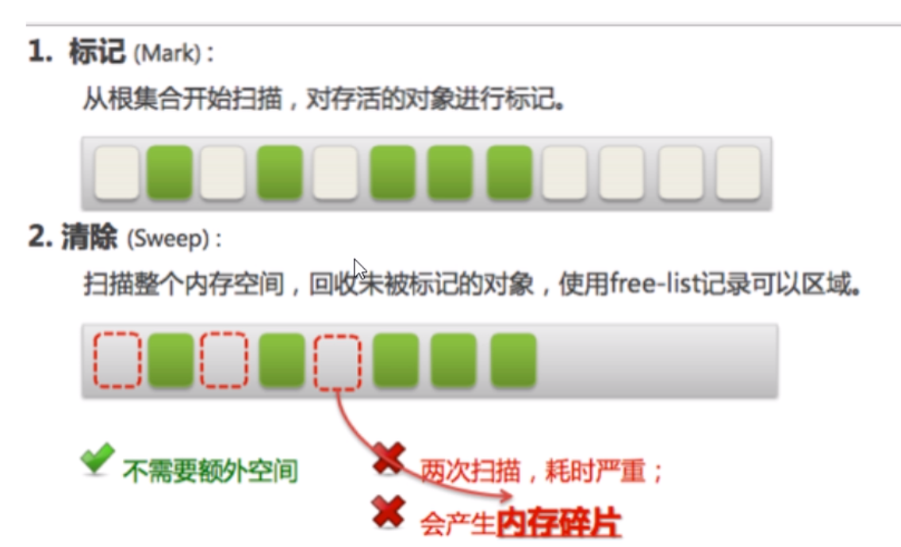

    1. 老年代一般是有标记清除或者是标记清除与标记整理的混合实现
    2. 原理：
        1. 标记（Mark）：
            1. 从根集合开始扫描，对存活的对象进行标记。
        2. 清除（Sweep）：
            1. 扫描整个内存空间，回收未被标记的对象，使用free-list记录可以区域。
    3. 优点：
        1. 不需要额外空间
    4. 缺点：
        1. 两次扫描，耗时严重
        2. 会产生内存碎片

4. 标记压缩（Mark-Compact）

   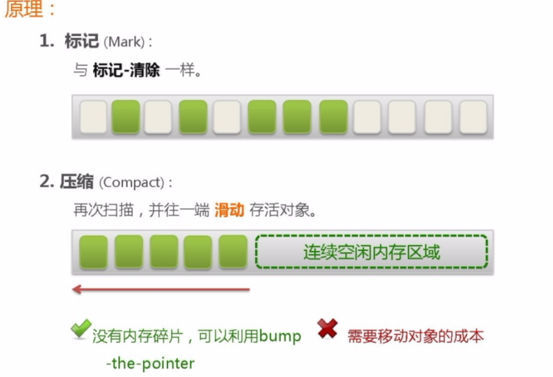

    1. 老年代一般是有标记清除或者标记清除与标记整理的混合实现
    2. 原理
        1. 标记（Mark）：与标记-清除一样。
        2. 压缩（Compact）：
            1. 再次扫描，并往一段话动存活对象。
    3. 优点
        1. 没有内存碎片，可以利用bump-the-pointer
    4. 缺点：
        1. 需要移动对象的成本

5. 标记清除压缩（Mark-Sweep-Compact）

    1. 原理：
        1. Mark-Sweep 和 Mark-Compact 的结合。
        2. 和 Mark-Sweep一致，当进行多次GC后才 Compact。
    2. 优点：
        1. 减少移动对象的成本。

6. GC，即分代收集算法

    1. 频繁收集新生代（Minor GC）
    2. 较少收集老年代（Major GC / Full GC）
    3. 基本不动元空间

### JVM垃圾回收的时候如何确定垃圾?是否知道什么是 GC Roots

1. 什么是垃圾
  
    1. 简单的说就是内存中已经不再被使用到的空间就是垃圾
2. 要进行垃圾回收，如何判断一个对象是否可以被回收
    1. 引用计数法
    2. 枚举根节点做可达性分析（根搜索路径）
        1. case
        
        
       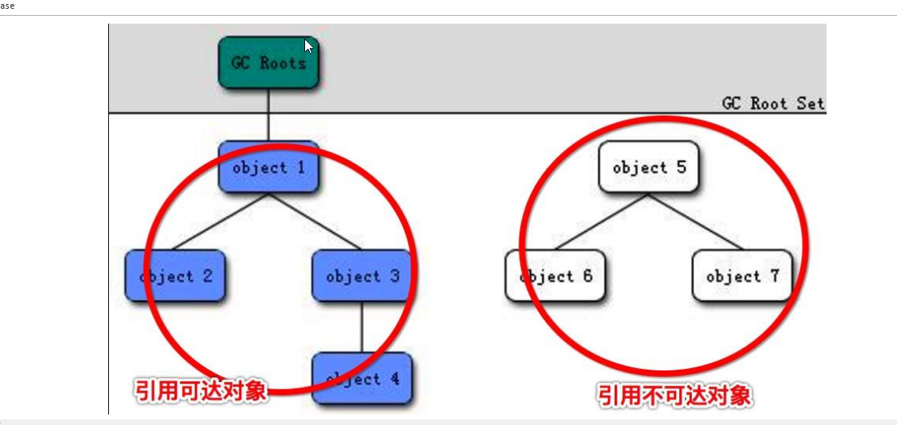
        
      2. Java 可以做GCRoots的对象
          
            1. 虚拟机栈（栈帧中的本地变量表）中引用的对象
            2. 方法区中的类静态属性引用的对象
            3. 方法区中常量引用的对象
            4. 本地方法栈中JNI（即一般说的Native方法）中引用的对象

### JVM调优和参数配置

1. JVM的参数类型

    1. 标配参数
        1. -version
        2. -help
        3. java -showversion
    2. X参数
        1. -Xint：解释执行
        2. -Xcomp：第一次使用就编译成本地代码
        3. -Xmixed：混合模式
    3. XX参数
        1. Boolean类型
            1. 公式
                1. -XX:+或者-某个属性值
                2. +表示开启 -表示关闭
            2. Case
                1. 是否打印GC收集细节：`jinfo -flag PrintGCDetails <pid>`
                    1. -XX:-PrintGCDetails
                    2. -XX:+PrintGCDetails
                2. 是否使用串行垃圾回收器：`jinfo -flag UseSerialGC <pid>`
                    1. -XX:-UseSerialGC
                    2. -XX:+UseSerialGC
        2. KV设值类型
            1. 公式
                1. -XX:属性key=属性值value
            2. Case
                1. -XX:MetaspaceSize=128M
                2. -XX:MaxTenuringThreshold=15
        3. jinfo举例，如何查看当前运行程序的配置
            1. 公式：
                1. `jinfo -flag 配置项 进程id`
                2. `jinfo -flags 进程id`
    4. 两个经典参数
        1. -Xms：等价于 -XX:InitialHeapSize
        2. -Xmx：等价于 -XX:MaxHeapSize

2. 查看JVM默认值

    1. -XX:+PrintFlagsInitial
        1. 查看初始默认值
        2. 公式
            1. java -XX:+PrintFlagsInitial -version

    2. -XX:+PrintFlagsFinal
        1. 主要查看修改更新
        2. 公式
            1. java -XX:+PrintFlagsFinal -version
        
    3. PrintFlagsFinal举例，运行java命令的同时打印出参数

       ```
       java -XX:+PrintFlagsFinal -Xss128k 运行的java类名字
       ```

    4. -XX:+PrintCommandLineFlags

         ```
         java -XX:+PrintCommandLineFlags -version
         ```

### JVM常用基本配置参数

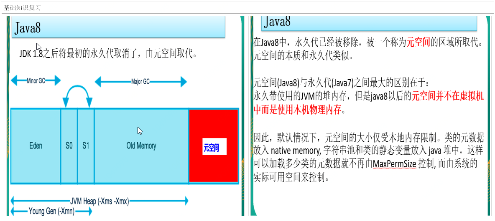

```
-Xms128m 初始化内存
-Xmx4096m	最大分配内存
-Xss1024k	单个线程栈大小
-XX:MetaspaceSize=512m	元空间大小
-XX:+PrintCommandLineFlags	打印设置的参数
-XX:+PrintGCDetails	打印GC详细信息
-XX:+UseSerialGC	使用串行垃圾回收器
```

1. -Xms：初始大小内存，默认为物理内存 1/64，等价于 -XX:InitialHeapSize

2. -Xmx：最大分配内存，默认为物理内存 1/4，等价于 -XX:MaxHeapSize

3. -Xss：设置单个线程栈的大小，一般默认为 512K ~ 1024K，等价于 -XX:ThreadStackSize

4. -Xmn：设置年轻代大小

5. -XX:MetaspaceSize：设置元空间大小

    1. 元空间的本质和永久代类似，都是对JVM规范中方法区的实现。
    2. 不过元空间与永久代之间最大的区别在于：元空间并不在虚拟机中，而是使用本地内存。因此，默认情况下，元空间的大小仅受本地内存限制。

6. -XX:+PrintGCDetails：

    1. 详细输出GC收集日志信息

    2. GC

       ```
       [GC (Allocation Failure) [PSYoungGen: 2048K->496K(2560K)] 2048K->579K(9728K), 0.0033885 secs] [Times: user=0.00 sys=0.00, real=0.00 secs]
       ```

    3. FullGC

       ```
       [Full GC (Allocation Failure) [PSYoungGen: 496K->0K(2560K)] [ParOldGen: 91K->521K(7168K)] 587K->521K(9728K), [Metaspace: 3308K->3308K(1056768K)], 0.0069650 secs] [Times: user=0.01 sys=0.00, real=0.01 secs]
       ```

7. -XX:SurvivorRatio

    1. 设置新生代中eden和S0/S1空间的比例
    2. 默认：-XX:SurvivorRatio=8，Eden:S0:S1=8:1:1
    3. 假如：-XX:SurvivorRatio=4，Eden:S0:S1=4:1:1
    4. SurvivorRatio值就是设置eden区的比例占多少，S0/S1相同

8. -XX:NewRatio

    1. 配置年轻代与老年代在堆结构的占比
    2. 默认：-XX:NewRatio=2 新生代占1，老年代2，年轻代占整个堆的1/3。
    3. 假如：-XX:NewRatio=4 新生代占1，老年代4，年轻代占整个堆的1/5。
    4. NewRatio值就是设置老年代的占比，剩下的1给新生代。

9. -XX:MaxTenuringThreshold

    1. 查看默认进入老年代年龄：
    
      ```
      jinfo -flag MaxTenuringThreshold pid
      ```
      
    2. 设置垃圾最大年龄。如果设置为0的话，则年轻代对象不经过Survivor区，直接进入年老代。对于年老代比较多的应用，可以提高效率。如果将此值设置为一个较大值，则年轻对象会在Survivor区进行多次复制，这样可以增加对象在年轻代的存活时间，增加在年轻代即被回收的概论。

### 强引用、软引用、弱引用、虚引用分别是什么？

1. 整体架构

   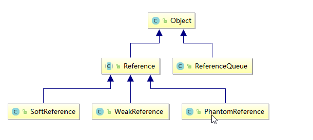

2. 强引用（默认支持模式）

    1. 当内存不足，JVM开始垃圾回收，对于强引用的对象，就算是出现了OOM也不会对该对象进行回收，死都不收。
    2. 强引用是我们最常见的普通对象引用，只要还有强引用指向一个对象，就能表明对象还“活着”，垃圾收集器不会碰这种对象，在java中最常见的就是强引用。把一个对象赋给一个引用变量，这个引用变量就是一个强引用。当一个对象被强引用变量引用时，它处于可达状态，它是不可能被垃圾回收机制回收的，即使该对象以后永远都不会被用到JVM也不会回收。因此强引用是造成java内存泄漏的主要原因之一。
    3. 对于一个普通的对象，如果没有其他的引用关系，只要超过了引用的作用域或者显示的将相应（强）引用赋值为null，一般认为就是可以被垃圾收集的（当然具体回收时机还是要看垃圾收集策略）。

3. 软引用

    1. 软引用是一种相对强引用弱化了一些引用，需要用java.lang.ref.SoftReference类实现，可以让对象豁免一些垃圾收集。
    2. 对于只有软引用的对象来说，当系统内存充足时不会被回收，当系统内存不足时会被回收。
    3. 软引用通常在堆内存敏感的程序中，比如高速缓存就有用到软引用，内存够用的时候就保留，不够用就回收。

4. 弱引用

    1. 弱引用需要用java.lang.ref.WeakReference类来实现，它比软引用的生存期更短。

    2. 对于只有弱引用的对象来说，只要垃圾回收机制一运行，不管JVM的内存空间是否足够，都会回收该对象占用的内存。
    
    3. 软引用和弱引用的适用场景
    
        1. 假如有一个应用需要读取大量的本地图片：
         
            1. 如果每次读取图片都从硬盘读则会严重影响性能，
            2. 如果一次性全部加载到内存中又可能造成内存溢出。
        
        2. 此时使用软引用可以解决这个问题。
    
        3. 设计思路是：用一个HashMap来保存图片的路径和相应图片对象关联的软引用之间的映射关系，在内存不足时，JVM会自动回收这些缓存图片对象所占用的空间，从而有效地避免了OOM的问题。
    
        ```
        Map<String, SoftReference<Bitmap>> imageCache = new HashMap<String, SoftReference<Bitmap>>();
        ```

5. 虚引用

    1. 虚引用需要java.lang.ref.PhantomReference类来实现。
    
    2. 顾名思义，就是形同虚设，与其他几种引用都不同，虚引用并不会决定对象的生命周期。如果一个对象仅持有虚引用，那么它就和美颜任何引用一样，在任何时候都可能被垃圾回收器回收，它不能单独使用也不能通过它访问对象，虚引用必须和引用队列（ReferenceQueue）联合使用。
    
    3. 虚引用的主要作用是跟踪对象被垃圾回收的状态。仅仅是提供了一种确保对象被finalize以后，做某些事情的机制。PhantomReference的get方法总是返回null，因此无法访问对应的引用对象。其意义在于说明一个对象已经进入finalization阶段，可以被gc回收，用来实现比finalization机制更灵活的回收操作。
    
    4. 换句话说，设置虚引用关联的唯一目的，就是在这个对象被收集器回收的事情收到一个系统通知或者后续添加进一步的处理。java技术允许使用finalize()方法在垃圾收集器将对象从内存中清除出去之前做必要的清理工作。
    
      
      
    5. 引用队列

6. GCRoots 和 四大引用小总结

   

    1. 黑色的实心箭头为强引用，在垃圾回收之外，即便报OOM也不回收。
    2. 蓝色的箭头为软引用，JVM内存足够不进行回收，JVM内存不足则进行回收。
    3. 黑色断断续续的箭头为弱引用，弱引用只要有GC必定被回收。
    4. 黑色虚线箭头为虚引用，主要和引用队列配合使用。GC之后被放到引用队列中。
    5. 与根对象无联系，不是从GC Roots对象出发的（虚拟机栈，方法区中的类静态属性引用的对象，方法区中常量引用的对象，本地方法栈中N( Native方法)引用的对象）则为引用不可达，都会被回收。

### OOM

1. java.lang.StackOverflowError
  
    1. 该异常表示的栈溢出异常。

2. java.lang.OutOfMemoryError: Java heap space
  
    1. 表示Java堆溢出。

3. java.lang.OutOfMemoryError: GC overhead limit exceeded
  
    1. 当GC回收时间过长时就会抛出该异常。过长的定义是，超过98%的时间用来做GC并且回收了不到2%的堆内存。连续多次GC，都只回收了不到2%的极端情况下才会抛出。加入不抛出GC overhead limit错误又会发生什么情况呢？那就是GC清理的这么点内存很快会被再次填满，迫使GC再次执行，这样就形成了恶性循环，CPU使用率一直是100%，而GC却没任何成果。

4. java.lang.OutOfMemoryError: Direct buffer memory
  
    1. 该错误常见于NIO中(Netty中使用NIO)。在写NIO程序经常使用ByteBuffer来读取或者写入数据，这是一种基于通道(Channle)与缓存区(Buffer)的I/O方式。
    2. 它可以使用Native函数库直接分配堆外内存，然后通过一个存储在Java堆里面的DIrectByteBuffer对象作为这块内存的引用进行操作。这样能在一些场景中显著提高性能，因为避免了在Java堆和Native堆中来回复制数据。
    3. ByteBuffer.allocate(capability)这种方式是分配JVM堆内存，属于GC管辖范围，由于需要拷贝所以速度较慢；而ByteBuffer.allocateDirect(capability)这种方式是分配OS本地内存，不属于GC管辖范围，由于不需要内存拷贝，所以速度相对较快。
    4. 但是如果不断分配本地内存，堆内存很少使用，那么JVM就不需要执行GC，DIrectByteBuffer对象就不会被回收。这个时候堆内存充足，但是本地内存已经使用光了，当再次尝试分配本地内存就会传OOM，程序就直接崩了。

5. java.lang.OutOfMemoryError: Unable to create native thread
  
    1. 该错误常见于高并发请求服务器的场景，准确的来说该native thread错误与对应的平台有关。

    2. 导致原因主要有2点：

        1. 应用创建了太多的线程，超过了系统承载的极限
        2. 服务器不允许应用创建过多线程，Linux系统默认只允许单个进程创建1024个线程(当然这个是针对非root用户)，超过就会报该类错误。

    3. 解决方案：

        1. 应用进行优化，减少不必要的线程

        2. 如果方案1仍无法解决，就通过修改Linux服务器的配置，扩大默认设置。那如何调整呢？

         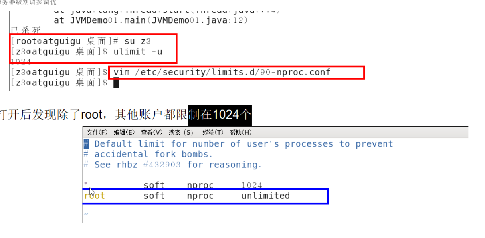

6. java.lang.OutOfMemoryError: Metaspace
  
    1. Java8及之后的版本使用Metaspace来替代永久代。
    2. Metaspace是方法区在HotSpot中的实现，它与持久代最大的区别在于：Metaspace并不在虚拟机内存中而是使用本地内存，也即在java8中，class metadata（the virtual machines internal presentation of Java class），被存储在叫做Metaspace的native memory
    3. 永久代（java8后被元空间Metaspace取代了）存放了以下信息：
        1. 虚拟机加载的类信息
        2. 常量池
        3. 静态变量
        4. 即时编译后的代码

### GC垃圾回收算法和垃圾收集器的关系

1. GC算法（引用计数/复制/标清/标整）是内存回收的方法论，垃圾收集器就是算法落地实现
2. 因为目前为止还没有完美的收集器出现，更加没有万能的收集器，只是针对具体应用最合适的收集器，进行分代收集
  
3. 4种主要垃圾收集器
    1. 串行垃圾回收器（Serial）
        1. 它为单线程环境设计并且只使用一个线程进行垃圾回收，会暂停所有的用户线程。所以不适合服务器环境
    2. 并行垃圾回收器（Parallel）
        1. 多个垃圾回收线程并行工作，此时用户线程是暂停的，适用于科学计算/大数据处理等弱交互场景
    3. 并发垃圾回收器（CMS）
        1. 用户线程和垃圾收集线程同时执行（不一定是并行，可能交替执行），不需要停顿用户线程
        2. 互联网公司多用它，适用于对响应时间有要求的场景
    4. G1垃圾回收器
        1. G1垃圾回收器将堆内存分割成不同的区域然后并发的对其进行垃圾回收

### 配置垃圾收集器

1. 查看默认的垃圾收集器
  
   ```
   java -XX:+PrintCommandLineFlags -version
   ```

2. 默认的垃圾收集器有哪些
  
    1. UseSerialGC
    2. UseParallelGC
    3. UseConcMarkSweepGC
    4. UseParNewGC
    5. UseParallelOldGC
    6. UseG1GC

3. 垃圾收集器
  
    1. 部分参数预先说明

        1. DefNew：Default New Generation

        2. Tenured：Old

        3. ParNew：Parallel New Generation

        4. PSYoungGen：Parallel Scavenge

        5. ParOldGen：Parallel Old Generation

    2. Server/Client模式分别是什么意思

        1. 适用范围：只需要掌握Server模式即可，Client模式基本不会用
        2. 操作系统：
            1. 32位Windows操作系统，不论硬件如何都默认使用Client的JVM模式
            2. 32位其他操作系统，2G内存同时有2个CPU以上用Server模式，低于该配置还是Client模式
            3. 64位only server模式

    3. 新生代

        1. 串行GC（Serial）/（Serial Coping）

            

            1. 一句话：一个单线程的收集器，在进行垃圾收集时候，必须暂停其他所有的工作线程直到它收集结束。
            2. 串行收集器是最古老，最稳定以及效率高的收集器，只使用一个线程去回收但其在进行垃圾收集过程中可能会产生较长的停顿（Stop-The-World状态）。虽然在收集垃圾过程中需要暂停所有其他的工作线程，但是它简单高效，对于限定单个CPU环境来说，没有线程交互的开销可以获得最高的单线程垃圾收集效率，因此Serial垃圾收集器依然是java虚拟机运行在Client模式下默认的新生代垃圾收集器。
            3. 对应JVM参数时：-XX:+UseSerialGC
            4. 开启后会使用：Serial（Young区用）+Serial Old（Old区用）的收集器组合
            5. 表示：新生代、老年代都会使用串行回收收集器，新生代使用复制算法，老年代使用标记-整理算法。

        2. 并行GC（ParNew）
            1. 一句话：使用多线程进行垃圾回收，在垃圾收集时，会Stop-The-World暂停其他所有的工作线程直到它收集结束。
            2. ParNew收集器其实就是Serial收集器新生代的并行多线程版本，最常见的应用场景是配合老年代的CMS GC工作，其余的行为和Serial收集器完全一样，ParNew垃圾收集器在垃圾收集过程中同样也要暂停所有其他的工作线程。它是很多Java虚拟机运行在Server模式下新生代的默认垃圾收集器。
            3. 常用对应JVM参数：-XX:+UseParNewGC，
                1. 启用ParNew收集器，只影响新生代的收集，不影响老年代
                2. 开启上述参数后，会使用：ParNew（Young区用）+Serial Old的收集器组合，新生代使用复制算法，老年代采用标记-整理算法。
            4. 但是，ParNew + Tenured 这样的搭配，Java8已经不再被推荐。Java HotSpot(TM) 64-Bit Server VM warning: Using the ParNew young collector with the Serial old collector is deprecated and will likely be removed in a future release
            5. 备注：
                1. -XX:ParallelGCThreads：限制线程数量，默认开启和CPU数目相同的线程数。

        3. 并行回收GC（Parallel）/ （Parallel Scavenge）

            

            1. Parallel Scavenge收集器类似ParNew也是一个新生代垃圾收集器，使用复制算法，也是一个并行的多线程的垃圾收集器，俗称吞吐量优先收集器。一句话：并行收集器在新生代和老年代的并行化。
            2. 它重点关注的是：
                1. 可控制的吞吐量（Thoughput=运行用户代码时间 / (运行用户代码时间 + 垃圾收集时间)，也即比如程序运行100分钟，垃圾收集时间1分钟，吞吐量就是99%）。高吞吐量意味着高效利用CPU的时间，它多用于后台运算而不需要太多交互的任务。
                2. 自适应调节策略也是ParallelScavenge收集器与ParNew收集器的一个重要区别。（自适应调节策略：虚拟机会根据当前系统的运行情况收集性能监控信息，动态调整这些参数以提供最合适的停顿时间（-XX:MaxGCPauseMillis）或最大的吞吐量）。
            3. 常用JVM参数：-XX:+UseParallelGC 或 -XX:+UseParallelOldGC（可相互激活）使用Parallel Scavenge收集器。
                1. 开启该参数后，新生代使用复制算法，老年代使用标记-整理算法
                2. 多说一句：-XX:ParallelGCThreads=数字N，表示启动多少个GC线程
                3. 如果cpu核心数目少于等于8，则GC线程数量和CPU数一致
                4. 如果cpu核心数大于8，则前8个核，每个核心对应一个GC线；其他核，每8个核对应5个GC线程

    4. 老年代

        1. 串行GC（Serial Old）/（Serial MSC）

            1. Serial Old时Serial垃圾收集器老年代版本，它同样是个单线程的收集器，使用标记-整理算法，这个收集器也主要是运行在Client默认的java虚拟机默认的年老代垃圾收集器。
            2. 在Server模式下，主要有两个用途（了解，版本已经到8及以后）：
                1. 在JDK1.5之前版本中与新生代的Parallel Scavenge收集器搭配使用。（Parallel Scavenge + Serial Old）
                2. 作为老年代版中使用CMS收集器的后备垃圾收集方案。

        2. 并行GC（Parallel Old）/（Parallel MSC）

            1. Parallel Old收集器是Parallel Scavenge的老年代版本，使用多线程的标记-整理算法，Parallel Old收集器在JDK1.6才开始提供。
            2. 在JDK1.6之前，新生代使用ParallelScavenge收集器只能搭配年老代的Serial Old收集器，只能保证新生代的吞吐量优先，无法保证整体的吞吐量，在JDK1.6之前（Parallel Scavenge + Serial Old）
            3. Parallel Old正是为了在年老代同样提供吞吐量优先的垃圾收集器，如果系统对吞吐量要求比较高，JDK1.8后可以优先考虑新生代Parallel Scavenge和年老代Parallel Old收集器的搭配策略。在JDK1.8及后（Parallel Scavenge + Parallel Old）
            4. JVM常用参数：
                1. -XX:+UseParallelOldGC 使用 Parallel Old 收集器，设置该参数后，新生代Parallel+老年代Parallel Old

        3. 并发标记清除GC（CMS）

            

            1. CMS收集器（Concurrent Mark Sweep：并发标记清除）是一种以获取最短回收停顿时间为目标的收集器。适合应用在互联网或者B/S系统的服务器上，这类应用尤其重视服务器的响应速度，希望系统停顿时间最短。
            2. CMS非常适合堆内存大、CPU核数多的服务器端应用，也是G1出现之前大型应用的首选收集器。
            3. Concurrent Mark Sweep 并发标记清除，并发收集低停顿，并发指的是与用户线程一起执行
            4. 开启该收集器的JVM参数：-XX:+UseConcMarkSweepGC 开启该参数后会自动将-XX:+UseParNewGC打开
                1. 开启该参数后，使用ParNew（Young区用）+ CMS（Old区用）+Serial Old的收集器组合，Serial Old将作为CMS出错的后备收集器。
            5. 4步过程
                1. 初始标记（CMS inital mark）
                    1. 只是标记一下GC Roots能直接关联的对象，速度很快，仍然需要暂停所有的工作线程。
                2. 并发标记（CMS concurrent mark）和用户线程一起
                    1. 进行GC Roots跟踪的过程，和用户线程一起工作，不需要暂停工作线程。主要标记过程，标记全部对象。
                3. 重新标记（CMS remark）
                    1. 为了修正在并发标记期间，因用户程序继续运行而导致标记产生变动的那一部分对象的标记记录，仍然需要暂停所有的工作线程。
                    2. 由于并发标记时，用户线程依然运行，因此在正式清理前，在做修正
                4. 并发清除（CMS concurrent sweep）和用户线程一起
                    1. 清除GC Roots不可达对象，和用户线程一起工作，不需要暂停工作线程。基于标记结果，直接清理对象。
                    2. 由于耗时最长的并发标记和并发清除过程中，垃圾收集线程可以和用户线程一起并发工作，所以总体上来看CMS收集器的内存回收和用户线程是一起并发的执行。
            6. 优缺点
                1. 优点：并发收集低停顿
                2. 缺点：
                    1. 并发执行，对CPU资源压力大
                        1. 由于并发进行，CMS在收集与应用线程会同时会增加对堆内存的占用，也就是说，CMS必须要在老年代堆内存用尽之前完成垃圾回收，否则CMS回收失败时，将出发担保机制，串行老年代收集器将会以STW的方式进行一次GC，从而造成较大停顿时间
                    2. 采用的标记清除算法会导致大量碎片
                        1. 标记清除算法无法整理空间碎片，老年代空间会随着应用时长被逐步耗尽，最后将不得不通过担保机制对堆内存进行压缩。CMS也提供了参数-XX:CMSFullGCsBeforeCompaction(默认0，即每次都进行内存整理)来指定多少次CMS收集之后，进行一次压缩的Full GC。

    5. 垃圾收集器配置代码总结

        1. 底层代码
        2. 实际代码

4. 如何选择垃圾回收器
  
    1. 组合的选择
        1. 单CPU或小内存，单机程序
            1. -XX:+UseSerialGC
        2. 多CPU，需要最大吞吐量，如后台计算型应用
            1. -XX:+UseParallelGC
            2. -XX:+UseParallelOldGC
        3. 多CPU，追求低停顿时间，需快速响应如互联网应用
            1. -XX:+UseConcMarkSweepGC
            2. -XX:+ParNewGC

   | 参数                                          | 新生代垃圾收集器          | 新生代算法                           | 老年代垃圾收集器                                             | 老年代算法 |
   | --------------------------------------------- | ------------------------- | ------------------------------------ | ------------------------------------------------------------ | ---------- |
   | -XX:+UseSerialGC                              | SerialGC                  | 复制                                 | SerialOldGC                                                  | 标整       |
   | -XX:+UseParNewGC                              | ParNew                    | 复制                                 | SerialOldGC                                                  | 标整       |
   | -XX:+UseParallelGC<br />-XX:+UseParallelOldGC | Parallel[Scavenge]        | 复制                                 | Parallel Old                                                 | 标整       |
   | -XX:+UseConcMarkSweepGC                       | ParNew                    | 复制                                 | CMS + Serial Old 的收集器组合<br />Serial Old作为CMS出错的后备收集器 | 标清       |
   | -XX:+UseG1GC                                  | G1整体上采用标记-整理算法 | 局部是通过复制算法，不会产生内存碎片 |                                                              |            |

### G1垃圾收集器

1. 以前收集器特点
  
    1. 年轻代和老年代是各自独立且连续的内存块
    2. 年轻代收集使用单eden + s0 + s1进行复制算法
    3. 老年代收集必须扫描整个老年代区域
    4. 都是以尽可能少而快速地执行GC为设计原则
   
2. G1是什么
  
    1. G1（Garbage-First）收集器，是一款面向服务端应用的收集器
    2. 从官网的描述中，我们知道G1是一种服务器端的垃圾收集器，应用在多处理器和大容器内存环境中，在实现高吞吐量的同时，尽可能的满足垃圾手机暂停时间的要求。另外，他还具有以下特性：
        1. 像CMS收集器一样，能与应用程序线程并发执行。
        2. 整理空闲空间更快。
        3. 需要更多的时间来预测GC停顿时间。
        4. 不希望牺牲大量的吞吐性能。
        5. 不需要更大的Java Heap。
    3. G1收集器的设计目标是取代CMS收集器，它同CMS相比，在以下方面表现的更出色：
        1. G1是一个有整理内存过程的垃圾收集器，不会产生很多内存碎片。
        2. G1的Stop-The-World（STW）更可控，G1在停顿时间上添加了预测机制，用户可以指定期望停顿时间。
    4. 特点
        1. G1能充分利用多CPU、多核环境硬件优势，尽量缩短STW。
        2. G1整体上采用标记-整理算法，局部是通过复制算法，不会产生内存碎片。
        3. 宏观上看G1之中不在区分年轻代和老年代。把内存划分多个独立的子区域（Region），可以近似理解为一个围棋的棋盘。
        4. G1收集器里面讲整个的内存区都混合在一起了，但其本身依然在小范围内要进行年轻代和老年代的区分，保留了新生代和老年代，但他们不再是物理隔离的，而是一部分Region的集合且不需要Region是连续的，也就是说依然会采用不同的GC方式来处理不同的区域。
        5. G1虽然也是分代收集器，但整个内存分区不存在物理上的年轻代与老年代的区别，也不需要完全独立的survivor（to space）堆做复制准备。G1只有逻辑上的分代概念，或者说每个分区都可能随G1的运行与不同代之间前后切换
   
3. 底层原理
  
    1. Region区域化垃圾收集器
     
        1. 最大好处是化整为零，避免全内存扫描，只需要按照区域来进行扫描即可。
        
        2. 区域化内存划片Region，整体变为了一系列不连续的内存区域，避免了全内存区的GC操作。核心思想是将整个堆内存区域分成大小相同的子区域（Region），在JVM启动时会自动设置这些子区域的大小，在堆的使用上，G1并不要求对象的存储一定是物理上连续的只要逻辑上连续即可，每个分区也不会固定地为某个代服务，可以按需在年轻代和老年代之间切换。启动时可以通过参数`-XX:G1HeapRegionSize=n`可指定分区大小（1MB~32MB，且必须是2的幂），默认将整堆划分为2048个分区。
        
        3. 大小范围在1MB~32MB，最多能设置2048个区域，也即能够支持的最大内存为：32MB * 2048 = 65536MB = 64G 内存
        
        
       
        
      4. G1算法将堆划分为若干个区域（Region），它仍然属于分代收集器
          
      5. 这些Region的一部分包含新生代，新生代的垃圾手机依然采用暂停所有应用线程的方式，将存活对象拷贝到老年代或者Survivor空间。
          
      6. 这些Region的一部分包含老年代，G1收集器通过将对象从一个区域复制到另外一个区域，完成了清理工作，这就意味着，在正常的处理过程中，G1完成了堆的压缩（至少是部分堆的压缩），这样也就不会有CMS内存碎片问题的存在了。
          
      7. 在G1中，还有一种特殊的区域，叫Humongous（巨大的）区域
          
      8. 如果一个对象占用的空间超过了分区容量50%以上，G1收集器就认为这是一个巨型对象，这些巨型对象默认直接会被分配在老年代，但是如果它是一个短期存在的巨型对象，就会对垃圾收集器造成负面影响。为了解决这个问题，G1划分了一个Humongous区，它用来专门存放巨型对象。如果一个H区装不下一个巨型对象，那么G1会寻找连续的H分区来存储。为了能找到连续的H区，有时有不得不启动Full GC
       
   2. 回收步骤
      
       1. 针对Eden区进行收集，Eden区耗尽后会被触发，主要是小区域收集+形成连续的内存块，避免内存碎片
         
            1. Eden区的数据移动到Survivor区，假如出现Survivor区空间不够，Eden区数据会部分晋升到Old区。
            2. Survivor区的数据移动到新的Survivor区，部分数据晋升到Old区
           3. 最后Eden区收集干净了，GC结束，用户的应用程序继续执行。
       
        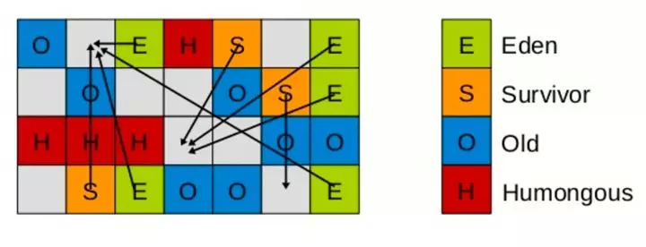
       
        
       
   3. 4步过程
      
        1. 初始标记：只标记GC Roots能直接关联到的对象
        2. 并发标记：进行GC Roots Tracing的过程
        3. 最终标记：修正并发标记期间，因程序运行导致标记发生变化的那一部分对象
       4. 筛选回收：根据时间来进行价值最大化的回收
    
     
   
4. 常用配置参数(了解)
  
    1. -XX:+UseG1GC
     
    2. -XX:G1HeapRegionSize=n : 设置G1区域的大小。值是2的幂，范围是1M到32M。目标是根据最小的Java堆大小划分出约2048个区域
     
    3. -XX:MaxGCPauseMillis=n : 最大停顿时间，这是个软目标，JVM将尽可能（但不保证）停顿时间小于这个时间
     
    4. -XX:InitiatingHeapOccupancyPercent=n 堆占用了多少的时候就触发GC，默认是45
     
    5. -XX:ConcGCThreads=n 并发GC使用的线程数
     
    6. -XX:G1ReservePercent=n 设置作为空闲空间的预留内存百分比，以降低目标空间溢出的风险，默认值是10%
    7. 开发人员仅仅需要声明一下参数即可：
        1. 三步归纳：开始G1 + 设置最大内存 + 设置最大停顿时间
        2. -XX:+UseG1GC -Xmx32g -XX:MaxGCPauseMillis=100
        3. -XX:MaxGCPauseMillis=n: 最大GC停顿时间单位毫秒，这是个软目标，JVM将尽可能（但不保证）停顿小于这个时间
   
5. 和CMS相比的优势
  
    1. G1不会产生内存碎片
    2. 是可以精确控制停顿。该收集器是把整个堆（新生代、老生代）划分成多个固定大小的区域，每次根据允许停顿的时间去收集垃圾最多的区域。
