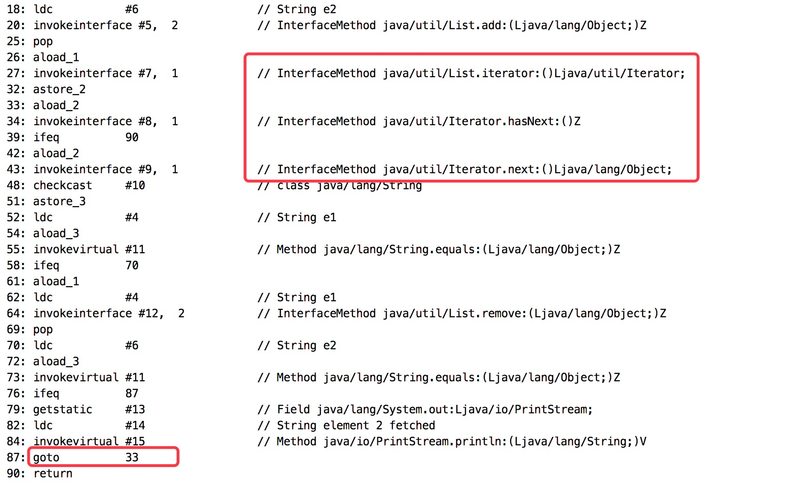

# Java基础之你会在foreach遍历集合时进行remove操作吗？

当通过for循环遍历集合时，一般禁止操作(add or remove)集合元素。虽然开发规范里写的非常清楚，但最近还是有人掉坑里导致出了一个小BUG，那我们就一起看看这么做到底会发生什么？

## 小例子
代码示例

```
List<String> list = new ArrayList<>();
list.add("e1");
list.add("e2");

for (String str : list) {
    if ("e1".equals(str)) {
        list.remove("e1");
    }

    if ("e2".equals(str)) {
        System.out.println("element 2 fetched");
    }
}
```


运行结果：element 2 fetched 将不会被打印。

## 字节码中是如何处理的？
让我们看看字节码是怎么样的，仅截图了部分字节码。



如上面截图的 #27、#34、#43，foreach 实际上是通过 Iterator 来处理的。最后通过 #87 的 goto 指令进入下一次遍历，并进行 hasNext()判断。

## class文件反编译后又是怎么样的？
再来看看将.class文件反编译后得到的代码，实际上编译器将 foreach 转换成了用 Iterator 来处理。

所以，眼见不一定为实，程序员开发时用的是高级语言，编码怎么简单高效怎么来，所以偶尔也可以看看反编译class后的代码以及字节码文件，看看编译器做了哪些优化。

```
ArrayList list = new ArrayList();
list.add("e1");
list.add("e2");
Iterator var2 = list.iterator();

while(var2.hasNext()) {
    String str = (String)var2.next();
    if("e1".equals(str)) {
        list.remove("e1");
    }

    if("e2".equals(str)) {
        System.out.println("element 2 fetched");
    }
}
```

为什么remove(e1)会导致无法获取e2？
当 list.remove("e1")后，在 while(var2.hasNext()) 时，返回结果将为 false，因此当循环一次后Iterator将认为list已经遍历结束。

要弄清原因，需要看看ArrayList对于Iterator接口的实现，了解hasNext()、next()方法的实现。

先看看ArrayList中实现Iterator的内部类Itr。

```
private class Itr implements Iterator<E> {
    int cursor;       // index of next element to return
    int lastRet = -1; // index of last element returned; -1 if no such
    ...
}
```

cursor表示下一个返回元素的下标，可以理解成 游标；lastRet表示上一次返回的元素下标。另ArrayList有个size属性，表示ArrayList中的元素个数。

hasNext() 的判断条件是cursor != size. 只要没遍历到最后一个元素，就返回true.

```
public boolean hasNext() {
    return cursor != size;
}
```

下面是 next() 部分代码。

```
public E next() {
    ...
    int i = cursor; // cursor为当前需要返回元素的下标
    ...
    cursor = i + 1; // cursor向后移动一个位置，指向下一个要返回的元素
    return (E) elementData[lastRet = i]; // 对lastRet赋值，然后返回当前元素
}
```

现在，看一下下面代码的运行情况：

```
ArrayList list = new ArrayList();
list.add("e1");
list.add("e2");
Iterator var2 = list.iterator();
while(var2.hasNext()) {
    String str = (String)var2.next();
    if("e1".equals(str)) {
        list.remove("e1");
    }
}
```

第一次 调用var2.hasNext()，此时满足条件 cursor(0) != size(2)，然后执行 var2.next()，此时 cursor=1
执行 list.remove(“e1”)，此时，list的size将从2变为1
当执行完第一次循环，进入第二次hasNext()判断时，cursor=1而且size=1，导致Iterator认为已经遍历结束，因此e2将被漏掉。
此时，过程已非常清楚。list本有2个元素，Iterator第一次获取元素时，程序删掉了当前元素，导致list的size变为1。Iterator第二次获取元素时，开心说到：”list一共只有一个元素，我已经遍历了一个，easy，轻松搞定!”。

矛盾点在于：hasNext() 是根据已fetch元素和被遍历对象的size动态判断的，一旦遍历过程中被遍历对象的size变化，就会出现以上问题。

## 用普通for循环进行处理
如果在普通for循环中进行如上操作，又会发生什么呢？

```
List<String> list = new ArrayList<>();
list.add("e1");
list.add("e2");

for (int i = 0, length = list.size(); i < length; i++) {
    if ("e1".equals(list.get(i))) {
        list.remove("e1");
    }
}
```

运行后将报如下异常：

```
java.lang.IndexOutOfBoundsException: Index: 1, Size: 1
```

原因：局部变量length为list遍历前的size，length=2；remove(“e1”)后，list的size变为1；因此，第二次进入循环执行list.get(1)时将出现上述异常

## 正确的姿势
将remove操作交给Iterator来处理，使用Iterator接口提供的remove操作。

```
List<String> list = new ArrayList<>();
list.add("e1");
list.add("e2");

for (Iterator<String> iterator = list.iterator(); iterator.hasNext(); ) {
    String str = iterator.next();
    if ("e1".equals(str)) {
        iterator.remove();
    }

    if ("e2".equals(str)) {
        System.out.println("element 2 fetched");
    }
}
```

运行结果：element 2 fetched 被正常打印出来。

那Iterator的remove()又是怎么做的？下面是ArrayList中迭代器的remove方法。

```
public void remove() {
    if (lastRet < 0)
        throw new IllegalStateException();
    checkForComodification();

    try {
        ArrayList.this.remove(lastRet); // 调用ArrayList的remove移除元素,且size减1
        cursor = lastRet; // 将游标回退一位
        lastRet = -1; // 重置lastRet
        expectedModCount = modCount;
    } catch (IndexOutOfBoundsException ex) {
        throw new ConcurrentModificationException();
    }
}
```

因为Iterator.remove()在执行集合本身的remove后，同时对游标进行了 “校准”。

关于ConcurrentModificationException
以下Demo将抛出该异常。

```
private static List<String> list = new ArrayList<>();
private static boolean isListUpdated = false;

public static void main(String[] args) throws InterruptedException {
    list.add("e1");
    list.add("e2");

    new Thread(() -> {
        list.add("e3");
        isListUpdated = true;
    }).start();

    for (Iterator<String> iterator = list.iterator(); iterator.hasNext(); ) {
        while (!isListUpdated) {
            Thread.sleep(1000);
        }
        iterator.next();
    }
}
```

在Java集合框架中，很多对象都不是线程安全的，例如：HashMap、ArrayList等。当Iterator在遍历集合时，如果其他线程操作了集合中的元素，将抛出该异常。

ArrayList中对于Iterator的实现类为Itr如下：

```
private class Itr implements Iterator<E> {
    int cursor;       // index of next element to return
    int lastRet = -1; // index of last element returned; -1 if no such
    int expectedModCount = modCount;
}
```

其中有个重要的属性 expectedModCount，表示本次期望修改的次数，初始值为modCount.

modCount 是 AbstractList 的属性，如下：

```
protected transient int modCount = 0;
```

注意，它由transient修饰，保证了线程之间修改的可见性。对集合中对象的增加、删除操作都会对modCount加1。

在next()、remove()操作中都会进行 checkForComodification() ，用于检查迭代期间其他线程是否修改了被迭代对象。下面是checkForComodification方法：

```
final void checkForComodification() {
    if (modCount != expectedModCount)
        throw new ConcurrentModificationException();
}
```

这是一种 Fail-Fast(快速失败) 策略，只要被迭代对象发生变更，将满足 modCount != expectedModCount 条件，从而抛出ConcurrentModificationException。
