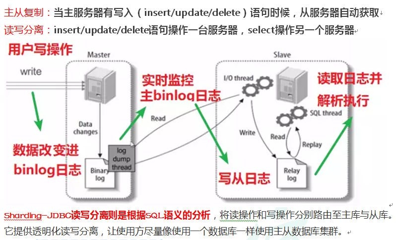
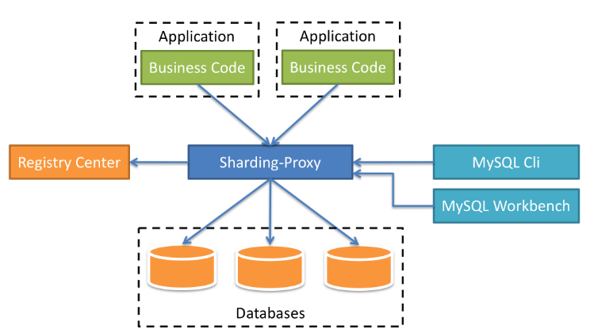

# Apache ShardingSphere

## 课程内容介绍

1. 基本概念
   1. 什么是Sharding Sphere
   2. 分库分表

2. Sharding-JDBC 分库分表操作

3. Sharding-Proxy分库分表操作

### 什么是ShardingSphere

1. 一套开源的分布式数据库中间件解决方案
2. 有三个产品：Sharding-JDBC和Sharding-Proxy
3. 定位为关系型数据库中间件，合理在分布式环境下使用关系型数据库操作

### 什么是分库分表

1. 数据库数据量不可控的，随着时间和业务发展，造成表里面数据越来越多，如果再去对数据库crud操作时候，造成性能问题。
2. 方案1:从硬件上
3. 方案2:分库分表
4. 为了解决由于数据量过大而造成数据库性能降低问题。

### 分库分表的方式

1. 分库分表有两种方式：垂直切分和水平切分
2. 垂直切分：垂直分表和垂直分库
3. 水平切分：水平分表和水平分库
4. 垂直分表：
   1. 操作数据库中某张表，把这张表中一部分字段数据放到一张新表里面，再把这张表另一部分字段数据存放到另外一张表里面
5. 垂直分库：
   1. 把单一数据库按照业务进行拆分，专库专表
6. 水平分库：
7. 水平分表

### 分库分表应用和问题

1. 应用
   1. 在数据库设计时候考虑垂直分库和垂直分表
   2. 随着数据库数据增加，不要马上考虑做水平拆分，首先考虑缓存处理，读写分离，使用索引等等方式，如果这些方式不能根本解决问题了，在考虑做水平分库和分表
2. 分库分表问题
   1. 跨节点连接查询问题（分页、排序）
   2. 多数据源管理问题

## Sharding-JDBC简介

1. 是轻量级的java框架，是增强版的JDBC驱动

2. Sharding-JDBC

   1. 主要目的是：简化对分库分表之后数据相关操作

      

### Sharding-JDBC实现水平分表

1. 搭建环境

   1. 技术：SpringBoot 2.2.1 + MyBatisPlus + Sharding-JDBC + Druid连接池

   2. 创建SpringBoot工程

   3. 修改工程SpringBoot版本2.2.1

      ```xml
      <parent>
        <groupId>org.springframework.boot</groupId>
        <artifactId>spring-boot-starter-parent</artifactId>
        <version>2.2.9.BUILD-SNAPSHOT</version>
        <relativePath/> <!-- lookup parent from repository -->
      </parent>
      ```

   4. 引入需要的依赖

      ```xml
      <dependencies>
        <dependency>
          <groupId>org.springframework.boot</groupId>
          <artifactId>spring-boot-starter</artifactId>
        </dependency>
      
        <dependency>
          <groupId>mysql</groupId>
          <artifactId>mysql-connector-java</artifactId>
          <scope>runtime</scope>
        </dependency>
        <dependency>
          <groupId>org.projectlombok</groupId>
          <artifactId>lombok</artifactId>
          <optional>true</optional>
        </dependency>
        <dependency>
          <groupId>org.springframework.boot</groupId>
          <artifactId>spring-boot-starter-test</artifactId>
          <scope>test</scope>
          <exclusions>
            <exclusion>
              <groupId>org.junit.vintage</groupId>
              <artifactId>junit-vintage-engine</artifactId>
            </exclusion>
          </exclusions>
        </dependency>
      
        <dependency>
          <groupId>com.alibaba</groupId>
          <artifactId>druid-spring-boot-starter</artifactId>
          <version>1.1.20</version>
        </dependency>
        <dependency>
          <groupId>org.apache.shardingsphere</groupId>
          <artifactId>sharding-jdbc-spring-boot-starter</artifactId>
          <version>4.0.0-RC1</version>
        </dependency>
        <dependency>
          <groupId>com.baomidou</groupId>
          <artifactId>mybatis-plus-boot-starter</artifactId>
          <version>3.0.5</version>
        </dependency>
      </dependencies>
      ```

2. 按照水平分表的方式，创建数据库和数据库表

   1. 创建数据库course_db
   2. 在数据库创建两张表course_1和course_2
   3. 约定规则：如果添加课程id是偶数把数据添加course_1，如果奇数添加到course_2

3. 编写代码实现对分库分表后数据的操作

   1. 创建实体类，mapper

4. 配置Sharding-JDBC分片策略

   1. 在项目application.properties配置文件中进行配置

      ```properties
      # sharding jdbc分片策略
      # 配置数据源，给数据源起名称
      spring.shardingsphere.datasource.names=m1
      
      # 一个实体类对应两张表，覆盖
      spring.main.allow-bean-definition-overriding=true
      
      # 配置数据源具体内容，包含连接池，驱动，地址，用户名和密码
      spring.shardingsphere.datasource.m1.type=com.alibaba.druid.pool.DruidDataSource
      spring.shardingsphere.datasource.m1.driver-class-name=com.mysql.cj.jdbc.Driver
      spring.shardingsphere.datasource.m1.url=jdbc:mysql://localhost:3306/default?serverTimezone=GMT%2B8
      spring.shardingsphere.datasource.m1.username=root
      spring.shardingsphere.datasource.m1.password=root
      
      # 指定course表分布情况，配置表在哪个数据库里面，表名称都是什么 m1.course_1，m1.course_2
      spring.shardingsphere.sharding.tables.course.actual-data-nodes=m1.course_$->{1..2}
      
      # 指定course表里面主键生成策略 SNOWFLAKE
      spring.shardingsphere.sharding.tables.course.key-generator.column=cid
      spring.shardingsphere.sharding.tables.course.key-generator.type=SNOWFLAKE
      
      # 指定分片策略 约定cid的值偶数添加到course_1表，如果cid是奇数添加到course_2表
      spring.shardingsphere.sharding.tables.course.table-strategy.inline.sharding-column=cid
      spring.shardingsphere.sharding.tables.course.table-strategy.inline.algorithm-expression=course_$->{cid % 2 + 1}
      
      # 打开sql输出日志
      spring.shardingsphere.props.sql.show=true
      ```

5. 编写测试代码

### Sharding-JDBC实现水平分库

1. 需求分析

   1. 创建两个数据库
   2. 数据库规则：
      1. userid为偶数数据添加edu_db_1数据库
      2. 为奇数数据添加edu_db_2数据库
   3. 表规则：
      1. cid为偶数数据添加course_1表
      2. 为奇数数据添加course_2表

2. 创建数据库和表

3. 在SpringBoot配置文件配置数据库分片规则

   ```properties
   # sharding jdbc分片策略
   # 配置数据源，给数据源起名称
   # 水平分库，配置两个数据源
   spring.shardingsphere.datasource.names=m1,m2
   
   # 一个实体类对应两张表，覆盖
   spring.main.allow-bean-definition-overriding=true
   
   # 配置第一个数据源具体内容，包含连接池，驱动，地址，用户名和密码
   spring.shardingsphere.datasource.m1.type=com.alibaba.druid.pool.DruidDataSource
   spring.shardingsphere.datasource.m1.driver-class-name=com.mysql.cj.jdbc.Driver
   spring.shardingsphere.datasource.m1.url=jdbc:mysql://localhost:3306/edu_db_1?serverTimezone=GMT%2B8
   spring.shardingsphere.datasource.m1.username=root
   spring.shardingsphere.datasource.m1.password=root
   
   # 配置第二个数据源具体内容，包含连接池，驱动，地址，用户名和密码
   spring.shardingsphere.datasource.m2.type=com.alibaba.druid.pool.DruidDataSource
   spring.shardingsphere.datasource.m2.driver-class-name=com.mysql.cj.jdbc.Driver
   spring.shardingsphere.datasource.m2.url=jdbc:mysql://localhost:3306/edu_db_2?serverTimezone=GMT%2B8
   spring.shardingsphere.datasource.m2.username=root
   spring.shardingsphere.datasource.m2.password=root
   
   # 指定数据库分布情况，数据库里面表分布情况
   # m1 m2 course_1 course_2
   spring.shardingsphere.sharding.tables.course.actual-data-nodes=m$->{1..2}.course_$->{1..2}
   
   # 指定course表分布情况，配置表在哪个数据库里面，表名称都是什么 m1.course_1，m1.course_2
   #spring.shardingsphere.sharding.tables.course.actual-data-nodes=m1.course_$->{1..2}
   
   # 指定course表里面主键生成策略 SNOWFLAKE
   spring.shardingsphere.sharding.tables.course.key-generator.column=cid
   spring.shardingsphere.sharding.tables.course.key-generator.type=SNOWFLAKE
   
   # 指定表分片策略 约定cid的值偶数添加到course_1表，如果cid是奇数添加到course_2表
   spring.shardingsphere.sharding.tables.course.table-strategy.inline.sharding-column=cid
   spring.shardingsphere.sharding.tables.course.table-strategy.inline.algorithm-expression=course_$->{cid % 2 + 1}
   
   # 指定数据库分片策略，约定user_id是偶数添加m1，是奇数添加m2
   #spring.shardingsphere.sharding.default-database-strategy.inline.sharding-column=user_id
   #spring.shardingsphere.sharding.default-database-strategy.inline.algorithm-expression=m$->{user_id % 2 + 1}
   
   spring.shardingsphere.sharding.tables.course.database-strategy.inline.sharding-column=user_id
   spring.shardingsphere.sharding.tables.course.database-strategy.inline.algorithm-expression=m$->{user_id % 2 + 1}
   
   # 打开sql输出日志
   spring.shardingsphere.props.sql.show=true
   ```

4. 编写测试方法

### Sharding-JDBC实现垂直分库

1. 需求分析

2. 创建数据库和表

3. 编写操作代码

   1. 创建User实体类和mapper

   2. 配置垂直分库策略

      ```properties
      # sharding jdbc分片策略
      # 配置数据源，给数据源起名称
      # 水平分库，配置两个数据源
      spring.shardingsphere.datasource.names=m1,m2,m0
      
      # 一个实体类对应两张表，覆盖
      spring.main.allow-bean-definition-overriding=true
      
      # 配置第一个数据源具体内容，包含连接池，驱动，地址，用户名和密码
      spring.shardingsphere.datasource.m1.type=com.alibaba.druid.pool.DruidDataSource
      spring.shardingsphere.datasource.m1.driver-class-name=com.mysql.cj.jdbc.Driver
      spring.shardingsphere.datasource.m1.url=jdbc:mysql://localhost:3306/edu_db_1?serverTimezone=GMT%2B8
      spring.shardingsphere.datasource.m1.username=root
      spring.shardingsphere.datasource.m1.password=root
      
      # 配置第二个数据源具体内容，包含连接池，驱动，地址，用户名和密码
      spring.shardingsphere.datasource.m2.type=com.alibaba.druid.pool.DruidDataSource
      spring.shardingsphere.datasource.m2.driver-class-name=com.mysql.cj.jdbc.Driver
      spring.shardingsphere.datasource.m2.url=jdbc:mysql://localhost:3306/edu_db_2?serverTimezone=GMT%2B8
      spring.shardingsphere.datasource.m2.username=root
      spring.shardingsphere.datasource.m2.password=root
      
      # 配置第三个数据源具体内容，包含连接池，驱动，地址，用户名和密码
      spring.shardingsphere.datasource.m0.type=com.alibaba.druid.pool.DruidDataSource
      spring.shardingsphere.datasource.m0.driver-class-name=com.mysql.cj.jdbc.Driver
      spring.shardingsphere.datasource.m0.url=jdbc:mysql://localhost:3306/user_db?serverTimezone=GMT%2B8
      spring.shardingsphere.datasource.m0.username=root
      spring.shardingsphere.datasource.m0.password=root
      
      # 配置user_db数据库里面t_user专库专表
      spring.shardingsphere.sharding.tables.t_user.actual-data-nodes=m$->{0}.t_user
      
      # 指定t_user表里面主键生成策略 SNOWFLAKE
      spring.shardingsphere.sharding.tables.t_user.key-generator.column=user_id
      spring.shardingsphere.sharding.tables.t_user.key-generator.type=SNOWFLAKE
      
      # 指定表分片策略
      spring.shardingsphere.sharding.tables.t_user.table-strategy.inline.sharding-column=user_id
      spring.shardingsphere.sharding.tables.t_user.table-strategy.inline.algorithm-expression=t_user
      ```

   3. 编写测试代码

### Sharding-JDBC操作公共表

1. 公共表

   1. 存储固定数据的表，表数据很少发生变化，查询时候经常进行关联
   2. 在每个数据库中创建相同结构公共表

2. 在多个数据库都创建相同结构公共表

3. 在项目配置文件application.properties进行公共表配置

   ```properties
   # 配置公共表
   spring.shardingsphere.sharding.broadcast-tables=t_udict
   spring.shardingsphere.sharding.tables.t_udict.key-generator.column=dictid
   spring.shardingsphere.sharding.tables.t_udict.key-generator.type=SNOWFLAKE
   ```

4. 编写测试代码

   1. 创建新实体类和mapper
   2. 编写添加和删除方法进行测试

### Sharding-JDBC实现读写分离

1. 读写分离概念
   
   1. 为了确保数据库产品的稳定性，很多数据库拥有双机热备功能。也就是，第一台数据库服务器，是对外提供增删改业务的生产服务器；第二台数据库服务器，主要进行读的操作。
   
   2. 原理：让主数据库（master）处理事务性增、改、删操作，而从数据库（slave）处理SELECT查询操作。
   
   3. 读写分离原理：
   
      
   
2. MySQL配置读写分离

   1. 第一步：创建两个MySQL数据库服务，并且启动两个MySQL服务

      1. 复制之前MySQL目录

      2. 修改复制之后配置文件

         1. 修改端口号，文件路径

            ```ini
            [mysqld]
            #设置3307端口
            port=3307
            #设置mysql的安装路径
            basedir=D:\mysql-5.7.25-s1
            #设置mysql数据库的数据的存放目录
            datadir=D:\mysql-5.7.25-s1\data
            ```

         2. 需要把数据文件目录在复制一份

      3. 把复制修改之后从数据库在windows安装服务

         ```
         D:\mysql-5.7.25-s1\bin>mysqld install mysqls1 --default-file='D:\mysql-5.7.25-s1\my.ini'
         
         #删除服务命令
         sc delete 服务名称
         ```

   2. 第二步：配置MySQL主从服务器

      1. 在主服务器配置文件

         ```ini
         [mysqld]
         #开启日志
         log-bin=mysql-bin
         #设置服务id，主从不能一致
         server-id=1
         #设置需要同步的数据库
         binlog-do-db=user_db
         #屏蔽系统库同步
         binlog-ignore-db=mysql
         binlog-ignore-db=information_schema
         binlog-ignore-db=performance_schema
         ```

      2. 在从服务器配置文件

         ```ini
         [mysqld]
         #开启日志
         log-bin=mysql-bin
         #设置服务id，主从不能一致
         server-id=2
         #设置需要同步的数据库
         replicate_wild_do_table=user_db.%
         #屏蔽系统库同步
         replicate_wild_ignore_table=mysql.%
         replicate_wild_ignore_table=information_schema.%
         replicate_wild_ignore_table=performance_schema.%
         ```

      3. 把主和从服务器重启

   3. 第三步：创建用于主从复制的账号

      1. 切换至主库bin目录，登录主库

         ```
         mysql -h localhost -uroot -p
         ```

      2. 授权主备复制专用账号

         ```mysql
         GRANT REPLICATION SLAVE ON *.* TO 'db_sync'@'%' IDENTIFIED BY 'db_sync';
         ```

         | Host | User    | Repl_slave_priv | ...  |
         | ---- | ------- | --------------- | ---- |
         | %    | db_sync | Y               |      |

      3. 刷新权限

         ```mysql
         FLUSH PRIVILEGES;
         ```

      4. 确定位点，记录下文件名以及位点

         ```mysql
         show master status;
         ```

         | File             | Position | Binlog_Do_DB | Binlog_Ignore_DB | ...  |
         | ---------------- | -------- | ------------ | ---------------- | ---- |
         | mysql-bin.000001 | 440      |              |                  |      |

   4. 第四步：主从数据同步设置

      1. 切换至从库bin目录，登录从库

         ```
         mysql -h localhost -P3307 -uroot -p
         ```

      2. 先停止同步

         ```mysql
         STOP SLAVE;
         
         -- 注意，如果之前此从库已有主库指向，需要先执行以下命令清空
         -- STOP SLAVE IO_THREAD FOR CHANNEL '';
         -- reset slave all;
         ```

      3. 修改从库指向到主库，使用上一步记录的文件名以及位点

         ```mysql
         CHANGE MASTER TO
         master_host='localhost',
         master_user='db_sync',
         master_password='db_sync',
         master_log_file='mysql-bin.000001',
         master_log_pos=440;
         ```

      4. 启动同步

         ```mysql
         START SLAVE;
         ```

      5. 查看Slave_IO_Running和Slave_SQL_Running字段值都为Yes，表示同步配置成功。如果不为Yes，请排查相关异常。

         ```mysql
         show slave status;
         ```

         | Relay_Master_Log_File | Slave_IO_Running | Slave_SQL_Running | ...  |
         | --------------------- | ---------------- | ----------------- | ---- |
         | mysql-bin.000001      | Yes              | Yes               |      |

3. Sharding-JDBC读写分离配置

   1. 配置读写分离策略

      ```properties
      # user_db主服务器
      spring.shardingsphere.datasource.m0.type=com.alibaba.druid.pool.DruidDataSource
      spring.shardingsphere.datasource.m0.driver-class-name=com.mysql.cj.jdbc.Driver
      spring.shardingsphere.datasource.m0.url=jdbc:mysql://localhost:3306/user_db?serverTimezone=GMT%2B8
      spring.shardingsphere.datasource.m0.username=root
      spring.shardingsphere.datasource.m0.password=root
      
      # user_db从服务器
      spring.shardingsphere.datasource.s0.type=com.alibaba.druid.pool.DruidDataSource
      spring.shardingsphere.datasource.s0.driver-class-name=com.mysql.cj.jdbc.Driver
      spring.shardingsphere.datasource.s0.url=jdbc:mysql://localhost:3307/user_db?serverTimezone=GMT%2B8
      spring.shardingsphere.datasource.s0.username=root
      spring.shardingsphere.datasource.s0.password=root
      
      # 主库从库逻辑数据源定义 ds0为user_db
      spring.shardingsphere.sharding.master-slave-rules.ds0.master-data-source-name=m0
      spring.shardingsphere.sharding.master-slave-rules.ds0.slave-data-source-names=s0
      
      # 配置user_db数据库里面t_user专库专表
      #spring.shardingsphere.sharding.tables.t_user.actual-data-nodes=m$->{0}.t_user
      # t_user分表策略，固定分配至ds0的t_user真实表
      spring.shardingsphere.sharding.tables.t_user.actual-data-nodes=ds0.t_user
      ```

   2. 编写测试代码

## Sharding-Proxy简介

1. 定位为透明的数据库代理端

   

2. Sharding-Proxy独立应用，需要安装服务，进行分库分表或者读写分离配置，启动使用

3. 安装

   1. [下载安装软件](https://shardingsphere.apache.org/document/legacy/4.x/document/cn/downloads/)
   2. 把下载之后压缩文件，解压，启动bin目录启动文件就可以了

### Sharding-Proxy配置（分表）

1. 进入conf目录，修改文件server.yaml，打开两段内容注释

   ```yaml
   authentication:
     users:
       root:
         password: root
       sharding:
         password: sharding
         authorizedSchemas: sharding_db
   
   props:
     max.connections.size.per.query: 1
     acceptor.size: 16  # The default value is available processors count * 2.
     executor.size: 16  # Infinite by default.
     proxy.frontend.flush.threshold: 128  # The default value is 128.
       # LOCAL: Proxy will run with LOCAL transaction.
       # XA: Proxy will run with XA transaction.
       # BASE: Proxy will run with B.A.S.E transaction.
     proxy.transaction.type: LOCAL
     proxy.opentracing.enabled: false
     query.with.cipher.column: true
     sql.show: false
   ```

2. 进入conf目录，修改config-sharding.yaml

   1. 复制mysql驱动jar包到lib目录

      ```
      If you want to connect to MySQL, you should manually copy MySQL driver to lib directory.
      ```

   2. 配置分库分表规则

      ```yaml
      schemaName: sharding_db
      
      dataSources:
        ds_0:
          url: jdbc:mysql://127.0.0.1:3306/edu_1?serverTimezone=UTC&useSSL=false
          username: root
          password: root
          connectionTimeoutMilliseconds: 30000
          idleTimeoutMilliseconds: 60000
          maxLifetimeMilliseconds: 1800000
          maxPoolSize: 50
      
      shardingRule:
        tables:
          t_order:
            actualDataNodes: ds_${0}.t_order_${0..1}
            tableStrategy:
              inline:
                shardingColumn: order_id
                algorithmExpression: t_order_${order_id % 2}
            keyGenerator:
              type: SNOWFLAKE
              column: order_id
        bindingTables:
          - t_order
        defaultDatabaseStrategy:
          inline:
            shardingColumn: user_id
            algorithmExpression: ds_${0}
        defaultTableStrategy:
          none:
      ```

3. 启动Sharding-Proxy服务

   1. Sharding-Proxy默认端口号3307

4. 通过Sharding-Proxy启动端口进行连接

   1. 打开cmd窗口连接Sharding-Proxy，连接方式和连接mysql一样的

      ```
      mysql -P3307 -uroot -p
      ```

   2. 进行sql命令操作看到只有一个库

      ```
      show databases;
      ```

   3. 在sharding_db数据库创建表

      ```mysql
      CREATE TABLE IF NOT EXISTS ds_0.t_order (
      	order_id BIGINT NOT NULL,
        user_id INT NOT NULL,
        status VARCHAR(50),
        PRIMARY KEY (order_id)
      );
      
      -- use sharding_db;
      -- show tables;
      ```

   4. 向表添加一条记录

      ```mysql
      INSERT INTO t_order (order_id, user_id, status) VALUES (11, 1, 'init');
      
      -- select * from t_order;
      ```

5. 回到本地3306端口实际数据库中，看到已经创建好了表和添加数据

### Sharding-Proxy配置（分库）

1. 创建两个数据库

2. 找到conf目录，config-sharding.yaml

   ```yaml
   schemaName: sharding_db
   
   dataSources:
     ds_0:
       url: jdbc:mysql://127.0.0.1:3306/edu_db_1?serverTimezone=UTC&useSSL=false
       username: root
       password: root
       connectionTimeoutMilliseconds: 30000
       idleTimeoutMilliseconds: 60000
       maxLifetimeMilliseconds: 1800000
       maxPoolSize: 50
     ds_1:
       url: jdbc:mysql://127.0.0.1:3306/edu_db_2?serverTimezone=UTC&useSSL=false
       username: root
       password: root
       connectionTimeoutMilliseconds: 30000
       idleTimeoutMilliseconds: 60000
       maxLifetimeMilliseconds: 1800000
       maxPoolSize: 50
   
   shardingRule:
     tables:
       t_order:
         actualDataNodes: ds_${0..1}.t_order_${0..1}
         tableStrategy:
           inline:
             shardingColumn: order_id
             algorithmExpression: t_order_${order_id % 2}
         keyGenerator:
           type: SNOWFLAKE
           column: order_id
     bindingTables:
       - t_order
     defaultDatabaseStrategy:
       inline:
         shardingColumn: user_id
         algorithmExpression: ds_${user_id % 2}
     defaultTableStrategy:
       none:
   ```

3. 启动Sharding-Proxy服务

4. 打开cmd，连接Sharding-Proxy服务

   ```
   mysql -P3307 -uroot -p
   ```

   1. 创建数据库表，向表添加数据

      ```mysql
      CREATE TABLE IF NOT EXISTS ds_0.t_order (
      	order_id BIGINT NOT NULL,
      	user_id INT NOT NULL,
      	status VARCHAR(50),
      	PRIMARY KEY (order_id)
      );
      
      INSERT INTO t_order(order_id, user_id, status) VALUES (11, 1, 'init');
      ```

   2. 连接本地3306的MySQL数据库服务器，表已经创建出来，表里面有数据

### Sharding-Proxy配置（读写分离）

1. 创建三个数据

2. 修改conf里面配置文件，config-master-slave.yaml

   ```yaml
   schemaName: master_slave_db
   
   dataSources:
     master_ds:
       url: jdbc:mysql://127.0.0.1:3306/demo_ds_master?serverTimezone=UTC&useSSL=false
       username: root
       password: root
       connectionTimeoutMilliseconds: 30000
       idleTimeoutMilliseconds: 60000
       maxLifetimeMilliseconds: 1800000
       maxPoolSize: 50
     slave_ds_0:
       url: jdbc:mysql://127.0.0.1:3306/demo_ds_slave_0?serverTimezone=UTC&useSSL=false
       username: root
       password: root
       connectionTimeoutMilliseconds: 30000
       idleTimeoutMilliseconds: 60000
       maxLifetimeMilliseconds: 1800000
       maxPoolSize: 50
     slave_ds_1:
       url: jdbc:mysql://127.0.0.1:3306/demo_ds_slave_1?serverTimezone=UTC&useSSL=false
       username: root
       password: root
       connectionTimeoutMilliseconds: 30000
       idleTimeoutMilliseconds: 60000
       maxLifetimeMilliseconds: 1800000
       maxPoolSize: 50
   
   masterSlaveRule:
     name: ms_ds
     masterDataSourceName: master_ds
     slaveDataSourceNames:
       - slave_ds_0
       - slave_ds_1
   ```

3. 启动Sharding-Proxy服务

4. 通过cmd连接Sharding-Proxy，进行创建表和添加记录操作

   1. 在主数据库和从数据库里面，都创建数据库表
   2. 向表添加记录，不指定向哪个库添加
      1. 把添加数据添加到主数据库里面
   3. 查询数据库表数据，不指定查询哪个库
      1. 直接执行查询从库里面的数据

## 课程总结

1. 基本概念
   1. 什么是Sharding Sphere
   2. 什么是分库分表
      1. 水平切分和垂直切分
2. Sharding-JDBC
   1. 什么是Sharding-JDBC
   2. 使用Sharding-JDBC水平切分
   3. 使用Sharding-JDBC垂直切分
   4. 使用Sharding-JDBC操作公共表
   5. 使用Sharding-JDBC读写分离
3. Sharding-Proxy
   1. 什么是Sharding-Proxy
   2. 使用Sharding-Proxy分库分表
   3. 使用Sharding-Proxy读写分离