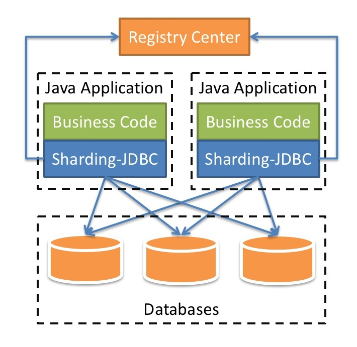

# Apache ShardingSphere

## 课程内容介绍

1. 基本概念
   1. 什么是Sharding Sphere
   2. 分库分表

2. Sharding-JDBC 分库分表操作

3. Sharding-Proxy分库分表操作

### 什么是ShardingSphere

1. 一套开源的分布式数据库中间件解决方案
2. 有三个产品：Sharding-JDBC和Sharding-Proxy
3. 定位为关系型数据库中间件，合理在分布式环境下使用关系型数据库操作

### 什么是分库分表

1. 数据库数据量不可控的，随着时间和业务发展，造成表里面数据越来越多，如果再去对数据库crud操作时候，造成性能问题。
2. 方案1:从硬件上
3. 方案2:分库分表
4. 为了解决由于数据量过大而造成数据库性能降低问题。

### 分库分表的方式

1. 分库分表有两种方式：垂直切分和水平切分
2. 垂直切分：垂直分表和垂直分库
3. 水平切分：水平分表和水平分库
4. 垂直分表：
   1. 操作数据库中某张表，把这张表中一部分字段数据放到一张新表里面，再把这张表另一部分字段数据存放到另外一张表里面
5. 垂直分库：
   1. 把单一数据库按照业务进行拆分，专库专表
6. 水平分库：
7. 水平分表

### 分库分表应用和问题

1. 应用
   1. 在数据库设计时候考虑垂直分库和垂直分表
   2. 随着数据库数据增加，不要马上考虑做水平拆分，首先考虑缓存处理，读写分离，使用索引等等方式，如果这些方式不能根本解决问题了，在考虑做水平分库和分表
2. 分库分表问题
   1. 跨节点连接查询问题（分页、排序）
   2. 多数据源管理问题

## Sharding-JDBC简介

1. 是轻量级的java框架，是增强版的JDBC驱动

2. Sharding-JDBC

   1. 主要目的是：简化对分库分表之后数据相关操作

      

### Sharding-JDBC实现水平分表

1. 搭建环境

   1. 技术：SpringBoot 2.2.1 + MyBatisPlus + Sharding-JDBC + Druid连接池

   2. 创建SpringBoot工程

   3. 修改工程SpringBoot版本2.2.1

      ```xml
      <parent>
        <groupId>org.springframework.boot</groupId>
        <artifactId>spring-boot-starter-parent</artifactId>
        <version>2.2.9.BUILD-SNAPSHOT</version>
        <relativePath/> <!-- lookup parent from repository -->
      </parent>
      ```

   4. 引入需要的依赖

      ```xml
      <dependencies>
        <dependency>
          <groupId>org.springframework.boot</groupId>
          <artifactId>spring-boot-starter</artifactId>
        </dependency>
      
        <dependency>
          <groupId>mysql</groupId>
          <artifactId>mysql-connector-java</artifactId>
          <scope>runtime</scope>
        </dependency>
        <dependency>
          <groupId>org.projectlombok</groupId>
          <artifactId>lombok</artifactId>
          <optional>true</optional>
        </dependency>
        <dependency>
          <groupId>org.springframework.boot</groupId>
          <artifactId>spring-boot-starter-test</artifactId>
          <scope>test</scope>
          <exclusions>
            <exclusion>
              <groupId>org.junit.vintage</groupId>
              <artifactId>junit-vintage-engine</artifactId>
            </exclusion>
          </exclusions>
        </dependency>
      
        <dependency>
          <groupId>com.alibaba</groupId>
          <artifactId>druid-spring-boot-starter</artifactId>
          <version>1.1.20</version>
        </dependency>
        <dependency>
          <groupId>org.apache.shardingsphere</groupId>
          <artifactId>sharding-jdbc-spring-boot-starter</artifactId>
          <version>4.0.0-RC1</version>
        </dependency>
        <dependency>
          <groupId>com.baomidou</groupId>
          <artifactId>mybatis-plus-boot-starter</artifactId>
          <version>3.0.5</version>
        </dependency>
      </dependencies>
      ```

2. 按照水平分表的方式，创建数据库和数据库表

   1. 创建数据库course_db
   2. 在数据库创建两张表course_1和course_2
   3. 约定规则：如果添加课程id是偶数把数据添加course_1，如果奇数添加到course_2

3. 编写代码实现对分库分表后数据的操作

   1. 创建实体类，mapper

4. 配置Sharding-JDBC分片策略

   1. 在项目application.properties配置文件中进行配置

      ```properties
      # sharding jdbc分片策略
      # 配置数据源，给数据源起名称
      spring.shardingsphere.datasource.names=m1
      
      # 一个实体类对应两张表，覆盖
      spring.main.allow-bean-definition-overriding=true
      
      # 配置数据源具体内容，包含连接池，驱动，地址，用户名和密码
      spring.shardingsphere.datasource.m1.type=com.alibaba.druid.pool.DruidDataSource
      spring.shardingsphere.datasource.m1.driver-class-name=com.mysql.cj.jdbc.Driver
      spring.shardingsphere.datasource.m1.url=jdbc:mysql://localhost:3306/default?serverTimezone=GMT%2B8
      spring.shardingsphere.datasource.m1.username=root
      spring.shardingsphere.datasource.m1.password=root
      
      # 指定course表分布情况，配置表在哪个数据库里面，表名称都是什么 m1.course_1，m1.course_2
      spring.shardingsphere.sharding.tables.course.actual-data-nodes=m1.course_$->{1..2}
      
      # 指定course表里面主键生成策略 SNOWFLAKE
      spring.shardingsphere.sharding.tables.course.key-generator.column=cid
      spring.shardingsphere.sharding.tables.course.key-generator.type=SNOWFLAKE
      
      # 指定分片策略 约定cid的值偶数添加到course_1表，如果cid是奇数添加到course_2表
      spring.shardingsphere.sharding.tables.course.table-strategy.inline.sharding-column=cid
      spring.shardingsphere.sharding.tables.course.table-strategy.inline.algorithm-expression=course_$->{cid % 2 + 1}
      
      # 打开sql输出日志
      spring.shardingsphere.props.sql.show=true
      ```

5. 编写测试代码

### Sharding-JDBC实现水平分库

1. 需求分析

   1. 创建两个数据库
   2. 数据库规则：
      1. userid为偶数数据添加edu_db_1数据库
      2. 为奇数数据添加edu_db_2数据库
   3. 表规则：
      1. cid为偶数数据添加course_1表
      2. 为奇数数据添加course_2表

2. 创建数据库和表

3. 在SpringBoot配置文件配置数据库分片规则

   ```properties
   # sharding jdbc分片策略
   # 配置数据源，给数据源起名称
   # 水平分库，配置两个数据源
   spring.shardingsphere.datasource.names=m1,m2
   
   # 一个实体类对应两张表，覆盖
   spring.main.allow-bean-definition-overriding=true
   
   # 配置第一个数据源具体内容，包含连接池，驱动，地址，用户名和密码
   spring.shardingsphere.datasource.m1.type=com.alibaba.druid.pool.DruidDataSource
   spring.shardingsphere.datasource.m1.driver-class-name=com.mysql.cj.jdbc.Driver
   spring.shardingsphere.datasource.m1.url=jdbc:mysql://localhost:3306/edu_db_1?serverTimezone=GMT%2B8
   spring.shardingsphere.datasource.m1.username=root
   spring.shardingsphere.datasource.m1.password=root
   
   # 配置第二个数据源具体内容，包含连接池，驱动，地址，用户名和密码
   spring.shardingsphere.datasource.m2.type=com.alibaba.druid.pool.DruidDataSource
   spring.shardingsphere.datasource.m2.driver-class-name=com.mysql.cj.jdbc.Driver
   spring.shardingsphere.datasource.m2.url=jdbc:mysql://localhost:3306/edu_db_2?serverTimezone=GMT%2B8
   spring.shardingsphere.datasource.m2.username=root
   spring.shardingsphere.datasource.m2.password=root
   
   # 指定数据库分布情况，数据库里面表分布情况
   # m1 m2 course_1 course_2
   spring.shardingsphere.sharding.tables.course.actual-data-nodes=m$->{1..2}.course_$->{1..2}
   
   # 指定course表分布情况，配置表在哪个数据库里面，表名称都是什么 m1.course_1，m1.course_2
   #spring.shardingsphere.sharding.tables.course.actual-data-nodes=m1.course_$->{1..2}
   
   # 指定course表里面主键生成策略 SNOWFLAKE
   spring.shardingsphere.sharding.tables.course.key-generator.column=cid
   spring.shardingsphere.sharding.tables.course.key-generator.type=SNOWFLAKE
   
   # 指定表分片策略 约定cid的值偶数添加到course_1表，如果cid是奇数添加到course_2表
   spring.shardingsphere.sharding.tables.course.table-strategy.inline.sharding-column=cid
   spring.shardingsphere.sharding.tables.course.table-strategy.inline.algorithm-expression=course_$->{cid % 2 + 1}
   
   # 指定数据库分片策略，约定user_id是偶数添加m1，是奇数添加m2
   #spring.shardingsphere.sharding.default-database-strategy.inline.sharding-column=user_id
   #spring.shardingsphere.sharding.default-database-strategy.inline.algorithm-expression=m$->{user_id % 2 + 1}
   
   spring.shardingsphere.sharding.tables.course.database-strategy.inline.sharding-column=user_id
   spring.shardingsphere.sharding.tables.course.database-strategy.inline.algorithm-expression=m$->{user_id % 2 + 1}
   
   # 打开sql输出日志
   spring.shardingsphere.props.sql.show=true
   ```

4. 编写测试方法

### Sharding-JDBC实现垂直分库

1. 需求分析

2. 创建数据库和表

3. 编写操作代码

   1. 创建User实体类和mapper

   2. 配置垂直分库策略

      ```properties
      # sharding jdbc分片策略
      # 配置数据源，给数据源起名称
      # 水平分库，配置两个数据源
      spring.shardingsphere.datasource.names=m1,m2,m0
      
      # 一个实体类对应两张表，覆盖
      spring.main.allow-bean-definition-overriding=true
      
      # 配置第一个数据源具体内容，包含连接池，驱动，地址，用户名和密码
      spring.shardingsphere.datasource.m1.type=com.alibaba.druid.pool.DruidDataSource
      spring.shardingsphere.datasource.m1.driver-class-name=com.mysql.cj.jdbc.Driver
      spring.shardingsphere.datasource.m1.url=jdbc:mysql://localhost:3306/edu_db_1?serverTimezone=GMT%2B8
      spring.shardingsphere.datasource.m1.username=root
      spring.shardingsphere.datasource.m1.password=root
      
      # 配置第二个数据源具体内容，包含连接池，驱动，地址，用户名和密码
      spring.shardingsphere.datasource.m2.type=com.alibaba.druid.pool.DruidDataSource
      spring.shardingsphere.datasource.m2.driver-class-name=com.mysql.cj.jdbc.Driver
      spring.shardingsphere.datasource.m2.url=jdbc:mysql://localhost:3306/edu_db_2?serverTimezone=GMT%2B8
      spring.shardingsphere.datasource.m2.username=root
      spring.shardingsphere.datasource.m2.password=root
      
      # 配置第三个数据源具体内容，包含连接池，驱动，地址，用户名和密码
      spring.shardingsphere.datasource.m0.type=com.alibaba.druid.pool.DruidDataSource
      spring.shardingsphere.datasource.m0.driver-class-name=com.mysql.cj.jdbc.Driver
      spring.shardingsphere.datasource.m0.url=jdbc:mysql://localhost:3306/user_db?serverTimezone=GMT%2B8
      spring.shardingsphere.datasource.m0.username=root
      spring.shardingsphere.datasource.m0.password=root
      
      # 配置user_db数据库里面t_user专库专表
      spring.shardingsphere.sharding.tables.t_user.actual-data-nodes=m$->{0}.t_user
      
      # 指定t_user表里面主键生成策略 SNOWFLAKE
      spring.shardingsphere.sharding.tables.t_user.key-generator.column=user_id
      spring.shardingsphere.sharding.tables.t_user.key-generator.type=SNOWFLAKE
      
      # 指定表分片策略
      spring.shardingsphere.sharding.tables.t_user.table-strategy.inline.sharding-column=user_id
      spring.shardingsphere.sharding.tables.t_user.table-strategy.inline.algorithm-expression=t_user
      ```

   3. 编写测试代码

### Sharding-JDBC操作公共表

1. 公共表

   1. 存储固定数据的表，表数据很少发生变化，查询时候经常进行关联
   2. 在每个数据库中创建相同结构公共表

2. 在多个数据库都创建相同结构公共表

3. 在项目配置文件application.properties进行公共表配置

   ```properties
   # 配置公共表
   spring.shardingsphere.sharding.broadcast-tables=t_udict
   spring.shardingsphere.sharding.tables.t_udict.key-generator.column=dictid
   spring.shardingsphere.sharding.tables.t_udict.key-generator.type=SNOWFLAKE
   ```

4. 编写测试代码

   1. 创建新实体类和mapper
   2. 编写添加和删除方法进行测试

### Sharding-JDBC实现读写分离

1. 读写分离概念
   1. 为了确保数据库产品的稳定性，很多数据库拥有双机热备功能。也就是，第一台数据库服务器，是对外提供增删改查