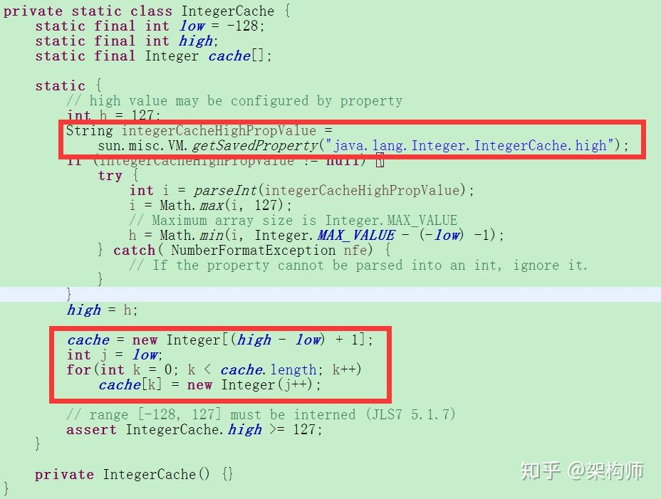

# 深入浅出JAVA包装类及面试题陷阱

## **什么是包装类**

虽然 Java 语言是典型的面向对象编程语言，但其中的八种基本数据类型并不支持面向对象编程，基本类型的数据不具备“对象”的特性——不携带属性、没有方法可调用。 沿用它们只是为了迎合人类根深蒂固的习惯，并的确能简单、有效地进行常规数据处理。这种借助于非面向对象技术的做法有时也会带来不便。比如：

1. 编码过程中只接收对象的情况，比如List中只能存入对象，不能存入基本数据类型；比如一个方法的参数是Object时，不能传入基本数据类型，但可以传入对应的包装类； 比如泛型等等。
2. 基本数据类型没有toString()方法等

Java中对每种基本类型都有一个对应的包装类：

- byte -> Byte
- short -> Short
- int -> Integer
- long -> Long
- float -> Float
- double -> Double
- boolean -> Boolean
- char -> Character
  其中需要注意int对应的是Integer，char对应的Character，其他6个都是基本类型首字母大写即可。

每个包装类的对象可以封装一个相应的基本类型的数据，并提供了其它一些有用的方法。包装类对象一经创建，其内容（所封装的基本类型数据值）不可改变(类似于String类，可看源码)。

### **基本数据类型和包装类的区别**

1. 定义不同。包装类属于对象，基本数据类型不是
2. 声明和使用方式不同。包装类使用new初始化，有些集合类的定义不能使用基本数据类型，例如 ArrayList<Integer>
3. 初始值不同。包装类默认值为null，基本数据类型则不同的类型不一样（具体见上表）
4. 存储方式和位置不同，从而性能不同。基本数据类型存储在栈（stack）中，包装类则分成引用和实例，引用在栈（stack）中，具体实例在堆（heap）中。可以通过程序来验证速度的不同。

### **拆箱/装箱**

基本类型和对应的包装类可以相互装换：

- 由基本类型向对应的包装类转换称为装箱，例如把 int 包装成 Integer 类的对象：

```java
Integer i = Integer.valueOf(1); //手动装箱
Integer j = 1; //自动装箱
```

- 包装类向对应的基本类型转换称为拆箱，例如把 Integer 类的对象重新简化为 int。

```java
Integer i0 = new Integer(1);
int i1 = i0; //自动拆箱
int i2 = i0.intValue(); //手动拆箱
```

jdk5.0开始增加自动装箱/拆箱

### **面试陷阱**

　　介绍完包装类的基本情况，下面重点讲几个面试/笔试中的常见陷阱。

1. 关于equals

```java
double i0 = 0.1;
Double i1 = new Double(0.1);
Double i2 = new Double(0.1);
System.out.println(i1.equals(i2)); //true 2个包装类比较，比较的是包装的基本数据类型的值
System.out.println(i1.equals(i0)); //true 基本数据类型和包装类型比较时，会先把基本数据类型包装后再比较
```

注意**equals方法比较的是真正的值**。

基本数据类型和包装类比较时，会先把基本数据类型包装成对应的包装类型，再进行比较。这一点可以通过查看.class字节码来证明：


为什么需要这么做？ 我们来查看JDK中Double包装类的equals方法：


可以看到equals方法中的参数是一个Object对象，而基本数据类型并不是一个对象类型，所以需要先将基本数据类型包装成对应的包装类后才能作为参数传入equals方法中。由此也侧面验证了包装类的必要性。

\2. 关于==（双等号）比较

==（双等号）比较的陷阱比较多。对此有必要先讲一个前置知识点：
**对于基本数据类型，==（双等号）比较的是值，而对于包装类型，==（双等号）比较的则是2个对象的内存地址。**

OK，下面开始讲题：

```java
double i0 = 0.1;
Double i1 = new Double(0.1);
Double i2 = new Double(0.1);
System.out.println(i1 == i2);    //false new出来的都是新的对象
System.out.println(i1 == i0);    //true 基本数据类型和包装类比较，会先把包装类拆箱
```

注意一点规律，**new出来的都是新的对象**。2个新的对象内存地址不同，那么==号比较的结果肯定是false。
基本数据类型和包装类型比较时，会先把包装类拆箱再进行值比较（和equals是反的）。这个也可以通过查看字节码来证明：


为什么要这么做？因为如果反过来把基本数据类型进行包装后再比较，那么2个包装类对象的内存地址是不一样的，==号比较肯定一直为false！

继续来看另一个陷阱：　　

```java
Double i1 = Double.valueOf(0.1);
Double i2 = Double.valueOf(0.1);
System.out.println(i1 == i2); //false valueOf方法内部实际上也是new
```

注意这里i1和i2是用包装类的静态方法valueOf来构造的。我们看一下Double.valueOf的源码：


可以看到，**valueOf内部也是用的new方法来构造对象的**。2个new出来的对象，内存地址肯定是不一样的。

那么问题来了，下面的代码运行结果却让人大跌眼镜：　　

```java
System.out.println(Integer.valueOf(1) ==Integer.valueOf(1)); //true 
System.out.println(Integer.valueOf(999) ==Integer.valueOf(999)); //false 
```

是不是感觉不会再爱了？
　　没关系，我们还是从源码来分析问题。查看Integer.valueOf方法的源码：


可以看到，当i的值在low和high范围内是，返回的是一个cache里的Integer对象。
我们继续追踪IntegerCache.cache的源码：



可以看到从-128到到127之间的值都被缓存到cache里了。这个叫做**包装类的缓存**。
**Java对部分经常使用的数据采用缓存技术，在类第一次被加载时换创建缓存和数据。当使用等值对象时直接从缓存中获取，从而提高了程序执行性能。（通常只对常用数据进行缓存）**
Integer默认缓存是-128到127之间的对象，上限127可以通过修改JVM参数来更改。
回到我们的示例代码中，可以看到Integer.valueOf(1)是会直接从缓存中去取被缓存的同一个对象，所以比较的值是true。而Integer.valueOf(999)是缓存范围外的值，那么就会new一个新的对象出来，所以比较的结果是false。
实际上，包装类中整数型的类型基本上都有缓存数据。可以通过阅读源码了解。不过只有Integer类可以通过修改JVM参数来更改缓存上限。
其他类型的缓存范围为：

1. Integer类型有缓存-128-127的对象。缓存上限可以通过配置jvm更改

2. Byte,Short,Long类型有缓存(-128-127)

3. Character缓存0-127

4. Boolean缓存TRUE、FALSE

   尤其需要特别注意的是，**只有valueOf方法构造对象时会用到缓存，new方法等不会使用缓存！**

了解了缓存机制，那么再看下面这道题目：

```java
Integer i4 = Integer.valueOf(1);
Integer i5 =1;
System.out.println(i4 == i5); //true

Integer i7 = Integer.valueOf(999);
Integer i8 = 999;
System.out.println(i7 == i8); //false
```

是不是觉得脑仁疼？
没关系，我们看一下上面自动包装时的class字节码：


发现什么了？ 自动包装时实际上还是调用的valueOf方法。而上面我们讲过的，valueOf方法用到了缓存池。