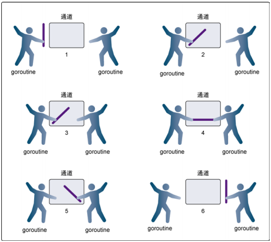
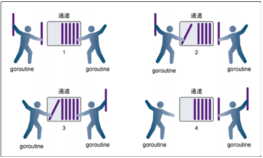

# [Golang 入门 : channel(通道)](https://www.cnblogs.com/sparkdev/p/10988499.html)

笔者在《[Golang 入门 : 竞争条件](https://www.cnblogs.com/sparkdev/p/10962430.html)》一文中介绍了 Golang 并发编程中需要面对的竞争条件。本文我们就介绍如何使用 Golang 提供的 channel(通道) 消除竞争条件。

Channel 是 Golang 在语言级别提供的 goroutine 之间的通信方式，可以使用 channel 在两个或多个 goroutine 之间传递消息。Channel 是进程内的通信方式，因此通过 channel 传递对象的过程和调用函数时的参数传递行为比较一致，比如也可以传递指针等。使用通道发送和接收所需的共享资源，可以在 goroutine 之间消除竞争条件。

当一个资源需要在 goroutine 之间共享时，channel 在 goroutine 之间架起了一个管道，并提供了确保同步交换数据的机制。Channel 是类型相关的，也就是说，一个 channel 只能传递一种类型的值，这个类型需要在声明 channel 时指定。可以通过 channel 共享内置类型、命名类型、结构类型和引用类型的值或者指针。

# 基本语法

声明 channel 的语法格式为：
**var ChannelName chan ElementType**

与一般变量声明的不同之处仅仅是在类型前面添加了一个 chan 关键字。ElementType 则指明这个 channel 能够传递的数据的类型。比如声明一个传递 int 类型的 channel：

```
var ch chan int
```

或者是声明一个 map，其元素是 bool 型的 channel：

```
var m map[string] chan bool
```

在 Golang 中需要使用内置的 make 函数类创建 channel 的实例：

```
ch := make(chan int)
```

这样就声明并初始化了一个名为 ch 的 int 型 channel。使用 channel 发送和接收数据的语法也很直观，比如下面的代码把数据发送到 channel 中：

```
ch <- value
```

**向 channel 中写入数据通常会导致程序阻塞，直到有其它 goroutine 从这个 channel 中读取数据。**下面的代码把数据从 channel 读取到变量中：

```
value := <-ch
```

**注意，如果 channel 中没有数据，那么从 channel 中读取数据也会导致程序阻塞，直到 channel 中被写入数据为止。**

根据 channel 是否有缓冲区可以简单地把 channel 分为无缓冲区的 channel 和带缓冲区的 channel，在本文接下来的篇幅中会详细的介绍这两类 channel 的用法。

# select

Linux 系统中的 select 函数用来监控一系列的文件句柄，一旦其中一个文件句柄发生了 I/O 动作，select 函数就会返回。该函数主要被用来实现高并发的 socket 服务器程序。Golang 中的 select 关键字和 linux 中的 select 函数功能有点相似，它主要用于处理异步 I/O 问题。

select 的语法与 switch 的语法非常相似，由 select 开始一个新的选择块，每个选择条件有 case 语句来描述。与 switch 语句可以选择任何可使用相等比较的条件相比，select 有比较多的限制，其中最大的一条限制就是每个 case 语句里必须是一个 I/O 操作。其大致的结构如下：

```
select {
    case <-chan1:       // 如果 chan1 成功读取到数据，则执行该 case 语句
    case chan2 <- 1:    // 如果成功向 chan2 写入数据，则执行该 case 语句
    default:            // 如果上面的条件都没有成功，则执行 default 流程
}
```

可以看出，select 不像 switch，后面并没有条件判断，而是直接去查看 case 语句。每个 case 语句都必须是一个面向 channel 的操作。比如上面的例子中，第一个 case 试图从 chan1 读取一个数据并直接忽略读取到的数据，而第二个 case 则试图向 chan2 中写入一个整数 1，如果这两者都没有成功，则执行 default 语句。

# 无缓冲的 channel

无缓冲的 channel(unbuffered channel) 是指在接收前没有能力保存任何值的 channel。这种类型的 channel 要求发送 goroutine 和接收 goroutine 同时准备好，才能完成发送和接收操作。如果两个 goroutine 没有同时准备好，channel 会导致先执行发送或接收操作的 goroutine 阻塞等待。这种对通道进行发送和接收的交互行为本身就是同步的。其中任意一个操作都无法离开另一个操作单独存在。我们可以通过下面的图示形象地理解两个 goroutine 如何利用无缓冲的 channel 来共享一个值(下图来自互联网)：



下面详细地解释一下上图：

- 在第 1 步，两个 goroutine 都到达通道，但两个都没有开始执行数据的发送或接收。
- 在第 2 步，左侧的 goroutine 将它的手伸进了通道，这模拟了向通道发送数据的行为。这时，这个 goroutine 会在通道中被锁住，直到交换完成。
- 在第 3 步，右侧的 goroutine 将它的手放入通道，这模拟了从通道里接收数据。这个 goroutine一样也会在通道中被锁住，直到交换完成。
- 在第 4 步和第 5 步，进行数据交换。
- 在第 6 步，两个 goroutine 都将它们的手从通道里拿出来，这模拟了被锁住的 goroutine 得到释放。两个 goroutine 现在都可以去做别的事情了。

下面的例子模拟一场网球比赛。在网球比赛中，两位选手会把球在两个人之间来回传递。选手总是处在以下两种状态之一：要么在等待接球，要么将球打向对方。可以使用两个goroutine来模拟网球比赛，并使用无缓冲的通道来模拟球的来回：

```
// 这个示例程序展示如何用无缓冲的通道来模拟
//2个goroutine间的网球比赛
package main

import(
    "math/rand"
    "sync"
    "time"
    "fmt"
)

// wg用来等待程序结束
var wg sync.WaitGroup

func init() {
    rand.Seed(time.Now().UnixNano())
}

// main是所有Go程序的入口
func main() {
    // 创建一个无缓冲的通道
    court := make(chan int)

    // 计数加2，表示要等待两个goroutine
    wg.Add(2)

    // 启动两个选手
    go player("Nick", court)
    go player("Jack", court)

    // 发球
    court <- 1

    // 等待游戏结束
    wg.Wait()
}

// player 模拟一个选手在打网球
func player(name string, court chan int) {
    // 在函数退出时调用Done来通知main函数工作已经完成
    defer wg.Done()

    for{
        // 等待球被击打过来
        ball, ok := <-court
        if !ok {
            // 如果通道被关闭，我们就赢了
            fmt.Printf("Player %s Won\n", name)
            return
        }

        // 选随机数，然后用这个数来判断我们是否丢球
        n := rand.Intn(100)
        if n%5 == 0 {
            fmt.Printf("Player %s Missed\n", name)

            // 关闭通道，表示我们输了
            close(court)
            return
        }

        // 显示击球数，并将击球数加1
        fmt.Printf("Player %s Hit %d\n", name, ball)
        ball++

        // 将球打向对手
        court <- ball
    }
}
```

运行上面的代码，会输出类似下面的信息：

```
Player Jack Hit 1
Player Nick Hit 2
Player Jack Hit 3
Player Nick Hit 4
Player Jack Missed
Player Nick Won
```

简单解释一下上面的代码：
在 main 函数中创建了一个 int 类型的无缓冲的通道，使用该通道让两个 goroutine 在击球时能够互相同步。然后创建了参与比赛的两个 goroutine。在这个时候，两个 goroutine 都阻塞住等待击球。court <- 1 模拟发球，将球发到通道里，程序开始执行这个比赛，直到某个 goroutine 输掉比赛。
在 player 函数里，主要是运行一个无限循环的 for 语句。在这个循环里，是玩游戏的过程。goroutine 从通道接收数据，用来表示等待接球。这个接收动作会锁住 goroutine，直到有数据发送到通道里。通道的接收动作返回时，会检测 ok 标志是否为 false。如果这个值是 false，表示通道已经被关闭，游戏结束。在这个模拟程序中，使用随机数来决定 goroutine 是否击中了球。如果击中了球，就把 ball 的值递增 1，并将 ball 作为球重新放入通道，发送给另一位选手。在这个时刻，两个 goroutine 都会被锁住，直到交换完成。最终，引某个 goroutine 没有打中球会把通道关闭。之后两个 goroutine 都会返回，通过 defer 声明的 Done 会被执行，程序终止。

# 带缓冲的 channel

带缓冲的 channel(buffered channel) 是一种在被接收前能存储一个或者多个值的通道。这种类型的通道并不强制要求 goroutine 之间必须同时完成发送和接收。通道会阻塞发送和接收动作的条件也会不同。只有在通道中没有要接收的值时，接收动作才会阻塞。只有在通道没有可用缓冲区容纳被发送的值时，发送动作才会阻塞。这导致有缓冲的通道和无缓冲的通道之间的一个很大的不同：**无缓冲的通道保证进行发送和接收的 goroutine 会在同一时间进行数据交换；有缓冲的通道没有这种保证。**可以通过下面的图示形象地理解两个 goroutine 分别向带缓冲的通道里增加一个值和从带缓冲的通道里移除一个值(下图来自互联网)：



下面详细地解释一下上图：

- 在第 1 步，右侧的 goroutine 正在从通道接收一个值。
- 在第 2 步，右侧的这个 goroutine 独立完成了接收值的动作，而左侧的 goroutine 正在发送一个新值到通道里。
- 在第 3 步，左侧的 goroutine 还在向通道发送新值，而右侧的 goroutine 正在从通道接收另外一个值。这个步骤里的两个操作既不是同步的，也不会互相阻塞。
- 最后，在第 4 步，所有的发送和接收都完成，而通道里还有几个值，也有一些空间可以存更多的值。

创建带缓冲区的 channel 非常简单，只需要再添加一个缓冲区的大小就可以了，比如创建一个传递 int 类型数据，缓冲区为 10 的 channel：

```
ch := make(chan int, 10)
```

下面的 demo 使用一组 goroutine 来接收并完成任务，带缓冲区的通道提供了一种清晰而直观的方式来实现这个功能：

```
// 这个示例程序展示如何使用
// 有缓冲的通道和固定数目的
// goroutine来处理一堆工作
package main

import(
    "math/rand"
    "sync"
    "time"
    "fmt"
)

const(
    numberGoroutines = 2 // 要使用的goroutine的数量
    taskLoad = 5 // 要处理的工作的数量
)

// wg用来等待程序结束
var wg sync.WaitGroup

func init()  {
    rand.Seed(time.Now().UnixNano())
}

// main是所有Go程序的入口
func main()  {
    // 创建一个有缓冲的通道来管理工作
    tasks := make(chan string, taskLoad)
    
    // 启动goroutine来处理工作
    wg.Add(numberGoroutines)
    for gr := 1; gr <= numberGoroutines; gr++ {
        go worker(tasks, gr)
    }
    
    // 增加一组要完成的工作
    for post := 1; post <= taskLoad; post++ {
        tasks <- fmt.Sprintf("Task: %d", post)
    }
    
    // 当所有工作都处理完时关闭通道
    // 以便所有goroutine退出
    close(tasks)
    
    // 等待所有工作完成
    wg.Wait()
}

// worker作为goroutine启动来处理
// 从有缓冲的通道传入的工作
func worker(tasks chan string, worker int) {
    // 通知函数已经返回
    defer wg.Done()

    for{
        // 等待分配工作
        task, ok := <-tasks
        if !ok{
            // 这意味着通道已经空了，并且已被关闭
            fmt.Printf("Worker: %d: Shutting Down\n", worker)
            return
        }

        // 显示我们开始工作了
        fmt.Printf("Worker: %d: Started %s\n", worker, task)

        // 随机等一段时间来模拟工作
        sleep := rand.Int63n(100)
        time.Sleep(time.Duration(sleep)* time.Millisecond)

        // 显示我们完成了工作
        fmt.Printf("Worker: %d: Completed %s\n", worker, task)
    }
}
```

运行上面的程序，输出结果大致如下：

```
Worker: 2: Started Task: 1
Worker: 1: Started Task: 2
Worker: 1: Completed Task: 2
Worker: 1: Started Task: 3
Worker: 1: Completed Task: 3
Worker: 1: Started Task: 4
Worker: 2: Completed Task: 1
Worker: 2: Started Task: 5
Worker: 1: Completed Task: 4
Worker: 1: Shutting Down
Worker: 2: Completed Task: 5
Worker: 2: Shutting Down
```

代码里有很详细的注释，因此不再赘言，只解释一下通道的关闭：
关闭通道的代码非常重要。当通道关闭后，goroutine 依旧可以从通道接收数据，但是不能再向通道里发送数据。能够从已经关闭的通道接收数据这一点非常重要，因为这允许通道关闭后依旧能取出其中缓冲的全部值，而不会有数据丢失。从一个已经关闭且没有数据的通道里获取数据，总会立刻返回，并返回一个通道类型的零值。如果在获取通道时还加入了可选的标志，就能得到通道的状态信息。

# 处理超时

使用 channel 时需要小心，比如对于下面的简单用法：

```
i := <-ch
```

碰到永远没有往 ch 中写入数据的情况，那么这个读取动作将永远也无法从 ch 中读取到数据，导致的结果就是整个 goroutine 永远阻塞并且没有挽回的机会。如果 channel 只是被同一个开发者使用，那样出问题的可能性还低一些。但如果一旦对外公开，就必须考虑到最差情况并对程序进行维护。

Golang 没有提供直接的超时处理机制，但可以利用 select 机制变通地解决。因为 select 的特点是只要其中一个 case 已经完成，程序就会继续往下执行，而不会考虑其它的 case。基于此特性我们来实现一个 channel 的超时机制：

```
ch := make(chan int)
// 首先实现并执行一个匿名的超时等待函数
timeout := make(chan bool, 1)
go func() {
    time.Sleep(1e9) // 等待 1 秒
    timeout <- true
}()
// 然后把 timeout 这个 channel 利用起来
select {
case <-ch:
    // 从 ch 中读取到数据
case <- timeout:
    // 一直没有从 ch 中读取到数据，但从 timeout 中读取到了数据
    fmt.Println("Timeout occurred.")
}
```

执行上面的代码，输出的结果为：

```
Timeout occurred.
```

# 关闭 channel

关闭 channel 非常简单，直接调用 Golang 内置的 close() 函数就可以了：

```
close(ch)
```

在关闭了 channel 之后我们要面对的问题是：如何判断一个 channel 是否已关闭？
其实在从 channel 中读取数据的同时，还可以获得一个布尔类型的值，该值表示 channel 是否已关闭：

```
x, ok := <-ch
```

如果 ok 的值为 false，则表示 ch 已经被关闭。

**参考：**
《Go语言实战》
《Go语言编程入门与实战技巧》
