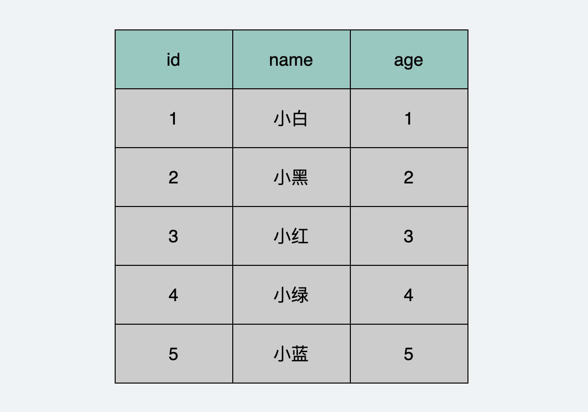
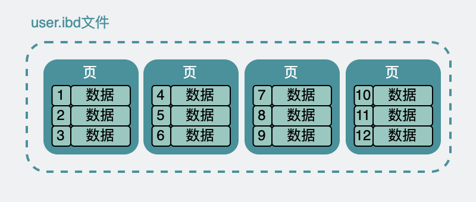
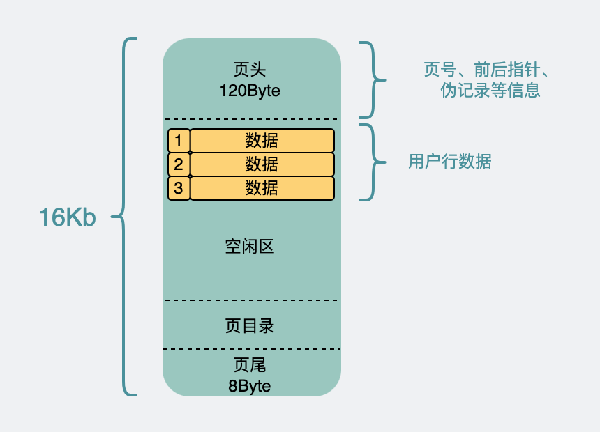
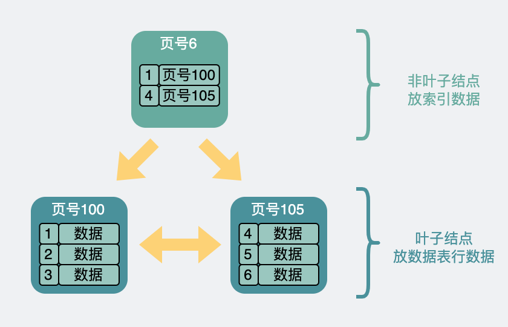
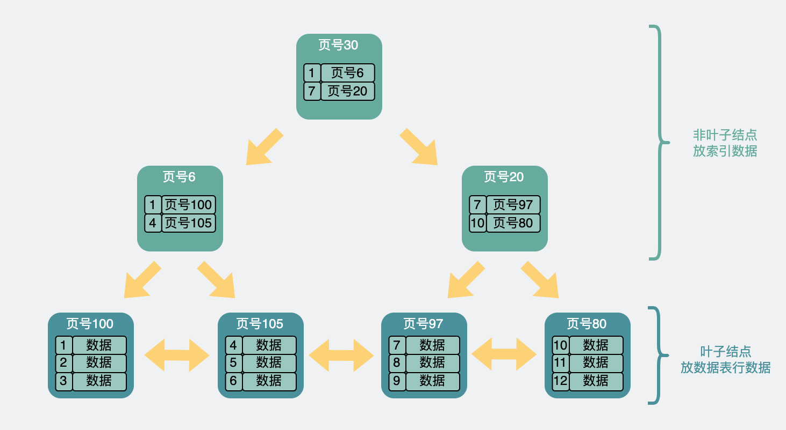
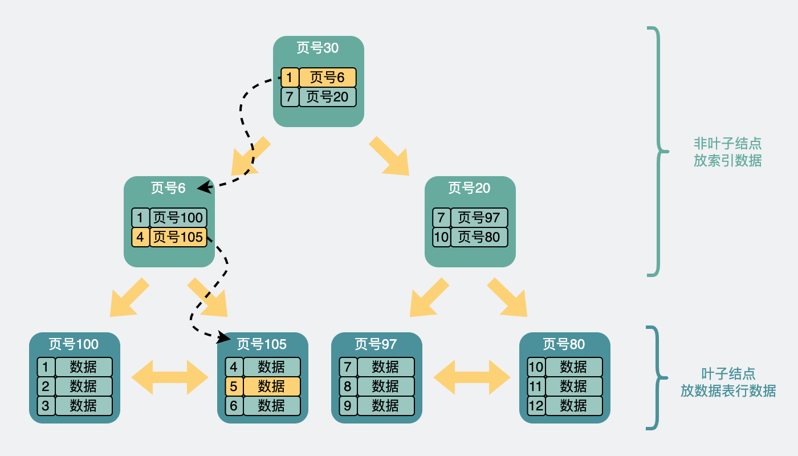
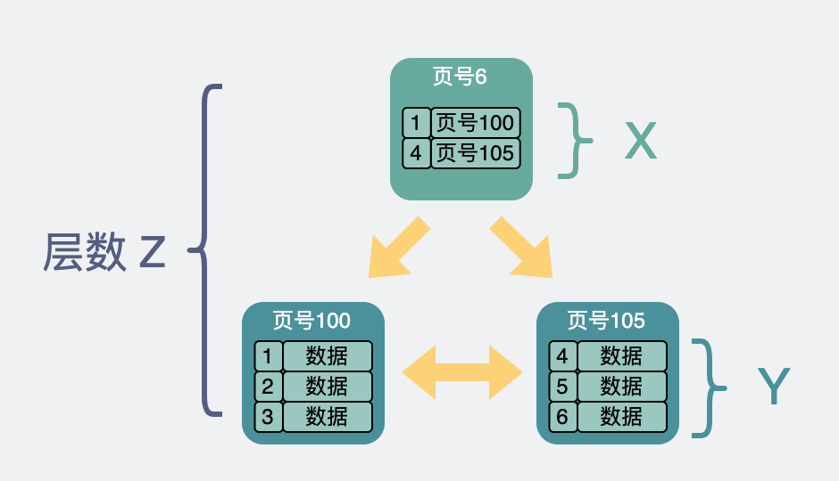
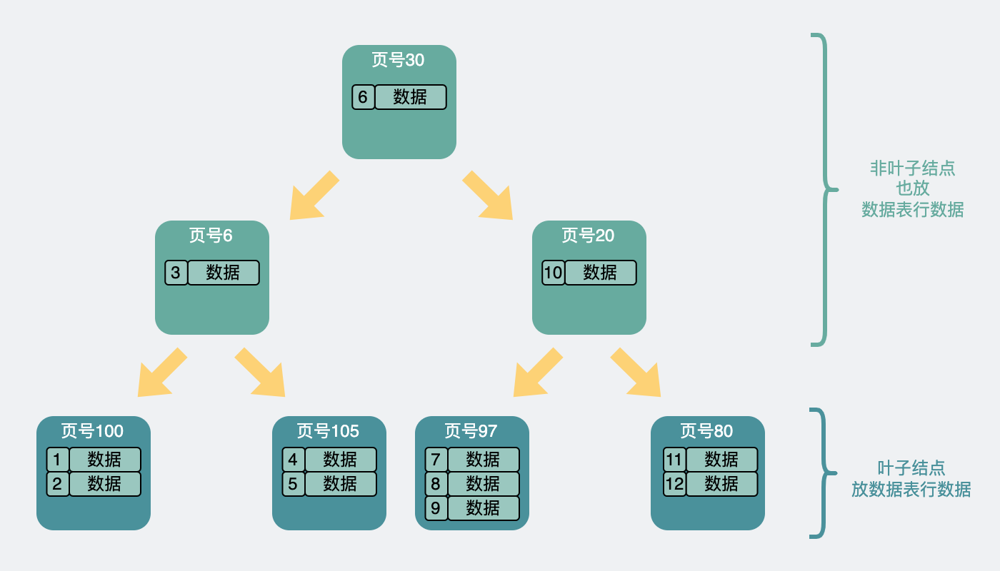

# 为什么大家说mysql数据库单表最大两千万？依据是啥？

转载自 [为什么大家说mysql数据库单表最大两千万？依据是啥？](https://xiaobaidebug.top/2022/04/05/%E5%9B%BE%E8%A7%A3mysql/%E4%B8%BA%E4%BB%80%E4%B9%88%E5%A4%A7%E5%AE%B6%E8%AF%B4mysql%E6%95%B0%E6%8D%AE%E5%BA%93%E5%8D%95%E8%A1%A8%E6%9C%80%E5%A4%A7%E4%B8%A4%E5%8D%83%E4%B8%87%EF%BC%9F%E4%BE%9D%E6%8D%AE%E6%98%AF%E5%95%A5%EF%BC%9F/)


故事从好多年前说起。

想必大家也听说过数据库单表**建议最大2kw**条数据这个说法。如果超过了，性能就会下降得比较厉害。

巧了。

我也听说过。

**但我不接受它的建议，硬是单表装了1亿条数据。**

这时候，我们组里新来的实习生看到了之后，天真无邪的问我：”单表不是建议最大两千万吗？为什么这个表都**放了1个亿还不分库分表**“？

我能说我是**因为懒**吗？我当初设计时哪里想到这表竟然能涨这么快。。。

我不能。

说了等于承认自己是**开发组里的毒瘤**，虽然我确实是，但我**不能承认**。

我如坐针毡，如芒刺背，如鲠在喉。

开始了一波骚操作。

“我这么做是有道理的”

“虽然这个表很大，但你有没有发现它查询其实还是很快”

“这个2kw是个建议值，我们要来看下这个2kw是怎么来的”


### 数据库单表行数最大多大？

我们先看下单表行数理论最大值是多少。

建表的SQL是这么写的，

```
CREATE TABLE `user` (
  `id` int(10) unsigned NOT NULL AUTO_INCREMENT COMMENT '主键',
  `name` varchar(100) NOT NULL DEFAULT '' COMMENT '名字',
  `age` int(11) NOT NULL DEFAULT '0' COMMENT '年龄',
  PRIMARY KEY (`id`),
  KEY `idx_age` (`age`)
) ENGINE=InnoDB AUTO_INCREMENT=100037 DEFAULT CHARSET=utf8;
```

其中id就是主键。主键本身唯一，也就是说主键的大小可以限制表的上限。

如果主键声明为`int`大小，也就是32位，那么能支持2^32-1，也就是**21个亿**左右。

如果是`bigint`，那就是2^64-1，但这个**数字太大**，一般还没到这个限制之前，**磁盘先受不了**。

搞离谱点。

如果我把主键声明为 `tinyint`，一个字节，8位，最大2^8-1，也就是`255`。

```
CREATE TABLE `user` (
  `id` tinyint(2) unsigned NOT NULL AUTO_INCREMENT COMMENT '主键',
  `name` varchar(100) NOT NULL DEFAULT '' COMMENT '名字',
  `age` int(11) NOT NULL DEFAULT '0' COMMENT '年龄',
  PRIMARY KEY (`id`),
  KEY `idx_age` (`age`)
) ENGINE=InnoDB AUTO_INCREMENT=0 DEFAULT CHARSET=utf8;
```

如果我想插入一个id=256的数据，那**就会报错**。

```
mysql> INSERT INTO `tmp` (`id`, `name`, `age`) VALUES (256, '', 60);
ERROR 1264 (22003): Out of range value for column 'id' at row 1
```

也就是说，`tinyint`主键限制表内最多255条数据。

那除了主键，还有哪些因素会影响行数？


### 索引的结构

索引内部是用的B+树，这个也是八股文老股了，大家估计也背得很熟了。

为了不让大家有过于强烈的审丑疲劳，今天我尝试从另外一个角度给大家讲讲这玩意。


#### 页的结构

假设我们有这么一张user数据表。



其中id是**唯一主键**。

这看起来的一行行数据，为了方便，我们后面就叫它们**record**吧。

这张表看起来就跟个excel表格一样。excel的数据在硬盘上是一个xx.excel的文件。

而上面user表数据，在硬盘上其实也是类似，放在了user.**ibd**文件下。含义是user表的innodb data文件，专业点，又叫**表空间**。

虽然在数据表里，它们看起来是挨在一起的。但实际上在user.ibd里他们被分成很多小份的**数据页**，每份大小16k。

类似于下面这样。



我们把视角聚焦一下，放到页上面。

整个页`16k`，不大，但record这么多，一页肯定放不下，所以会分开放到很多页里。并且这16k，也不可能全用来放record对吧。

因为record们被分成好多份，放到好多页里了，为了唯一标识具体是哪一页，那就需要引入**页号**（其实是一个表空间的地址偏移量）。同时为了把这些数据页给关联起来，于是引入了**前后指针**，用于指向前后的页。这些都被加到了**页头**里。

页是需要读写的，16k说小也不小，写一半电源线被拔了也是有可能发生的，所以为了保证数据页的正确性，还引入了校验码。这个被加到了**页尾**。

那剩下的空间，才是用来放我们的record的。而record如果行数特别多的话，进入到页内时挨个遍历，效率也不太行，所以为这些数据生成了一个**页目录**，具体实现细节不重要。只需要知道，它可以通过**二分查找**的方式将查找效率**从O(n) 变成O(lgn)**。



#### 从页到索引

如果想查一条record，我们可以把表空间里每一页都捞出来，再把里面的record捞出来挨个判断是不是我们要找的。

行数量小的时候，这么操作也没啥问题。

**行数量大了，性能就慢了**，于是为了加速搜索，我们可以在每个数据页里选出**主键id最小**的record，而且只需要它们的**主键id和所在页的页号**。组成**新的record**，放入到一个新生成的一个数据页中，这个**新数据页跟之前的页结构没啥区别，而且大小还是16k。**

但为了跟之前的数据页进行区分。数据页里加入了**页层级（page level）**的信息，从0开始往上算。于是页与页之间就有了**上下层级**的概念，就像下面这样。



突然页跟页之间看起来就像是一棵倒过来的树了。也就是我们常说的**B+树**索引。

最下面那一层，**page level 为0**，也就是所谓的**叶子结点**，其余都叫**非叶子结点**。

上面展示的是**两层**的树，如果数据变多了，我们还可以再通过类似的方法，再往上构建一层。就成了**三层**的树。




那现在我们就可以通过这样一棵B+树加速查询。举个例子。

比方说我们想要查找行数据5。会先从顶层页的record们入手。**record里包含了主键id和页号（页地址）**。看下图黄色的箭头，向左最小id是1，向右最小id是7。那id=5的数据如果存在，那必定在左边箭头。于是顺着的record的页地址就到了`6号`数据页里，再判断id=5>4，所以肯定在右边的数据页里，于是加载`105号`数据页。在数据页里找到id=5的数据行，完成查询。



另外需要注意的是，上面的页的页号并不是连续的，它们在磁盘里也不一定是挨在一起的。

这个过程中查询了三个页，如果这三个页都在磁盘中（没有被提前加载到内存中），那么**最多**需要经历三次**磁盘IO查询**，它们才能被加载到内存中。


### B+树承载的记录数量

从上面的结构里可以看出B+树的**最末级叶子结点**里放了record数据。而**非叶子结点**里则放了用来加速查询的索引数据。

也就是说

同样一个16k的页，非叶子节点里每一条数据都指向一个新的页，而新的页有两种可能。

- 如果是末级叶子节点的话，那么里面放的就是一行行record数据。
- 如果是非叶子节点，那么就会循环继续指向新的数据页。

假设

- 非叶子结点内指向其他内存页的指针数量为`x`
- 叶子节点内能容纳的record数量为`y`
- B+树的层数为`z`



那这棵B+树放的**行数据总量**等于 `(x ^ (z-1)) * y`。


#### x怎么算

我们回去看数据页的结构。


非叶子节点里主要放索引查询相关的数据，放的是主键和指向页号。

主键假设是`bigint（8Byte）`，而页号在源码里叫`FIL_PAGE_OFFSET（4Byte）`，那么非叶子节点里的一条数据是`12Byte`左右。

整个数据页`16k`， 页头页尾那部分数据全加起来大概`128Byte`，加上页目录毛估占`1k`吧。那剩下的**15k**除以`12Byte`，等于`1280`，也就是可以指向**x=1280页**。

我们常说的二叉树指的是一个结点可以发散出两个新的结点。m叉树一个节点能指向m个新的结点。这个指向新节点的操作就叫**扇出（fanout）**。

而上面的B+树，它能指向1280个新的节点，恐怖如斯，可以说**扇出非常高**了。


#### y的计算

叶子节点和非叶子节点的数据结构是一样的，所以也假设剩下`15kb`可以发挥。

叶子节点里放的是真正的行数据。假设一条行数据`1kb`，所以一页里能放**y=15行**。


#### 行总数计算

回到 `(x ^ (z-1)) * y `这个公式。

已知`x=1280`，`y=15`。

假设B+树是**两层**，那`z=2`。则是`(1280 ^ (2-1)) * 15 ≈ 2w`

假设B+树是**三层**，那`z=3`。则是`(1280 ^ (3-1)) * 15 ≈ 2.5kw`

**这个2.5kw，就是我们常说的单表建议最大行数2kw的由来。**毕竟再加一层，数据就大得有点离谱了。三层数据页对应最多三次磁盘IO，也比较合理。


### 行数超一亿就慢了吗？

上面假设单行数据用了1kb，所以一个数据页能放个15行数据。

如果我单行数据用不了这么多，比如只用了`250byte`。那么单个数据页能放60行数据。

那同样是三层B+树，单表支持的行数就是 `(1280 ^ (3-1)) * 60 ≈ 1个亿`。

你看我一个亿的数据，其实也就三层B+树，在这个B+树里要查到某行数据，最多也是三次磁盘IO。所以并不慢。

这就很好的解释了文章开头，为什么我单表1个亿，但查询性能没啥大毛病。


### B树承载的记录数量

既然都聊到这里了，我们就顺着这个话题多聊一些吧。

我们都知道，现在mysql的索引都是B+树，而有一种树，跟B+树很像，叫**B树，也叫B-树**。

它跟B+树最大的区别在于，**B+树只在末级叶子结点处放数据表行数据，而B树则会在叶子和非叶子结点上都放。**

于是，B树的结构就类似这样



B树将行数据都存在非叶子节点上，假设每个数据页还是16kb，掐头去尾每页剩15kb，并且一条数据表行数据还是占1kb，就算不考虑各种页指针的情况下，也只能放个15条数据。**数据页扇出明显变少了。**

计算可承载的总行数的公式也变成了一个**等比数列**。

```
15 + 15^2 +15^3 + ... + 15^z
```

其中**z还是层数**的意思。

为了能放`2kw`左右的数据，需要`z>=6`。也就是树需要有6层，查一次要访问6个页。假设这6个页并不连续，为了查询其中一条数据，最坏情况需要进行**6次磁盘IO**。

而B+树同样情况下放2kw数据左右，查一次最多是**3次磁盘IO。**

磁盘IO越多则越慢，这两者在性能上差距略大。

为此，**B+树比B树更适合成为mysql的索引。**


### 总结

- B+树叶子和非叶子结点的数据页都是16k，且数据结构一致，区别在于叶子节点放的是真实的行数据，而非叶子结点放的是主键和下一个页的地址。
- B+树一般有两到三层，由于其高扇出，三层就能支持2kw以上的数据，且一次查询最多1~3次磁盘IO，性能也还行。
- 存储同样量级的数据，B树比B+树层级更高，因此磁盘IO也更多，所以B+树更适合成为mysql索引。
- 索引结构不会影响单表最大行数，2kw也只是推荐值，超过了这个值可能会导致B+树层级更高，影响查询性能。
- 单表最大值还受主键大小和磁盘大小限制。

### 参考资料

《MYSQL内核：INNODB存储引擎 卷1》

### 最后


虽然我在单表里塞了1亿条数据，但这个操作的前提是，我很清楚这不会太影响性能。

这波解释，毫无破绽，无懈可击。

到这里，连我自己都被自己说服了。想必实习生也是。

可恶，这该死的毒瘤竟然有些”知识渊博”。


