# [redis系列--你真的入门了吗？redis4.0入门～](https://www.cnblogs.com/wdliu/p/9360286.html)

## 前言

redis作为nosql家族中非常热门的一员，也是被大型互联网公司所青睐，无论你是开发、测试或者运维，学习掌握它总会为你的职业生涯增色添彩。

当然，你或多或少已经了解redis，但是你是否了解其中的某些细节，本片文章将详细介绍redis基础，后续也会介绍其高级部分如、持久化、复制、集群等内容，希望对你有所帮助。

自redis3.0发布已经3年了，redis目前官方提供的redis稳定版本是4.0，以下示例均在4.0版本上进行。

## 一、redis简介

### 概述

redis(REmote DIctionary Server)是一个由Salvatore Sanfilippo写key-value存储系统，它由C语言编写、遵守BSD协议、支持网络、可基于内存亦可持久化的日志型、Key-Value类型的数据库，并提供多种语言的API。和Memcached类似，它支持存储的value类型相对更多，包括string(字符串)、list(链表)、set(集合)、zset(sorted set --有序集合)和hash（哈希类型）。这些数据类型都支持push/pop、add/remove及取交集并集和差集及更丰富的操作，而且这些操作都是原子性的。在此基础上，redis支持各种不同方式的排序。与memcached一样，为了保证效率，数据都是缓存在内存中。区别的是redis会周期性的把更新的数据写入磁盘或者把修改操作写入追加的记录文件，并且在此基础上实现了master-slave(主从)同步，redis在3.0版本推出集群模式。

### 特点、优势

- k、v键值存储以及数据结构存储（如列表、字典）
- 所有数据(包括数据的存储)操作均在内存中完成
- 单线程服务(这意味着会有较多的阻塞情况)，采用epoll模型进行请求响应，对比nginx
- 支持主从复制模式，更提供高可用主从复制模式（哨兵）
- 去中心化分布式集群
- 丰富的编程接口支持，如Python、Golang、Java、php、Ruby、Lua、Node.js 
- 功能丰富，除了支持多种数据结构之外，还支持事务、发布/订阅、消息队列等功能
- 支持数据持久化(AOF、RDB)

### 对比memcache

- memcache是一个分布式的内存对象缓存系统，并不提供持久存储功能，而redis拥有持久化功能
- memcache数据存储基于LRU(简单说：最近、最少使用key会被剔除)，而redis则可以永久保存(服务一直运行情况下)
- memcache是多线程的（这是memcache优势之一），也就意味着阻塞情况少，而redis是单线程的，阻塞情况相对较多
- 两者性能上相差不大
- memcache只支持简单的k、v数据存储，而redis支持多种数据格式存储。
- memcache是多线程、非阻塞IO复用网络模型，而redis是单线程IO复用模型

## 二、开始

### 源码部署

```
yum install gcc -y  #安装C依赖
wget http://download.redis.io/redis-stable.tar.gz  #下载稳定版本
tar zxvf redis-stable.tar.gz  #解压
cd redis-stable
make PREFIX=/opt/app/redis install   #指定目录编译，也可以不用指定
make install
mkdir /etc/redis   #建立配置目录
cp redis.conf /etc/redis/6379.conf # 拷贝配置文件
cp utils/redis_init_script /etc/init.d/redis  #拷贝init启动脚本针对6.X系统
chmod a+x  /etc/init.d/redis  #添加执行权限
vi /etc/redis/6379.conf #修改配置文件： 
bind 0.0.0.0      #监听地址
maxmemory 4294967296   #限制最大内存（4G）：
daemonize yes   #后台运行

####启动与停止
/etc/init.d/redis start
/etc/init.d/redis stop
```

查看是否成功安装

```
#执行客户端工具
redis-cli 
#输入命令info
127.0.0.1:6379> info
# Server
redis_version:4.0.10
redis_git_sha1:00000000
redis_git_dirty:0
redis_build_id:cf83e9c690dbed33
redis_mode:standalone
os:Linux 2.6.32-642.el6.x86_64 x86_64
arch_bits:64
multiplexing_api:epoll
```

### 二进制文件说明

redis安装完成后会有以下可执行文件（window下是exe文件）生成，下面是各个文件的作用。

```
redis-server　　　　   #Redis服务器和Sentinel服务器，启动时候可使用--sentinel指定为哨兵
redis-cli　　　　　    #Redis命令行客户端 
redis-benchmark　     #Redis性能测试工具 
redis-check-aof      #AOF文件修复工具 
redis-check-dump     #RDB文件检测工具 
redis-sentinel       #Sentinel服务器,4.0版本已经做了软链接到redis-server
```

## 三、配置详解

redis所有的配置参数都可以通过客户端通过“CONFIG GET 参数名” 获取，参数名支持通配符，如*代表所有。所得结果并按照顺序分组，第一个返回结果是参数名，第二个结果是参数对应的值。

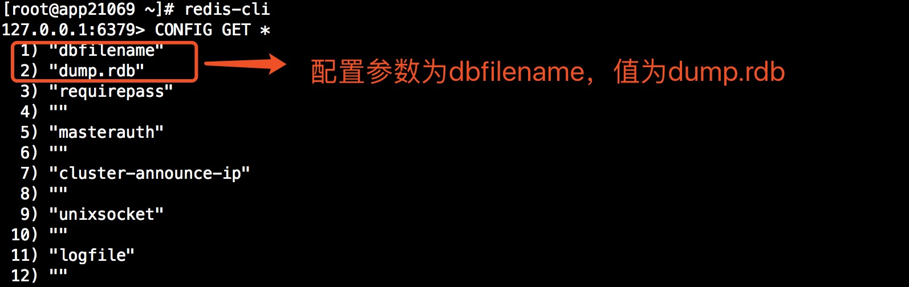

除了查看配置还可以使用CONFIG SET修改配置，写入配置文件使用CONFIG REWRITE,使用时是需要注意某些关于服务配置参数慎重修改，如bind。

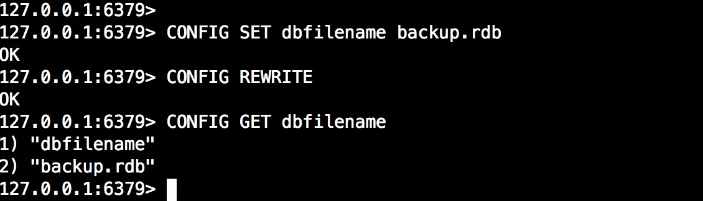

配置参数以及解释，需要注意的是，有些配置是4.0.10新增的，有些配置已经废除，如vm相关配置，和集群相关配置在集群篇章在进行补充。

```
logfile
#日志文件位置及文件名称

bind 0.0.0.0
#监听地址，可以有多个 如bind 0.0.0.0 127.0.0.1

daemonize yes
#yes启动守护进程运行，即后台运行，no表示不启用

pidfile /var/run/redis.pid 
# 当redis在后台运行的时候，Redis默认会把pid文件在在/var/run/redis.pid，也可以配置到其他地方。
# 当运行多个redis服务时，需要指定不同的pid文件和端口

port 6379
# 指定redis运行的端口，默认是6379

unixsocket 
#sock文件位置

unixsocketperm
#sock文件权限

timeout 0
# 设置客户端连接时的超时时间，单位为秒。当客户端在这段时间内没有发出任何指令，那么关闭该连接， 0是关闭此设置

loglevel debug
# 指定日志记录级别，Redis总共支持四个级别：debug、verbose、notice、warning，默认为verbose

logfile ""
# 日志文件配置,默认值为stdout，标准输出，若后台模式会输出到/dev/null

syslog-enabled
# 是否以syslog方式记录日志，yes开启no禁用，与该配置相关配置syslog-ident 和syslog-facility local0 分别是指明syslog的ident和facility

databases 16
#配置可用的数据库个数，默认值为16，默认数据库为0，数据库范围在0-（database-1）之间

always-show-logo yes #4.0以后新增配置
#是否配置日志显示redis徽标，yes显示no不显示


################################ 快照相关配置 #################################

save 900 1
save 300 10
save 60 10000
#配置快照(rdb)促发规则，格式：save <seconds> <changes>
#save 900 1  900秒内至少有1个key被改变则做一次快照
#save 300 10  300秒内至少有300个key被改变则做一次快照
#save 60 10000  60秒内至少有10000个key被改变则做一次快照

dbfilename  dump.rdb
#rdb持久化存储数据库文件名，默认为dump.rdb

stop-write-on-bgsave-error yes 
#yes代表当使用bgsave命令持久化出错时候停止写RDB快照文件，no则代表继续写

rdbchecksum yes
#开启rdb文件校验

dir "/etc"
#数据文件存放目录，rdb快照文件和aof文件都会存放至该目录


################################# 复制相关配置参数 #################################

slaveof <masterip> <masterport>  
#设置该数据库为其他数据库的从数据库，设置当本机为slave服务时，设置master服务的IP地址及端口，在Redis启动时，它会自动从master进行数据同步

masterauth <master-password>
#主从复制中，设置连接master服务器的密码（前提master启用了认证）

slave-serve-stale-data yes
# 当从库同主机失去连接或者复制正在进行，从机库有两种运行方式：
# 1) 如果slave-serve-stale-data设置为yes(默认设置)，从库会继续相应客户端的请求
# 2) 如果slave-serve-stale-data是指为no，除了INFO和SLAVOF命令之外的任何请求都会返回一个错误"SYNC with master in progress"

repl-ping-slave-period 10
#从库会按照一个时间间隔向主库发送PING命令来判断主服务器是否在线，默认是10秒

repl-timeout 60
#设置主库批量数据传输时间或者ping回复时间间隔超时时间，默认值是60秒
# 一定要确保repl-timeout大于repl-ping-slave-period

repl-backlog-size 1mb
#设置复制积压大小,只有当至少有一个从库连入才会释放。

slave-priority 100
#当主库发生宕机时候，哨兵会选择优先级最高的一个称为主库，从库优先级配置默认100，数值越小优先级越高

min-slaves-to-write 3
min-slaves-max-lag 10
#设置某个时间断内，如果从库数量小于该某个值则不允许主机进行写操作，以上参数表示10秒内如果主库的从节点小于3个，则主库不接受写请求，min-slaves-to-write 0代表关闭此功能。


################################## 安全相关配置 ###################################

requirepass
#客户端连接认证的密码，默认为空，即不需要密码，若配置则命令行使用AUTH进行认证

maxclients 10000
# 设置同一时间最大客户端连接数，4.0默认10000，Redis可以同时打开的客户端连接数为Redis进程可以打开的最大文件描述符数，
# 如果设置 maxclients 0，表示不作限制。
# 当客户端连接数到达限制时，Redis会关闭新的连接并向客户端返回max number of clients reached错误信息

maxmemory 4gb
#设置最大使用的内存大小

maxmemory-policy noeviction
#设置达到最大内存采取的策略：
# volatile-lru -> 利用LRU算法移除设置过过期时间的key (LRU:最近使用 Least Recently Used )
# allkeys-lru -> 利用LRU算法移除任何key
# volatile-random -> 移除设置过过期时间的随机key
# allkeys->random -> remove a random key, any key
# volatile-ttl -> 移除即将过期的key(minor TTL)
# 4.0默认noeviction代表不删除任何key，只在写操作时候返回错误。

maxmemory-samples 5
#LRU，LFU等算法样本设置，默认5个key


############################## AOF相关配置###############################

appendonly no
# 设置AOF持久化，yes开启，no禁用，开启后redis会把所接收到的每一次写操作请求都追加到appendonly.aof文件中，当redis重新启动时，会从该文件恢复出之前的状态。
# 但是这样会造成appendonly.aof文件过大，所以redis还支持了BGREWRITEAOF指令，对appendonly.aof 进行重写。

appendfilename "appendonly.aof"
#设置AOF文件名

appendfsync everysec
# AOF文件写策略，Redis支持三种同步AOF文件的策略:
# no: 不进行同步，交给操作系统去执行 ，速度较快
# always: always表示每次有写操作都调用fsync方法强制内核将该写操作写入到文件，速度会慢, 但是安全，因为每次写操作都在AOF文件中.
# everysec: 表示对写操作进行累积，每秒同步一次，折中方案.
# 默认是"everysec"，按照速度和安全折中这是最好的。

no-appendfsync-on-rewrite no
# AOF策略设置为always或者everysec时，后台处理进程(后台保存或者AOF日志重写)会执行大量的I/O操作
# 在某些Linux配置中会阻止过长的fsync()请求。注意现在没有任何修复，即使fsync在另外一个线程进行处理，为了减缓这个问题，可以设置下面这个参数no-appendfsync-on-rewrite

auto-aof-rewrite-percentage 100
auto-aof-rewrite-min-size 64mb
#当AOF文件增长到一定大小的时候Redis能够调用BGREWRITEAOF对日志文件进行重写，它是这样工作的：Redis会记住上次进行些日志后文件的大小(如果从开机以来还没进行过重写，那日子大小在开机的时候确定)。
#基础大小会同现在的大小进行比较。如果现在的大小比基础大小大制定的百分比，重写功能将启动
# 同时需要指定一个最小大小用于AOF重写，这个用于阻止即使文件很小但是增长幅度很大也去重写AOF文件的情况
# 设置 percentage 为0就关闭这个特性
#auto-aof-rewrite-percentage 代表AOF文件每次重写文件大小（以百分数代表），100表示百分之百，即当文件增加了1倍（100%），则开始重写AOF文件
#auto-aof-rewrite-min-size  设置最小重写文件大小，避免文件小而执行太多次的重写

aof-load-truncated yes
＃当redis突然运行崩溃时，会出现aof文件被截断的情况，Redis可以在发生这种情况时退出并加载错误，以下选项控制此行为。
＃如果aof-load-truncated设置为yes，则加载截断的AOF文件，Redis服务器启动发出日志以通知用户该事件。
＃否则，如果该选项设置为no，则服务器将中止并显示错误并停止启动。当该选项设置为no时，用户需要在重启之前使用“redis-check-aof”实用程序修复AOF文件在进行重启


################################## 慢查询配置 ###################################


slowlog-log-slower-than 10000
 #Redis Slow Log 记录超过特定执行时间的命令。执行时间不包括I/O计算比如连接客户端，返回结果等，只是命令执行时间，可以通过两个参数设置slow log：一个是告诉Redis执行超过多少时间被记录的参数slowlog-log-slower-than(微秒，因此1000000代表一分钟
#另一个是slow log 的长度。当一个新命令被记录的时候最早的命令将被从队列中移除
 
slowlog-max-len 128
#慢查询命令记录队列长度设置，该队列占用内存，可以使用SLOWLOG RESET清空队列


############################### 高级配置 ###############################

hash-max-zipmap-entries 512
hash-max-zipmap-value 64
# 当hash中包含超过指定元素个数并且最大的元素没有超过临界时，hash将以一种特殊的编码方式（大大减少内存使用）来存储，这里可以设置这两个临界值
# Redis Hash对应Value内部实际就是一个HashMap，实际这里会有2种不同实现，
# 这个Hash的成员比较少时Redis为了节省内存会采用类似一维数组的方式来紧凑存储，而不会采用真正的HashMap结构，对应的value redisObject的encoding为zipmap,当成员数量增大时会自动转成真正的HashMap,此时encoding为ht。

list-max-ziplist-size -2
#Lists也以特殊方式编码，以节省大量空间。
＃可以指定每个内部列表节点允许的条目数
＃作为固定的最大大小或最大元素数。
＃对于固定的最大大小，使用-5到-1表示：
＃-5：最大大小：64 Kb < - 不建议用于正常工作负载
＃-4：最大尺寸：32 Kb < - 不推荐
＃-3：最大尺寸：16 Kb < - 可能不推荐
＃-2：最大尺寸：8 Kb < - 好
＃-1：最大尺寸：4 Kb < - 良好
＃正数意味着存储_exactly_元素数量
＃每个列表节点。
＃性能最高的选项通常为-2（8 Kb大小）或-1（4 Kb大小）

zset-max-ziplist-entries 128
zset-max-ziplist-value 64
# list数据类型多少节点以下会采用去指针的紧凑存储格式。
# list数据类型节点值大小小于多少字节会采用紧凑存储格式。

activerehashing yes
# Redis将在每100毫秒时使用1毫秒的CPU时间来对redis的hash表进行重新hash，可以降低内存的使用
# 当你的使用场景中，有非常严格的实时性需要，不能够接受Redis时不时的对请求有2毫秒的延迟的话，把这项配置为no。
# 如果没有这么严格的实时性要求，可以设置为yes，以便能够尽可能快的释放内存

client-output-buffer-limit normal 0 0 0
client-output-buffer-limit slave 256mb 64mb 60
client-output-buffer-limit pubsub 32mb 8mb 60
#客户端输出缓冲区限制可用于强制断开客户端，由于某种原因，没有足够快地从服务器读取数据，常见的原因是Pub / Sub客户端不能像很快的消费一条消息，可以为三种不同类型的客户端设置不同的限制：
#normal - >普通客户端，包括MONITOR客户端
#subve - >从服务器客户端
#pubsub - >客户端订阅了至少一个pubsub通道或模式
#设置方法：client-output-buffer-limit 软限制大小 硬限制大小 秒数
#当客户端达到硬限制大小则立即断开连接，当客户端达到软限制时候并且在设置的秒数缓冲大小任然超了，则在设置的秒数后断开连接
```

## 四、数据类型以及相关操作

通常使用redis不外乎使用其常用的5中数据类型：string、list、hash、set、sorted_set,在3.2版本以后新添加geo经纬度支持，以下将对其类型的常用操作做说明。

### 命令使用前言

通大多数据库一样，redis所有的命令提供了帮助，可以使用help +命令名称查看其使用方法，帮助信息中不仅有命令用法，还有命令始于版本信息，分组等。

为了友好的使用，redis还将所有命令都进行了分组,同时使用help+@+组名进行查看每个组中所有命令，以下是所有分组信息。

上面以及介绍如何查看命令使用方法，所以在以下数据类型操作时候，只举例常用的命令，更多命令参考https://redis.io/commands

注意：redis在3.2版本新增geo数据类型。

```
generic       #一般命令组，对大多数类型适用
string        #字符串类型命令组，使用所有字符串类型
list          #列表类型命令组
set           #集合类型命令组
sorted_set    #有序集合命令组
hash          #hash操作命令组
pubsub        #发布命令组
transactions  #事务操作命令组
connection    #连接相关命令组
server        #服务器相关命令组
scripting     #lua 脚本命令组
hyperloglog   #hyperloglog类型命令组，redis在 2.8.9 版本添加了 HyperLogLog 结构
cluster       #集群相关命令组
geo           #经纬度相关命令组，适用于3.2.0以后的版本
```

示例：查看事务操作所有命令

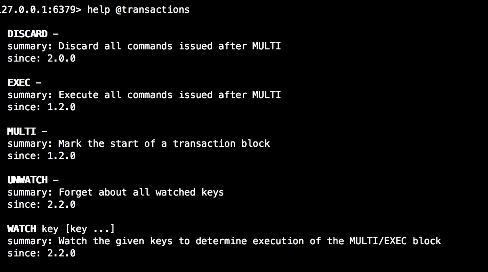

 

### key操作

常用：

```
DEL key #删除某个key
KEYS pattern  #查看符合正则的所有key
EXISTS key [key ...] #判断某个key是否存在，可支持多个，返回存在的个数
EXPIRE key seconds #刷新某个key过期时间
MOVE key db  #移动key到某个数据库
```

示例：

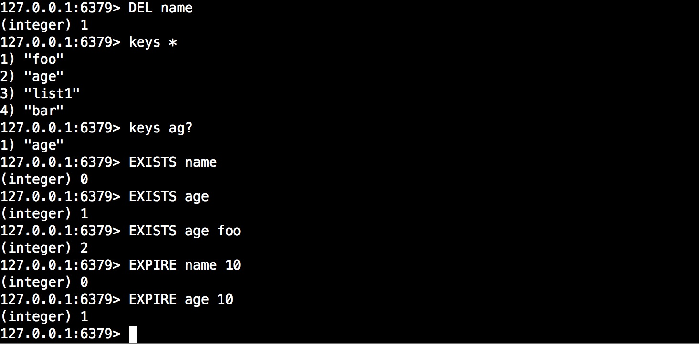

### string操作

字符串操作中需要注意的是，redis中的整型也当作字符串处理。

常用：

```
SET key value [EX seconds] [PX milliseconds] [NX|XX]  #设置key为指定的字符串值。
#参数：
#EX seconds – 设置键key的过期时间，单位时秒
#PX milliseconds – 设置键key的过期时间，单位时毫秒
#NX – 只有键key不存在的时候才会设置key的值
#XX – 只有键key存在的时候才会设置key的值

APPEND key value  #如果 key 已经存在，并且值为字符串，那么这个命令会把 value 追加到原来值（value）的结尾。 如果 key 不存在，那么它将首先创建一个空字符串的key，再执行追加操作，这种情况 APPEND 将类似于 SET 操作。

GET key #获取key值，不存在则返回nil

GETRANGE key start end #获取指定key值的索引开始位置和结束位置所对应的值，索引从0开始

GETSET key value  #设置新的key值，并获取设置之前的值，如果key不存在则设置，并返回nil

MGET key [key ...]   #批量获取key的值

MSET key value [key value ...] #批量设置key的值

DECR key #数字类型的key自减操作，key类型不是数字则报错

INCR key  #数字类型key 自加操作，与DECR相反

DECRBY key decrement  #数字类型key指定减少数值

INCRBY key increment   #数字类型key指定增加数值，与DECRBY相反

STRLEN key  #获取key长度
```

示例：

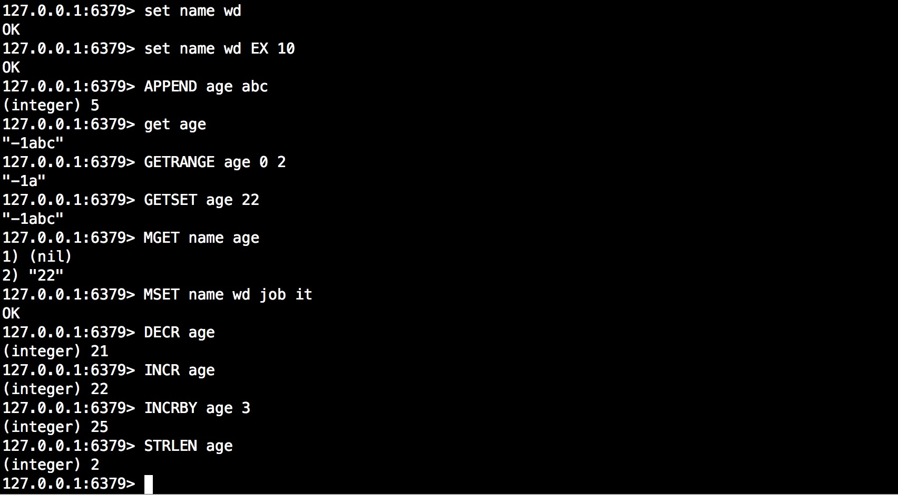

### list操作

列表中的元素索引从0开始，倒数的元素可以用“-”+倒数位置表示，如-2，代表倒数第二个元素，-1则代表最后一个元素。

Redis列表是简单的字符串列表，按照插入顺序排序。你可以添加一个元素到列表的头部（左边）或者尾部（右边。

一个列表最多可以包含  $2^{32}-1$  个元素 (4294967295, 每个列表超过40亿个元素)。

常用：

```
LPUSH key value [value ...]  #从列表左边放入一个或者多个元素

LPUSHX key value  #当列表存在时，从左边放入一个元素

RPUSH key value [value ...]  #从列表右边放入一个或者多个元素

RPUSHX key value  #当列表存在时，从右边放入一个元素

LSET key index value  #根据索引设置列表中元素的值,当list不存在是报错

LINDEX key index  #根据列表索引获取元素值，索引从0开始

LINSERT key BEFORE|AFTER pivot value  #在列表中，基于某个基准点插入值，pivot代表基准点

LLEN key #获取列表长度

LRANGE key start stop  #根据索引获取列表中的元素，列表索引最后一个可以使用-1

LREM key count value  #从存于 key 的列表里移除前 count 次出现的值为 value 的元素
#count > 0: 从头往尾移除值为 value 的元素
#count < 0: 从尾往头移除值为 value 的元素
#count = 0: 移除所有值为 value 的元素

LPOP key  #从列表左边删除一个元素

RPOP key  #从列表右边删除一个元素

RPOPLPUSH source destination  #删除source列表中的删除最后一个元素将其追加到destination列表

LTRIM key start stop  #根据索引start和stop保留列表元素
```

示例：

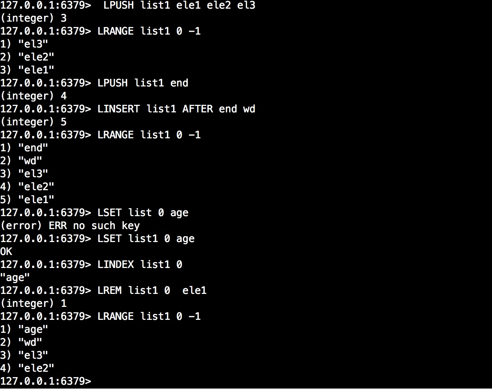

### hash操作

hash操作所有命令都以H开头。

Redis hash 是一个string类型的field和value的映射表，hash特别适合用于存储对象。

Redis 中每个 hash 可以存储 $2^{32} - 1$ 键值对（40多亿）。

常用：

```
HDEL key field [field ...]  #删除hash表中一个或多个字段

HEXISTS key field  #判断hash表中字段是否存在

HGET key field  #获取hash表中字段的值

HGETALL key  #获取hash表中所有字段

HSET key field value  # 设置hash表中字段的值

HSETNX key field value  #只有当字段不存在时候才设置hash表中字段值，

HLEN key  #获取hash表中字段个数

HVALS key  #获取hash表中所有字段的值

HKEYS key  #获取hash表中所有的字段

HSTRLEN key field #获取hash表中指定字段的值的长度

HMSET key field value [field value ...]  #批量设置hash表中字段的值

HMGET key field [field ...]  #批量获取hash表中字段的值
```

示例：


### 集合set操作

Redis 的 Set 是 String 类型的无序集合。集合成员是唯一的，这就意味着集合中不能出现重复的数据。

Redis 中集合是通过哈希表实现的，所以添加，删除，查找的复杂度都是 O(1)。

集合中最大的成员数为 $2^{32} - 1$  (4294967295, 每个集合可存储40多亿个成员)。

常用：

```
SADD key member [member ...]  #添加一个或多个元素到集合中

SREM key member [member ...]  #删除一个或多个集合中的元素

SCARD key  #获取集合中元素数量

SMEMBERS key  #返回集合中所有的元素

SINTER key [key ...] #获取两个或两个以上集合的交集

SUNION key [key ...]  #获取两个或两个以上集合的并集

SDIFF key [key ...]     #获取两个或者两个以上集合的差集

SISMEMBER key member  #判断元素是否是在指定集合中

SMOVE source destination member #移动一个集合中的元素到另一个集合

SPOP key [count]  #移除count个集合中元素，count可选参数，默认为1，即移除一个
```

### 有序集合操作

Redis 有序集合和集合一样也是string类型元素的集合,且不允许重复的成员。

不同的是每个元素都会关联一个double类型的分数。redis正是通过分数来为集合中的成员进行从小到大的排序。

有序集合的成员是唯一的,但分数(score)却可以重复。

集合是通过哈希表实现的，所以添加，删除，查找的复杂度都是O(1)。 集合中最大的成员数为 $2^{32} - 1$ (4294967295, 每个集合可存储40多亿个成员)。

常用：

```
ZADD key [NX|XX] [CH] [INCR] score member [score member ...]  #向一个有序集合添加成员（元素）
#参数：
#XX: 仅仅更新存在的成员，不添加新成员。
#NX: 不更新存在的成员。只添加新成员。
#CH: 修改返回值为发生变化的成员总数，原始是返回新添加成员的总数 (CH 是 changed 的意思)。更改的元素是新添加的成员，已经存在的成员更新分数。 所以在命令中指定的成员有相同的分数将不被计算在内。注：在通常情况下，ZADD返回值只计算新添加成员的数量。
#INCR: 当ZADD指定这个选项时，成员的操作就等同ZINCRBY命令，对成员的分数进行递增操作。

ZCARD key  #获取有序集合中元素个数

ZCOUNT key min max  #指定分数范围的元素个数

ZINCRBY key increment member  #为有序集的元素的score值加上增加指定的increment

ZRANGE key start stop [WITHSCORES]  #根据有序集合中分数区间获取集合中的元素

ZRANGE key start stop [WITHSCORES]  #获取有序集合中元素的排名

ZREM key member [member ...]  #删除有序集合中一个或多个元素

ZSCORE key member  #设置元素在集合中的分数
```

### GEO类型操作

Redis的GEO是 3.2 版本的新特性，对GEO(地理位置)的支持。这个功能可以将用户给定的地理位置信息储存起来， 并对这些信息进行操作。

geo类型命令不多，总共6个所以这里全部列举出来了。

```
GEOADD key longitude latitude member [longitude latitude member ...]  #将指定的地理空间位置（纬度、经度、名称）添加到指定的key中

GEODIST key member1 member2 [unit]  #返回两个给定位置之间的距离。如果两个位置之间的其中一个不存在， 那么命令返回空值。指定单位的参数 unit 必须是以下单位的其中一个：

#m 表示单位为米
#km 表示单位为千米
#mi 表示单位为英里
#ft 表示单位为英尺

GEOPOS key member [member ...]  #从key里返回所有给定位置元素的位置（经度和纬度）

GEOHASH key member [member ...]  #返回一个或多个位置元素的 Geohash 表示。通常使用表示位置的元素使用不同的技术，使用Geohash位置52点整数编码。由于编码和解码过程中所使用的初始最小和最大坐标不同，编码的编码也不同于标准。此命令返回一个标准的Geohash

GEORADIUS key longitude latitude radius m|km|ft|mi [WITHCOORD] [WITHDIST] [WITHHASH] [COUNT count] [ASC|DESC] [STORE key] [STOREDIST key]  
#以给定的经纬度为中心， 返回键包含的位置元素当中， 与中心的距离不超过给定最大距离的所有位置元素。

#范围可以使用以下其中一个单位：

#m 表示单位为米。
#km 表示单位为千米。
#mi 表示单位为英里。
#ft 表示单位为英尺。
#在给定以下可选项时， 命令会返回额外的信息：

#WITHDIST: 在返回位置元素的同时， 将位置元素与中心之间的距离也一并返回。 距离的单位和用户给定的范围单位保持一致。
#WITHCOORD: 将位置元素的经度和维度也一并返回。
#WITHHASH: 以 52 位有符号整数的形式， 返回位置元素经过原始 geohash 编码的有序集合分值。 这个选项主要用于底层应用或者调试， 实际中的作用并不大。
#命令默认返回未排序的位置元素。 通过以下两个参数， 用户可以指定被返回位置元素的排序方式：

#ASC: 根据中心的位置， 按照从近到远的方式返回位置元素。
#DESC: 根据中心的位置， 按照从远到近的方式返回位置元素。
#在默认情况下， GEORADIUS 命令会返回所有匹配的位置元素。 虽然用户可以使用 COUNT <count> 选项去获取前 N 个匹配元素， 但是因为命令在内部可能会需要对所有被匹配的元素进行处理， 所以在对一个非常大的区域进行搜索时， 即使只使用 COUNT 选项去获取少量元素， 命令的执行速度也可能会非常慢。 但是从另一方面来说， 使用 COUNT 选项去减少需要返回的元素数量， 对于减少带宽来说仍然是非常有用的。

#返回值：
  #在没有给定任何 WITH 选项的情况下， 命令只会返回一个像 [“New York”,”Milan”,”Paris”] 这样的线性（linear）列表。
  #在指定了 WITHCOORD 、 WITHDIST 、 WITHHASH 等选项的情况下， 命令返回一个二层嵌套数组， 内层的每个子数组就表示一个元素

  #在返回嵌套数组时， 子数组的第一个元素总是位置元素的名字。 至于额外的信息， 则会作为子数组的后续元素， 按照以下顺序被返回：
    #以浮点数格式返回的中心与位置元素之间的距离， 单位与用户指定范围时的单位一致。
    #geohash 整数。
    #由两个元素组成的坐标，分别为经度和纬度。

GEORADIUSBYMEMBER key member radius m|km|ft|mi [WITHCOORD] [WITHDIST] [WITHHASH] [COUNT count] [ASC|DESC] [STORE key] [STOREDIST key]
#这个命令和 GEORADIUS 命令一样， 都可以找出位于指定范围内的元素， 但是 GEORADIUSBYMEMBER 的中心点是由给定的位置元素决定的。
```

操作示例：

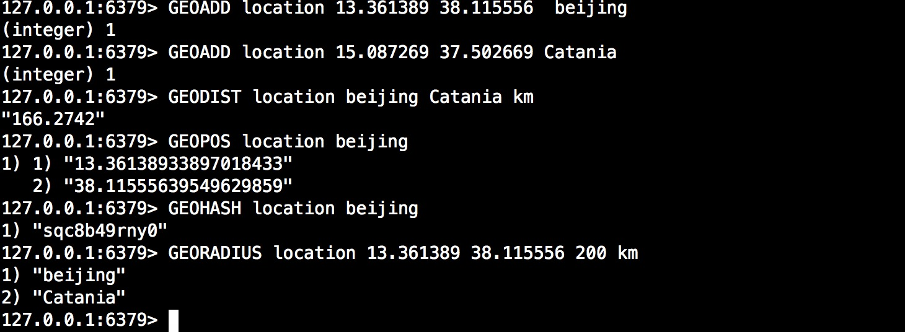

## 五、发布订阅

Redis 发布订阅(pub/sub)是一种消息通信模式：发送者(pub)发送消息，订阅者(sub)接收消息。

Redis 客户端可以订阅任意数量的频道。

下图代表其发布订阅之间的关系


 

### 运作原理

每个Redis 服务器进程都维持着一个表示服务器状态的 redis.h/redisServer结构， 结构的pubsub_channels 属性是一个字典， 这个字典就用于保存订阅频道的信息：

```
struct redisServer {
    // ...
    dict *pubsub_channels;
    // ...
};
```

其中，字典的键为正在被订阅的频道， 而字典的值则是一个链表， 链表中保存了所有订阅这个频道的客户端。
比如说，在下图展示的这个pubsub_channels示例中，client1 、 client2 和 client3 就订阅了 channel1 ， 而client3也同时订阅了channel2。
当客户端调用SUBSCRIBE命令时， 程序就将客户端和要订阅的频道在pubsub_channels字典中关联起来。

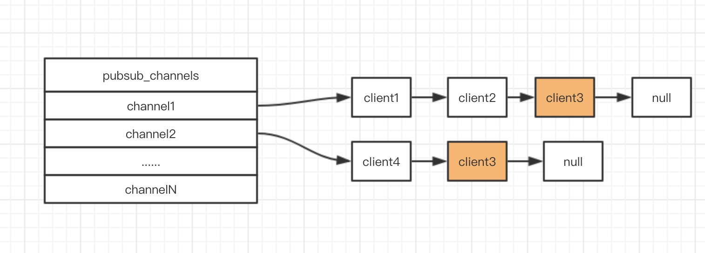

 

SUBSCRIBE 命令的行为可以用伪代码表示如下：

```
def SUBSCRIBE(client, channels):

    // 遍历所有输入频道
    for channel in channels:

        // 将客户端添加到链表的末尾
        redisServer.pubsub_channels[channel].append(client)
```

通过pubsub_channels字典， 程序只要检查某个频道是否为字典的键， 就可以知道该频道是否正在被客户端订阅； 只要取出某个键的值， 就可以得到所有订阅该频道的客户端的信息。

了解了pubsub_channels字典的结构之后， 解释PUBLISH命令的实现就非常简单了： 当调用PUBLISH channel message命令， 程序首先根据channel定位到字典的键， 然后将信息发送给字典值链表中的所有客户端。

### 订阅模式

redis的发布订阅不仅仅提供简单的订阅频道，还提供模式匹配订阅。模式订阅使用命令PSUBSCRIBE实现。

redisServer.pubsub_patterns属性是一个链表，链表中保存着所有和模式相关的信息：

```
struct redisServer {
    // ...
    list *pubsub_patterns;
    // ...
};
```

链表中的每个节点都包含一个redis.h/pubsubPattern结构：

```
typedef struct pubsubPattern {
    redisClient *client;
    robj *pattern;
} pubsubPattern;
```


client 属性保存着订阅模式的客户端，而 pattern 属性则保存着被订阅的模式。
每当调用 PSUBSCRIBE命令订阅一个模式时， 程序就创建一个包含客户端信息和被订阅模式的pubsubPattern结构， 并将该结构添加到redisServer.pubsub_patterns链表中。
作为例子，下图展示了一个包含两个模式的 pubsub_patterns 链表， 其中 client123 和 client256 都正在订阅 tweet.shop.* 模式：

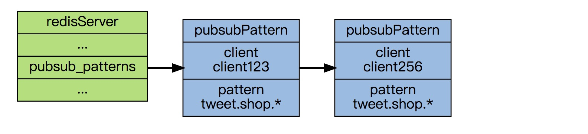

通过遍历整个pubsub_patterns链表，程序可以检查所有正在被订阅的模式，以及订阅这些模式的客户端。

当执行PUBLISH进行命令向channel命令发送消息时，PUBLISH除了将message 发送到所有订阅channel的客户端之外， 它还会将channel和pubsub_patterns中的模式进行对比， 如果channel和某个模式匹配的话， 那么也将message 发送到订阅那个模式的客户端，例如一个客户端订阅了aa.bb.*频道，那么他会收到来自所有aa.bb开头的所有频道消息。

### 相关命令

```
PSUBSCRIBE pattern [pattern ...]  #使用模式订阅一个或多个符合给定模式的频道

PUNSUBSCRIBE [pattern [pattern ...]]  #退订所有给定模式的频道

SUBSCRIBE channel [channel ...]   #订阅给定的一个或多个频道的信息

UNSUBSCRIBE [channel [channel ...]]   #指退订给定的频道

PUBSUB subcommand [argument [argument ...]]  #查看订阅与发布系统状态

PUBLISH channel message   #将信息发送到指定的频道
```

### 实践

在以下示例中，将分别用SUBSCRIBE命令订阅aa.bb和使用PSUBSCRIBE模式订阅频道aa.bb*。

SUBSCRIBE订阅：

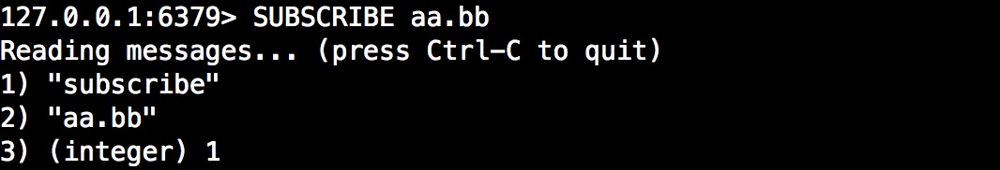

PSUBSCRIBE订阅：

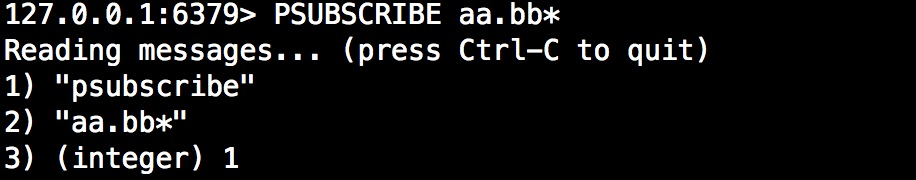

此时我们使用PUBSH向aa.bb发送消息，返回接受到的频道数，两个订阅者都能收到消息。

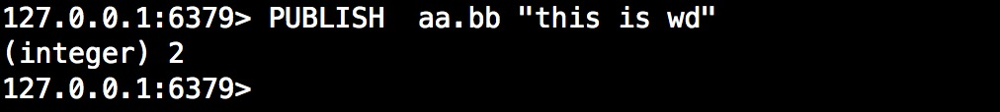

订阅者1:


模式订阅者：


### 小结

- 订阅信息由服务器进程维持的redisServer.pubsub_channels字典保存，字典的键为被订阅的频道，字典的值为订阅频道的所有客户端。
- 当有新消息发送到频道时，程序遍历频道（键）所对应的（值）所有客户端，然后将消息发送到所有订阅频道的客户端上。
- 订阅模式的信息由服务器进程维持的redisServer.pubsub_patterns链表保存，链表的每个节点都保存着一个pubsubPattern结构，结构中保存着被订阅的模式，以及订阅该模式的客户端。程序通过遍历链表来查找某个频道是否和某个模式匹配。
- 当有新消息发送到频道时，除了订阅频道的客户端会收到消息之外，所有订阅了匹配频道的模式的客户端，也同样会收到消息。
- 退订频道和退订模式分别是订阅频道和订阅模式的反操作。

## 六、事务

所谓事务应具有以下特效：原子性(Atomicity)， 一致性(Consistency)，隔离性(Isolation)，持久性(Durability)，简称ACID，但redis所提供的事务比较简单，它通过MULTI、EXEC、DISCARD和WATCH等命令实现事务。

而Redis只支持简单的事务，将执行命令放入队列缓存，当程序中有异常或命令出错，执行DISCARD清空缓存队列不执行队列中命令，其事务过程有以下特点：

- 事务是一个单独的隔离操作：事务中的所有命令都会序列化、按顺序地执行。事务在执行的过程中，不会被其他客户端发送来的命令请求所打断。
- 事务是一个**泛原子**操作（这里我以泛原子称呼，在某些情况redis的事务不是原子性的，后续会说明）：事务中的命令要么全部被执行，要么全部都不执行。

EXEC 命令负责触发并执行事务中的所有命令：

- 如果客户端在使用 MULTI 开启了一个事务之后，却因为断线而没有成功执行 EXEC ，那么事务中的所有命令都不会被执行。
- 另一方面，如果客户端成功在开启事务之后执行 EXEC ，那么事务中的所有命令都会被执行。

特别说明文中的**泛原子操作**：

- redis在开启事务以后，若执行命令具有显示的错误或者客户端中断则此次事务在执行EXEC命令时会调用DISCARD清空缓存队列不执行队列中的所有任务，此时是原子性的。
- 当执行命令过程中，命令没有显示的报错（例如LSET操作设置一个不存在的list），而是在EXEC调用时候某个命令出错，那么在这之前已经执行的命令将不会回滚，所以严格说来，redis并不支持原子性。

### 涉及命令

```
MULTI  #用于标记事务块的开始。Redis会将后续的命令逐个放入队列中，然后才能使用EXEC命令执行缓存队列中的命令。

EXEC  #执行缓存队列中的命令

DISCARD  #清除所有先前在一个事务中放入队列的命令，然后恢复正常的连接状态，如果使用了WATCH命令，那么DISCARD命令就会将当前连接监控的所有键取消监控。

WATCH key [key ...]   #当某个事务需要按条件执行时，就要使用这个命令将给定的键设置为受监控的

UNWATCH  #清除所有先前为一个事务监控的键，如果你调用了EXEC或DISCARD命令，那么就不需要手动调用UNWATCH命令
```

### 乐观锁机制

乐观锁：总是认为不会产生并发问题，每次去取数据的时候总认为不会有其他线程对数据进行修改，因此不会上锁，但是在更新时会判断其他线程在这之前有没有对数据进行修改，一般会使用版本号机制或检查再设置(CAS)操作实现。

redis通过WATCH命令实现乐观锁，作为WATCH命令的参数的键会受到Redis的监控，Redis能够检测到它们的变化。在执行EXEC命令之前，如果Redis检测到至少有一个键被修改了，那么整个事务便会中止运行，然后EXEC命令会返回一个nil值，提醒用户事务运行失败。

注意：WATCH命令需要在MULTI之前执行，不然redis会将其一个命令放入缓存队列中。

示例：在以下示例中通过一个客户端开启事务监听name键，另一个客户端在执行EXEC之前修改name键，此次事务将不会执行，并返回nil，如下。


 

### 原子性实践

为演示redis严格意义上将不支持原子性，做了一些简单实践。

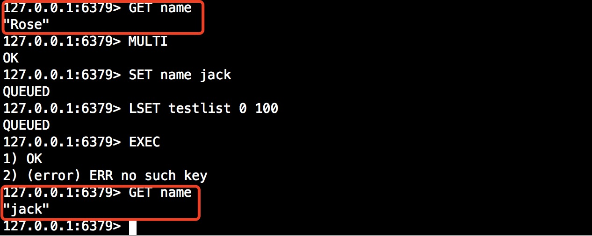

从上面的结果可以看出，在开启事务前name 值为Rose，在开启事务先后执行了SET命令和LSET命令，但是LSET命令是错误的，当我们调用EXEC执行事务完事务以后，在回头看事务中的SET命令已经生效，并未回滚，因为在次过程中该命令没有显示的报错，所以可以说redis的事务不支持原子性。

 

以上为本文所有内容，希望对你有所帮助！