# [redis系列--redis4.0深入持久化](https://www.cnblogs.com/wdliu/p/9377278.html)

## 前言

在之前的博文中已经详细的介绍了[redis4.0基础部分](./redis系列--redis4.0入门.md)，并且在memcache和redis对比中提及redis提供可靠的数据持久化方案，而memcache没有数据持久化方案，本篇博文将详细介绍redis4.0所提供的持久化方案：RDB持久化和AOF持久化以及redis4.0新特性混合持久化。这里将从原理到配置以及相关实践进行说明，希望能对你有所帮助。

## 一、RDB持久化

### 简介

RDB持久化方式是通过快照(snapshotting)完成的，当符合一定条件时，redis会自动将内存中所有数据以二进制方式生成一份副本并存储在硬盘上。当redis重启时，并且AOF持久化未开启时，redis会读取RDB持久化生成的二进制文件(默认名称dump.rdb，可通过设置dbfilename修改)进行数据恢复，对于持久化信息可以用过命令“info Persistence”查看。

### 快照文件位置

RDB快照文件存储文件位置由dir配置参数指明，文件名由dbfilename指定，如下：

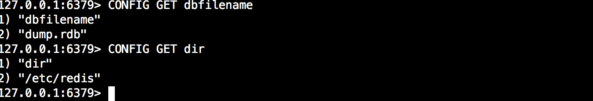

 

### 快照触发条件

RDB生成快照可自动促发，也可以使用命令手动触发，以下是redis触发执行快照条件，后续会对每个条件详细说明：

1. 客户端执行命令save和bgsave会生成快照；
2. 根据配置文件save m n规则进行自动快照；
3. 主从复制时，从库全量复制同步主库数据，此时主库会执行bgsave命令进行快照；
4. 客户端执行数据库清空命令FLUSHALL时候，触发快照；
5. 客户端执行shutdown关闭redis时，触发快照；

 

### save命令触发

客户端执行save命令，该命令强制redis执行快照，这时候redis处于阻塞状态，不会响应任何其他客户端发来的请求，直到RDB快照文件执行完毕，所以请慎用。

实践操作：

首先使用info Persistence查看最近一次持久化时间：

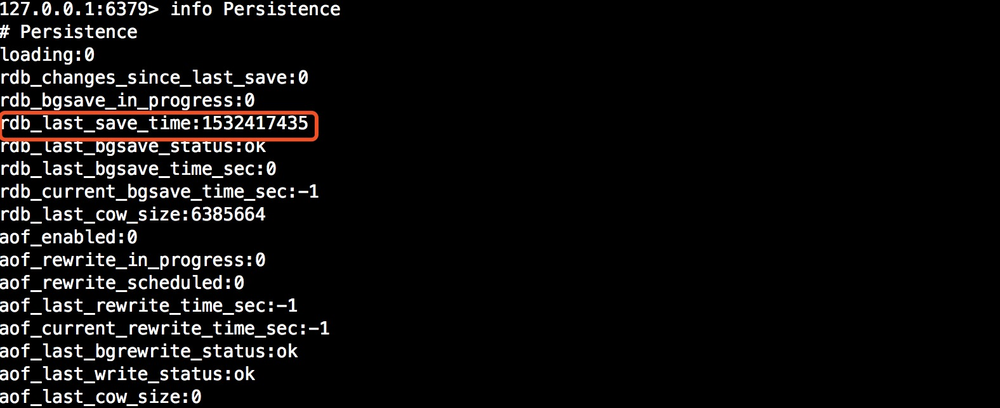

此时我们执行save命令，并再次查看最新快照保存时间已经是最新一次时间：

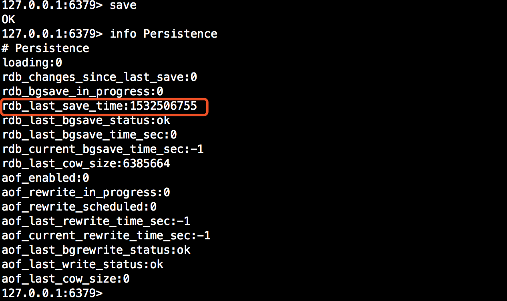

当然你也可以直接查看RDB数据文件目录下的RDB文件最新时间：

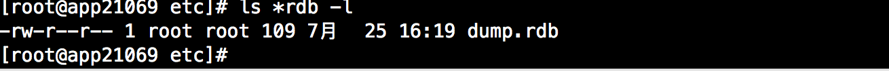

 

### bgsave命令触发

bgsave命令可以理解为background save即：“后台保存”。当执行bgsave命令时，redis会fork出一个子进程来执行快照生成操作，需要注意的redis是在fork子进程这个简短的时间redis是阻塞的（此段时间不会响应客户端请求，），当子进程创建完成以后redis响应客户端请求。其实redis自动快照也是使用bgsave来完成的。

为了能清楚了解bgsave工作过程，以下将图文详细描述其工作过程：

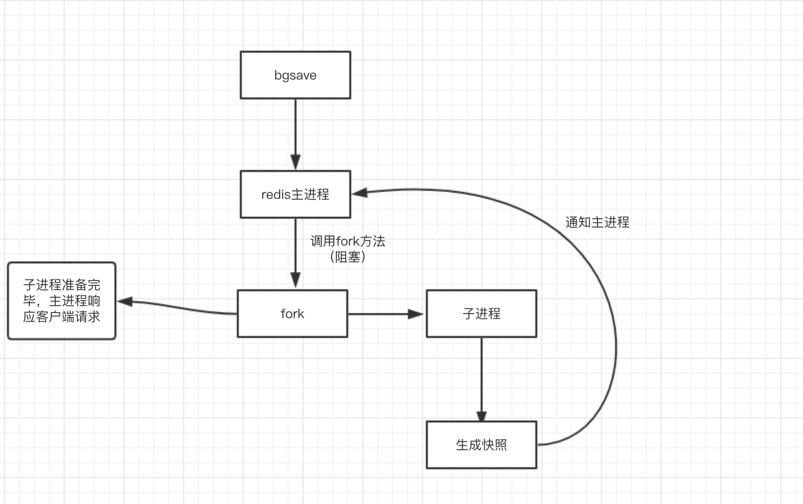

对上述过程描述：

1. 客户端执行bgsave命令，redis主进程收到指令并判断此时是否在执行bgrewriteaof(AOF文件重新过程，后续会讲解)，如果此时正好在执行则bgsave直接返回，不fork子进程，如果没有执行bgrewriteaof重写AOF文件，则进入下一个阶段；
2. 主进程调用fork方法创建子进程，在创建过程中redis主进程阻塞，所以不能响应客户端请求；
3. 子进程创建完成以后，bgsave命令返回“Background saving started”，此时标志着redis可以响应客户端请求了；
4. 子经常根据主进程的内存副本创建临时快照文件，当快照文件完成以后对原快照文件进行替换；
5. 子进程发送信号给redis主进程完成快照操作，主进程更新统计信息（info Persistence可查看）,子进程退出；

 

实践操作：

执行bgsave

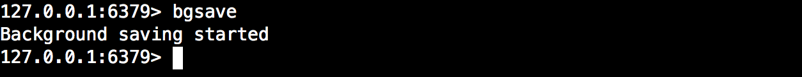

查看日志，能看到6MB文件内存副本写到了磁盘上，同时打印“Background saving terminated with success”代表文件bgsave操作完成。

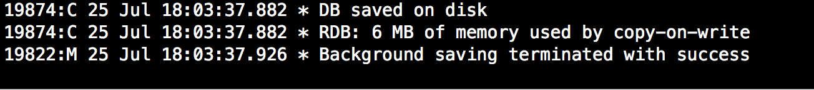

此时我们查看统计信息最后一次RDB保存时间已经更新：

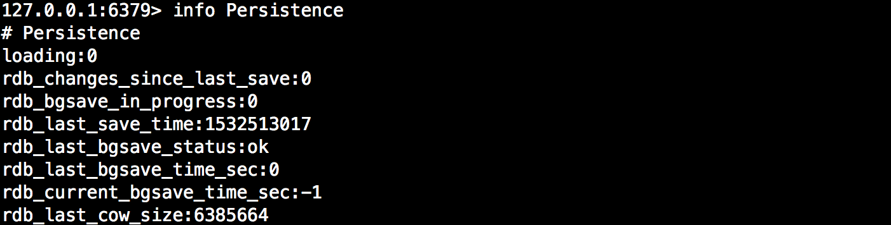

 

###  save m n规则触发 

save m n规则说明：在指定的m秒内，redis中有n个键发生改变，则自动触发bgsave。该规则默认也在redis.conf中进行了配置，并且可组合使用，满足其中一个规则，则触发bgsave，在上篇博文也进行了解释，如下：

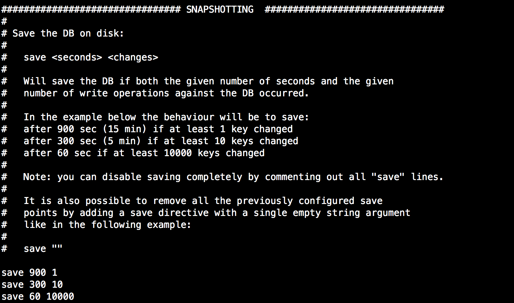

以save 900 1为例，表明当900秒内至少有一个键发生改变时候，redis触发bgsave操作。

 

实践操作：

我们改变一个键，满足save 900 1 ：

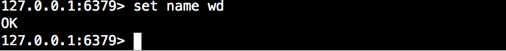

此时查看redis日志，会发现redis立即响应开始bgsave操作：


 

### FLUSHALL触发

flushall命令用于清空数据库，请慎用，当我们使用了则表明我们需要对数据进行清空，那redis当然需要对快照文件也进行清空，所以会触发bgsave。

实践操作：

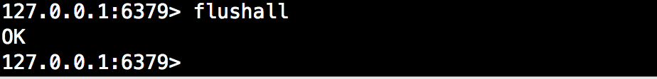

日志：


 

### shutdown触发

shutdown命令触发就不用说了,redis在关闭前处于安全角度将所有数据全部保存下来，以便下次启动会恢复。

实践操作：

可以使用客户端连入执行shutdown命令，也可以直接使用脚本关闭redis,这里我使用init脚本（系统centos6.X）。

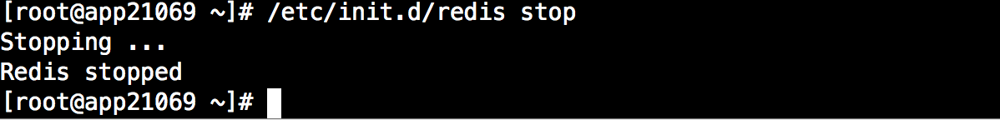

查看日志：


 

### 主从触发

在redis主从复制中，从节点执行全量复制操作，主节点会执行bgsave命令，并将rdb文件发送给从节点，该过程会在复制篇中进行阐述。

 

### 故障恢复

上面提及到过，当redis意外崩溃或者关闭再次启动时，此时AOF持久化未开启时(默认未开启)，将使用RDB快照文件恢复数据。

下面我们停用redis服务来模拟故障情况，让再启动redis服务：

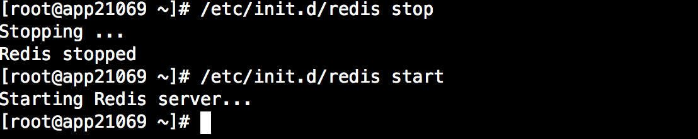

观察日志会发现，启动时候load RDB文件。

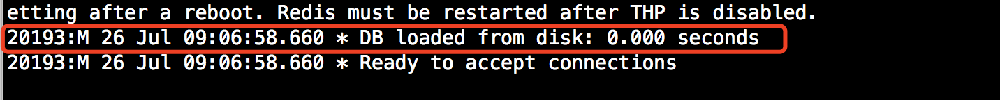

 

### RDB持久化配置

```
save m n
#配置快照(rdb)促发规则，格式：save <seconds> <changes>
#save 900 1  900秒内至少有1个key被改变则做一次快照
#save 300 10  300秒内至少有300个key被改变则做一次快照
#save 60 10000  60秒内至少有10000个key被改变则做一次快照
#关闭该规则使用svae “” 

dbfilename  dump.rdb
#rdb持久化存储数据库文件名，默认为dump.rdb

stop-write-on-bgsave-error yes 
#yes代表当使用bgsave命令持久化出错时候停止写RDB快照文件,no表明忽略错误继续写文件。

rdbchecksum yes
#在写入文件和读取文件时是否开启rdb文件检查，检查是否有无损坏，如果在启动是检查发现损坏，则停止启动。

dir "/etc/redis"
#数据文件存放目录，rdb快照文件和aof文件都会存放至该目录，请确保有写权限

rdbcompression yes
#是否开启RDB文件压缩，该功能可以节约磁盘空间
```

 

##  二、AOF持久化

### 简介

当redis存储非临时数据时，为了降低redis故障而引起的数据丢失，redis提供了AOF(Append Only File)持久化，从单词意思讲，将命令追加到文件。AOF可以将Redis执行的每一条写命令追加到磁盘文件(appendonly.aof)中,在redis启动时候优先选择从AOF文件恢复数据。由于每一次的写操作，redis都会记录到文件中，所以开启AOF持久化会对性能有一定的影响，但是大部分情况下这个影响是可以接受的，我们可以使用读写速率高的硬盘提高AOF性能。与RDB持久化相比，AOF持久化数据丢失更少，其消耗内存更少(RDB方式执行bgsve会有内存拷贝)。

 

### 开启AOF

默认情况下，redis是关闭了AOF持久化，开启AOF通过配置appendonly为yes开启，我们修改配置文件或者在命令行直接使用config set修改，在用config rewrite同步到配置文件。通过客户端修改好处是不用重启redis，AOF持久化直接生效。

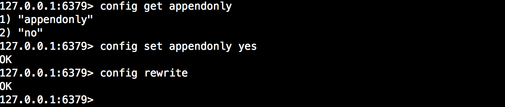

 

### AOF持久化过程 

redisAOF持久化过程可分为以下阶段：

1.追加写入

　　redis将每一条写命令以redis通讯协议添加至缓冲区aof_buf,这样的好处在于在大量写请求情况下，采用缓冲区暂存一部分命令随后根据策略一次性写入磁盘，这样可以减少磁盘的I/O次数，提高性能。

2.同步命令到硬盘

　　当写命令写入aof_buf缓冲区后，redis会将缓冲区的命令写入到文件，redis提供了三种同步策略，由配置参数appendfsync决定，下面是每个策略所对应的含义：

- no：不使用fsync方法同步，而是交给操作系统write函数去执行同步操作，在linux操作系统中大约每30秒刷一次缓冲。这种情况下，缓冲区数据同步不可控，并且在大量的写操作下，aof_buf缓冲区会堆积会越来越严重，一旦redis出现故障，数据丢失严重。
- always：表示每次有写操作都调用fsync方法强制内核将数据写入到aof文件。这种情况下由于每次写命令都写到了文件中, 虽然数据比较安全，但是因为每次写操作都会同步到AOF文件中，所以在性能上会有影响，同时由于频繁的IO操作，硬盘的使用寿命会降低。
- everysec：数据将使用调用操作系统write写入文件，并使用fsync每秒一次从内核刷新到磁盘。 这是折中的方案，兼顾性能和数据安全，所以redis默认推荐使用该配置。

3.文件重写(bgrewriteaof)

　　当开启的AOF时，随着时间推移，AOF文件会越来越大,当然redis也对AOF文件进行了优化，即触发AOF文件重写条件（后续会说明）时候，redis将使用bgrewriteaof对AOF文件进行重写。这样的好处在于减少AOF文件大小，同时有利于数据的恢复。

　　为什么重写？比如先后执行了“set foo bar1 set foo bar2 set foo bar3” 此时AOF文件会记录三条命令，这显然不合理，因为文件中应只保留“set foo bar3”这个最后设置的值，前面的set命令都是多余的，下面是一些重写时候策略：

- 重复或无效的命令不写入文件
- 过期的数据不再写入文件
- 多条命令合并写入（当多个命令能合并一条命令时候会对其优化合并作为一个命令写入，例如“RPUSH list1 a RPUSH list1 b" 合并为“RPUSH list1 a b” ）

　　

### 重写触发条件 

AOF文件触发条件可分为手动触发和自动触发：

手动触发：客户端执行bgrewriteaof命令。

自动触发：自动触发通过以下两个配置协作生效：

- auto-aof-rewrite-min-size: AOF文件最小重写大小，只有当AOF文件大小大于该值时候才可能重写,4.0默认配置64mb。
- auto-aof-rewrite-percentage：当前AOF文件大小和最后一次重写后的大小之间的比率等于或者等于指定的增长百分比，如100代表当前AOF文件是上次重写的两倍时候才重写。　

redis开启在AOF功能开启的情况下，会维持以下三个变量

- 记录当前AOF文件大小的变量aof_current_size。
- 记录最后一次AOF重写之后，AOF文件大小的变量aof_rewrite_base_size。
- 增长百分比变量aof_rewrite_perc。

每次当serverCron（服务器周期性操作函数）函数执行时，它会检查以下条件是否全部满足，如果全部满足的话，就触发自动的AOF重写操作：

- 没有BGSAVE命令（RDB持久化）/AOF持久化在执行；
- 没有BGREWRITEAOF在进行；
- 当前AOF文件大小要大于server.aof_rewrite_min_size的值；
- 当前AOF文件大小和最后一次重写后的大小之间的比率等于或者大于指定的增长百分比（auto-aof-rewrite-percentage参数）

### 重写过程

　　AOF文件重写过程与RDB快照bgsave工作过程有点相似，都是通过fork子进程，由子进程完成相应的操作，同样的在fork子进程简短的时间内，redis是阻塞的，以下图文说明其重写过程：

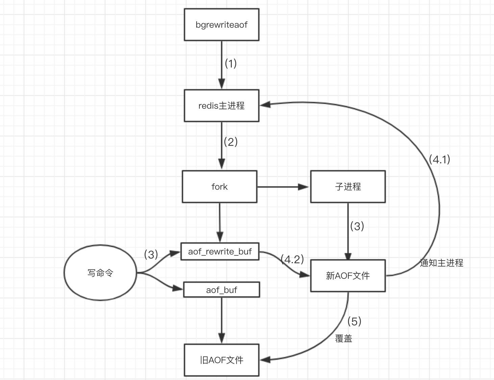

 

过程说明：

　　aof_rewrite_buf 代表重写缓冲区   aof_buf代表写写命令存放的缓冲区

　　1.开始bgrewriteaof，判断当前有没有bgsave命令(RDB持久化)/bgrewriteaof在执行，倘若有，则这些命令执行完成以后在执行。

　　2.主进程fork出子进程，在这一个短暂的时间内，redis是阻塞的。

　　3.主进程fork完子进程继续接受客户端请求，所有写命令依然写入AOF文件缓冲区并根据appendfsync策略同步到磁盘，保证原有AOF文件完整和正确。由于fork的子进程仅仅只共享主进程fork时的内存，因此Redis使用采用重写缓冲区(aof_rewrite_buf)机制保存fork之后的客户端的写请求，防止新AOF文件生成期间丢失这部分数据。此时，客户端的写请求不仅仅写入原来aof_buf缓冲，还写入重写缓冲区(aof_rewrite_buf)。

　　4.子进程通过内存快照，按照命令重写策略写入到新的AOF文件。

　　4.1子进程写完新的AOF文件后，向主进程发信号，父进程更新统计信息。

　　4.2主进程把AOFaof_rewrite_buf中的数据写入到新的AOF文件(避免写文件是数据丢失)。

　　5.使用新的AOF文件覆盖旧的AOF文件，标志AOF重写完成。

 

### AOF实现本质

AOF实现本质是基于redis通讯协议，将命令以纯文本的方式写入到文件中。

redis协议：

首先Redis是以行来划分，每行以\r\n行结束。每一行都有一个消息头，消息头共分为5种分别如下:

(+) 表示一个正确的状态信息，具体信息是当前行+后面的字符。

(-)  表示一个错误信息，具体信息是当前行－后面的字符。

(*) 表示消息体总共有多少行，不包括当前行,*后面是具体的行数。

($) 表示下一行数据长度，不包括换行符长度\r\n,$后面则是对应的长度的数据。

(:) 表示返回一个数值，：后面是相应的数字节符。

我们可以直接查看AOF文件中的格式，如下图：

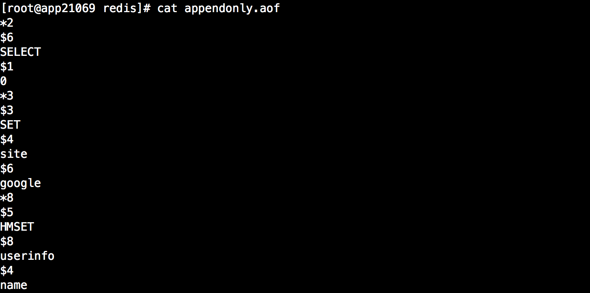

 

### 数据恢复

之前已经提到当AOF开启时候，redis数据恢复优先选用AOF进行数据恢复，以下使用停止redis来模拟redis故障,然后在重写启动进行恢复。

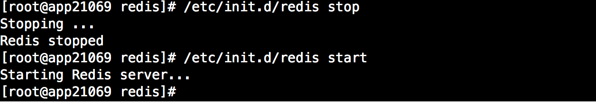

查看日志会发现数据恢复已经变成从AOF(append only file)文件中恢复：

 

### AOF配置参数

```
auto-aof-rewrite-min-size 64mb
#AOF文件最小重写大小，只有当AOF文件大小大于该值时候才可能重写,4.0默认配置64mb。

auto-aof-rewrite-percentage  100
#当前AOF文件大小和最后一次重写后的大小之间的比率等于或者等于指定的增长百分比，如100代表当前AOF文件是上次重写的两倍时候才重写。

appendfsync everysec
#no：不使用fsync方法同步，而是交给操作系统write函数去执行同步操作，在linux操作系统中大约每30秒刷一次缓冲。这种情况下，缓冲区数据同步不可控，并且在大量的写操作下，aof_buf缓冲区会堆积会越来越严重，一旦redis出现故障，数据
#always：表示每次有写操作都调用fsync方法强制内核将数据写入到aof文件。这种情况下由于每次写命令都写到了文件中, 虽然数据比较安全，但是因为每次写操作都会同步到AOF文件中，所以在性能上会有影响，同时由于频繁的IO操作，硬盘的使用寿命会降低。
#everysec：数据将使用调用操作系统write写入文件，并使用fsync每秒一次从内核刷新到磁盘。 这是折中的方案，兼顾性能和数据安全，所以redis默认推荐使用该配置。

aof-load-truncated yes
#当redis突然运行崩溃时，会出现aof文件被截断的情况，Redis可以在发生这种情况时退出并加载错误，以下选项控制此行为。
#如果aof-load-truncated设置为yes，则加载截断的AOF文件，Redis服务器启动发出日志以通知用户该事件。
#如果该选项设置为no，则服务将中止并显示错误并停止启动。当该选项设置为no时，用户需要在重启之前使用“redis-check-aof”实用程序修复AOF文件在进行启动。

appendonly no 
#yes开启AOF，no关闭AOF

appendfilename appendonly.aof
#指定AOF文件名，4.0无法通过config set 设置，只能通过修改配置文件设置。

dir /etc/redis
#RDB文件和AOF文件存放目录
```

### 实践

实践操作这里使用手动执bgrewriteaof演示重写。

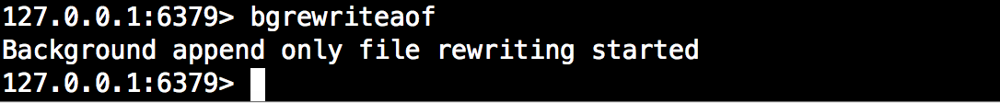

查看日志：

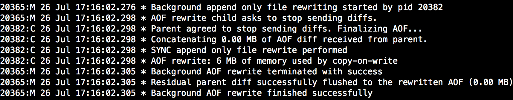

 

## 三、RDB-AOF混合持久化

### 简介

redis4.0相对与3.X版本其中一个比较大的变化是4.0添加了新的混合持久化方式。前面已经详细介绍了AOF持久化以及RDB持久化，这里介绍的混合持久化就是同时结合RDB持久化以及AOF持久化混合写入AOF文件。这样做的好处是可以结合 rdb 和 aof 的优点, 快速加载同时避免丢失过多的数据，缺点是 aof 里面的 rdb 部分就是压缩格式不再是 aof 格式，可读性差。

### 开启混合持久化

4.0版本的混合持久化默认关闭的，通过aof-use-rdb-preamble配置参数控制，yes则表示开启，no表示禁用，默认是禁用的，可通过config set修改。

### 混合持久化过程

了解了AOF持久化过程和RDB持久化过程以后，混合持久化过程就相对简单了。

混合持久化同样也是通过bgrewriteaof完成的，不同的是当开启混合持久化时，fork出的子进程先将共享的内存副本全量的以RDB方式写入aof文件，然后在将重写缓冲区的增量命令以AOF方式写入到文件，写入完成后通知主进程更新统计信息，并将新的含有RDB格式和AOF格式的AOF文件替换旧的的AOF文件。简单的说：新的AOF文件前半段是RDB格式的全量数据后半段是AOF格式的增量数据，如下图：


 

### 数据恢复

当我们开启了混合持久化时，启动redis依然优先加载aof文件，aof文件加载可能有两种情况如下：

- aof文件开头是rdb的格式, 先加载 rdb内容再加载剩余的 aof。
- aof文件开头不是rdb的格式，直接以aof格式加载整个文件。

### 实践 

 开启混合持久化，并在开启后立马执行写操作，为了证实混合持久化的后半部分AOF过程

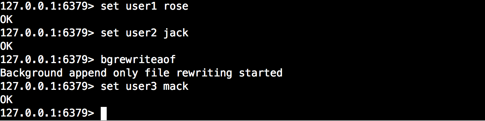

查看日志：

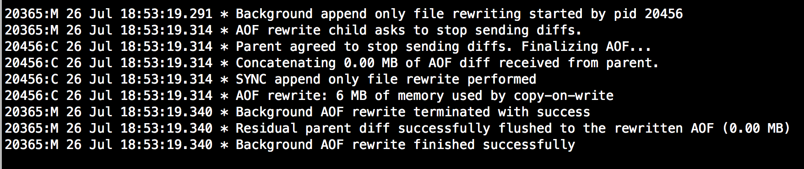

此时的aof文件已经和只开启AOF持久化文件不一样了，上半部分是RDB持久化的数据，下半部分是AOF格式数据。

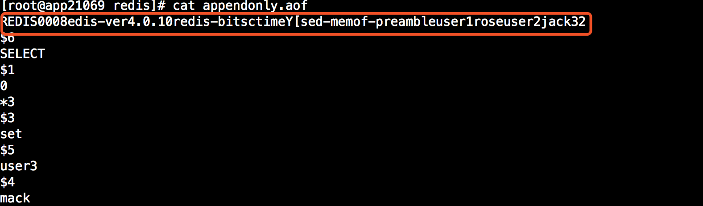

 

## 四、优缺点 

###  RDB

优点：

1. RDB 是一个非常紧凑（compact）的文件，体积小，因此在传输速度上比较快，因此适合灾难恢复。 
2. RDB 可以最大化 Redis 的性能：父进程在保存 RDB 文件时唯一要做的就是 `fork` 出一个子进程，然后这个子进程就会处理接下来的所有保存工作，父进程无须执行任何磁盘 I/O 操作。
3. RDB 在恢复大数据集时的速度比 AOF 的恢复速度要快。

缺点：

1. RDB是一个快照过程，无法完整的保存所以数据，尤其在数据量比较大时候，一旦出现故障丢失的数据将更多。
2. 当redis中数据集比较大时候，RDB由于RDB方式需要对数据进行完成拷贝并生成快照文件，fork的子进程会耗CPU，并且数据越大，RDB快照生成会越耗时。
3. RDB文件是特定的格式，阅读性差，由于格式固定，可能存在不兼容情况。

### AOF　

优点：

1. 数据更完整，秒级数据丢失(取决于设置fsync策略)。
2. 兼容性较高，由于是基于redis通讯协议而形成的命令追加方式，无论何种版本的redis都兼容，再者aof文件是明文的，可阅读性较好。

缺点：

1. 数据文件体积较大,即使有重写机制，但是在相同的数据集情况下，AOF文件通常比RDB文件大。
2. 相对RDB方式，AOF速度慢于RDB，并且在数据量大时候，恢复速度AOF速度也是慢于RDB。
3. 由于频繁地将命令同步到文件中，AOF持久化对性能的影响相对RDB较大，但是对于我们来说是可以接受的。

### **混合持久化**

优点：

1. 混合持久化结合了RDB持久化 和 AOF 持久化的优点, 由于绝大部分都是RDB格式，加载速度快，同时结合AOF，增量的数据以AOF方式保存了，数据更少的丢失。

缺点：

1. 兼容性差，一旦开启了混合持久化，在4.0之前版本都不识别该aof文件，同时由于前部分是RDB格式，阅读性较差

 

## 五、相关命令

aof文件检查

```
redis-check-aof /etc/redis/appendonly.aof
```

rdb文件检查

```
redis-check-rdb /etc/redis/dump.rdb
```

查看持久化信息

```
info Persistence
```

查看状态信息

```
info stats
```

 

以上是所有内容，希望对你有帮助～
